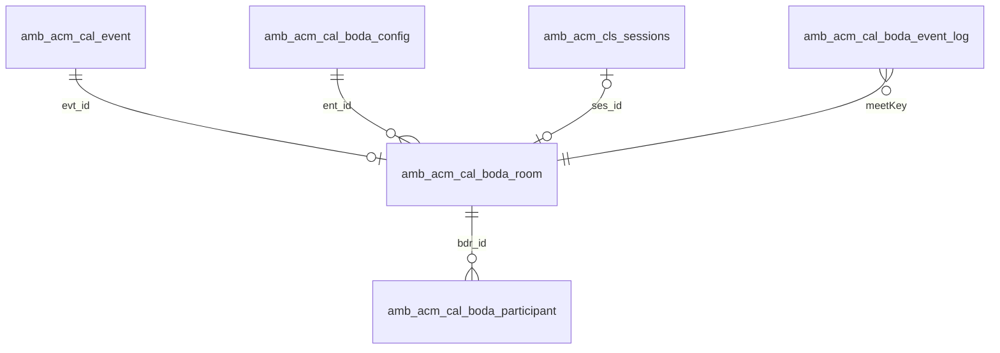

# REQ-260526 v2 — BODA 화상 강의실 캘린더 연동 요구사항 분석서

## (BODA Virtual Classroom × Calendar — Requirements Analysis, v2)

---

## 1. 개요 (Overview)

강사가 **앱아카데미 수업용 캘린더**(`amb_acm_cal_event`)에 수업을 등록하면 대응 **BODA 화상 강의실** 이 결합되고, 캘린더의 **「강의실 입장」** 링크를 강사·학생이 클릭하면 같은 강의실에 입장하는 기능을 추가한다.

본 분석서는 [`REQ-260506`](REQ-260506-acm-tch-stf-cal.md) 캘린더 v1 의 화상미팅 영역(현재 **수동 URL 붙여넣기**) 을 BODA 플랫폼과의 **자동 연동** 으로 확장하기 위한 요구사항을 정의한다.

> **본 분석서가 전제하는 핵심 모델**
> BODA 는 "예약된 시각에 룸을 미리 생성" 하는 서버 API 를 제공하지 않는다. 따라서
> ① **수업 등록 시점** 에는 앱아카데미가 결합키 `meetKey` 와 입장 페이지 URL 을 선발급하고,
> ② **BODA 룸은 강사 첫 입장 (`bodaOpen()`) 시점에 지연 생성** 된다.
> 모든 FR / AC 는 이 모델을 전제로 한다.

---

## 2. 배경 (Background)

### 2.1 현재 구현 상태 (As-Is) — 2026-06-08 재확인

[`REQ-260506`](REQ-260506-acm-tch-stf-cal.md) 결정 (2026-05-06) 으로 캘린더의 화상미팅 기능은 **수동 URL 붙여넣기** 만 제공한다. v1 이후 BODA 자동 연동을 향한 **데이터 스캐폴딩** 은 기존에 존재하나, **연동 로직 코드는 0** 이다.

| 위치 | 자산 | 상태 (2026-06-08) |
|------|------|------|
| `amb_acm_cal_event.evt_meeting_provider` | enum 값에 `'BODASCHOOL'` 포함 | 정의만, 수동 URL 모드 |
| `amb_acm_cal_event.evt_meeting_url` | 미팅 URL 컬럼 (varchar 500) | 강사/어드민 수동 입력 |
| `amb_acm_cls_video_config.vcf_bodaschool_room_id` | 클래스별 룸 ID (varchar 100) | 항상 `null` |
| `amb_acm_cls_sessions.ses_video_provider / ses_video_url` | 회차 화상 정보 | `NONE` 기본 |
| `backend/src/modules/acm-cal/application/cal-event.service.ts` `validateMeeting()` | `https://` 강제 + provider≠NONE 이면 URL 필수 | 수동 URL 검증만 |
| `frontend-acm/src/modules/cal/components/cal-event-modal.tsx:281-303` | "화상 미팅" 폼 섹션 + provider 셀렉터 + URL 입력 | 4 locale i18n 완비 |
| `presentation/webhooks/ama-subscription-webhook.controller.ts` | 외부 Webhook 수신 패턴 — HMAC 검증·Throttle·멱등 | 가동 — 본 작업에서 재사용 |
| `backend/src/infrastructure/external/bodaedu/` | BODA HTTP client / mock | ❌ **미존재** |
| `BODA_*` 환경변수 (`.env.production.example`) | API URL / 토큰 / 모드 | ❌ **미정의** |
| `docs/design/DSN-260525-…boda-classroom-integration.md` | "선행 설계서" (REQ v1 에서 참조) | ❌ **파일 부재** (git history 도 없음). 본 v2 에서 참조 제거 |

[REQ-260506 의 R2 리스크](REQ-260506-acm-tch-stf-cal.md#§리스크-r2) ("보다스쿨 URL 패턴 미확정") 가 본 가이드 수령으로 해소되었고, 같은 문서의 Non-Goal "화상미팅 자동 생성 / 예약" 이 **본 분석서의 대상 범위** 다.

### 2.2 TPI 연동 자격증명 (㈜새하컴즈 제공)

**모든 자격증명은 [docker/production/.env.production](../../docker/production/.env.production) 서버 측 env 로만 운반한다.** 본 REQ / PLN / 코드 / 클라이언트 JS / 로그 어디에도 평문 보관 금지 (NFR-3).

| 항목 | env key (또는 BODA 설정 테이블 컬럼) | 값 (실값은 본 REQ 외부에 보관) |
|------|---------------------------------------|------------|
| bodaWeb URL | `BODA_WEB_URL` | `https://bodaedu.kr` (공개) |
| WebRTC URL | `BODA_WEBRTC_URL` | `https://bodaedu.kr/webrtc` (공개) |
| SERVER API URL | `BODA_SERVER_URL` | `https://svr.bodaedu.kr` (공개) |
| companyCode (Ccd) | `BODA_COMPANY_CODE` | 공개 식별자 |
| companyId (Cid) | `BODA_COMPANY_ID` | 공개 식별자 (`tpi`) |
| authKey (AuCd) | `BODA_AUTH_KEY` **[비밀]** | **REDACTED — env 만**. ㈜새하컴즈 비대칭 채널로 운반 후 1회만 env 입력 |
| SERVER API Authorization 헤더 | `BODA_BASIC_AUTH` **[비밀]** | **REDACTED — env 만**. `Basic Base64(companyCode:authKey)` 사전 계산값 |
| roomCode (1:1 수업) | `BODA_DEFAULT_ROOM_CODE` | `roomCategoryCd=4` 연동 개설 룸 (TPI 1종) |
| joinUserType | (상수) | TEACHER=11 · STUDENT=12 · OPERATOR=13 |
| Language | (상수) | `ko` / `en` |

위 env 키는 [`amb_acm_cal_boda_config`](#7-데이터-모델-conceptual) 테이블의 행으로도 매핑된다. 운영 시 우선순위: **env > DB row (테넌트별 override)**.

### 2.3 BODA 연동 채널 (3종)

| 채널 | 위치 | 본 연동 활용 |
|------|------|--------------|
| **APP API** (`BodaAppApi.js`) | 사용자 브라우저 (JS) → BODA Client (앱) | 강사 룸 개설 · 강사 / 학생 입장 |
| **SERVER API** (`BODA_SERVER_URL`) | 앱아카데미 백엔드 | 출결 reconcile · 강제 폐쇄 · 녹화 조회 |
| **이벤트 연동** (BODA → 고객사 Webhook) | 앱아카데미 백엔드 수신 | 룸 상태 · 입퇴장 동기화 |

채널별 명세 · 제약 (C1 ~ C9) · 결정사항 (DD-1 ~ DD-6) 은 본 REQ §5 (FR) 에 통합 반영.

---

## 3. 목표 / 비목표 (Goals / Non-Goals)

### 3.1 Goals

1. 강사가 캘린더 이벤트 등록 시 화상 제공자로 **`BODASCHOOL`** 선택 → `meetKey` · 입장 링크 자동 생성.
2. 캘린더 이벤트 상세에서 강사 · 학생이 **「강의실 입장」** 클릭 → 동일 BODA 룸 입장.
3. 강사 = `bodaOpen()` (개설 + 입장), 학생 = `bodaJoin()` (입장).
4. BODA 이벤트 Webhook 수신 → 룸 상태 (개설 / 시작 / 종료 / 폐쇄) · 출결 입퇴장을 자동 동기화.
5. **입장 가능 시간 창** (시작 N 분 전 ~ 종료 후 M 분) 게이팅, 학생은 룸 미개설 시 대기 화면.
6. BODA 연동 설정 (자격증명 · URL · roomCode) 을 **테넌트별** 로 관리 (멀티테넌시).
7. 수업 종료 후 SERVER API 로 **출결 정합성 재대조** (reconcile) — Webhook 누락 보정.

### 3.2 Non-Goals (본 작업 범위 외)

- BODA 웹 포털 SSO 임베드 (`/sso/login` + `/svr/auth/token`) — 녹화 · 노트 열람용. 후속 분리.
- 녹화본 · 수업노트의 앱아카데미 내 보관 · 재생 UI.
- 그룹수업용 `roomCode` 다종 운용 — 현재 TPI 는 1종 (`BODA_DEFAULT_ROOM_CODE`) 만 발급됨.
- Google Meet 경로 변경 — 기존 수동 URL 방식 유지 (`evt_meeting_provider IN ('GOOGLE_MEET', 'OTHER')`).
- BODA 룸 제목 사후 변경 동기화 — BODA 에 룸 제목 갱신 API 없음.

---

## 4. 사용자 / 역할 (Users)

| Role | 설명 | 본 기능 권한 |
|------|------|--------------|
| ADMIN | 학원 어드민 | 전체 캘린더 이벤트 등록 · 수정, BODA 설정 관리, 강의실 강제 종료 |
| TEACHER | 강사 (REQ-260506 신규 role) | 본인 일정의 BODASCHOOL 등록 · 개설 · 입장 |
| STUDENT (또는 PARENT 대리) | 포털 사용자 | 본인이 invitee 인 이벤트의 강의실 입장 |
| (운영자) | 어드민 모니터링 | (선택) `userType=13` 으로 모니터링 입장 |

---

## 5. 기능 요구사항 (Functional Requirements)

### 5.1 BODA-CFG — 테넌트 연동 설정

| ID | 요구사항 | 우선순위 |
|----|---------|---------|
| FR-BODA-CFG-1 | 테넌트 (`ent_id`) 별 1행으로 BODA 연동 설정 (`bodaWeb` · `svr` · `webrtc` URL, `companyCode`, `companyId`, `authKey`, `default_room_code`, Webhook 공유비밀) 을 저장한다 | P0 |
| FR-BODA-CFG-2 | 비밀 컬럼 (`authKey`, Webhook 공유비밀) 은 **AES-GCM 암호화 (`BYTEA`)** 또는 **KMS envelope** 으로 보관한다 ([ADR-005](../design/adr/) / [ADR-003](../design/adr/ADR-003-cert-storage.md) 패턴). DB 의 텍스트 컬럼 / 로그 / 스택트레이스에 평문 노출 금지 | P0 |
| FR-BODA-CFG-3 | 어드민이 설정을 조회 · 수정 (`GET / PUT /api/admin/cal/boda/config`) 할 수 있다. **응답에 비밀값을 절대 포함하지 않는다** (mask 또는 `is_set: true` 만) | P0 |
| FR-BODA-CFG-4 | `is_active = false` 인 테넌트는 BODA 분기가 비활성화되어 기존 수동 URL 동작으로 자동 폴백한다 | P1 |
| **FR-BODA-CFG-5** (v2 신규) | 자격증명의 **운반 경로** 를 명시한다: ㈜새하컴즈 → 운영자 비대칭 채널 (예: 1Password / GPG) → 서버 측 env (`.env.production`) → 1회 부팅 시 DB 암호화 저장. 평문이 git · slack · 이메일 등 일반 채널을 통과하지 않는다 | P0 |

### 5.2 BODA-ROOM — 캘린더 이벤트별 BODA 룸 라이프사이클

| ID | 요구사항 | 우선순위 |
|----|---------|---------|
| FR-BODA-ROOM-1 | 캘린더 이벤트 생성 시 `evt_meeting_provider = 'BODASCHOOL'` 이면 `amb_acm_cal_boda_room` 행을 `status = 'PENDING'` 으로 생성 | P0 |
| FR-BODA-ROOM-2 | `meetKey` 생성 규칙: `tac-{evt_id 32 hex}` (≤ 255, `"+"` 미포함). 전역 유일 · 불변 | P0 |
| FR-BODA-ROOM-3 | `roomCode` 는 테넌트 기본값 (TPI = `BODA_DEFAULT_ROOM_CODE`) 자동 사용. CLS 회차 mirror 이벤트는 `ses_id` 연계 | P0 |
| FR-BODA-ROOM-4 | 이벤트 생성 시 `evt_meeting_url` 에 앱아카데미 입장 페이지 URL (`/web/classroom/{evtId}`) 을 자동 채운다 (수동 URL 입력란 숨김) | P0 |
| FR-BODA-ROOM-5 | 룸 상태 머신: `PENDING → OPEN → STARTED → (PAUSED) → ENDED → CLOSED`. 전이는 이벤트 1 · 2 · 3 · 4 · 5 · 10 으로만 수행 | P0 |
| FR-BODA-ROOM-6 | 이벤트 수정 시 `meetKey` 는 재발급하지 않는다. 일정 변경은 시간창 갱신만 (BODA 룸 제목은 미반영) | P0 |
| FR-BODA-ROOM-7 | 이벤트 삭제 · 취소 시 `boda_room` CASCADE 삭제 + 룸이 `OPEN` 상태면 SERVER API `/svr/meet/close` 호출 | P0 |
| FR-BODA-ROOM-8 | `meetIdx` 는 개설 (이벤트 1) 수신 시 저장. 이후 SERVER API 조회 호출에 활용 | P0 |

### 5.3 BODA-LAUNCH — 입장 런처 페이지

| ID | 요구사항 | 우선순위 |
|----|---------|---------|
| FR-BODA-LAUNCH-1 | `GET /web/classroom/{evtId}` 페이지를 신설한다. 앱아카데미 세션 인증 필수 | P0 |
| FR-BODA-LAUNCH-2 | 페이지는 `BodaAppApi.js` 를 로드하고, 백엔드에서 launch-context 를 받아 `bodaOpen()` (강사) 또는 `bodaJoin()` (학생) 을 호출 | P0 |
| FR-BODA-LAUNCH-3 | 권한 · 시간창 검증 — owner / invitee 인가 + 입장 가능 창 (기본 시작 10 분 전 ~ 종료 후 15 분, 테넌트 설정 가능) 밖이면 입장 버튼 비활성화 | P0 |
| FR-BODA-LAUNCH-4 | 학생은 `GET /api/cal/boda/rooms/:evtId/status` 로 상태를 폴링 (예: 10 초 간격). 상태가 `PENDING` 이면 "선생님 입장 대기 중" 화면 + 폴링, `OPEN` 이상이면 입장 버튼 활성화 | P0 |
| FR-BODA-LAUNCH-5 | `joinUser.UId` 는 앱아카데미 사용자 UUID 32 hex (≤ 32 한도) 로 설정 — 출결 역매핑 키 | P0 |
| FR-BODA-LAUNCH-6 | `setErrorCallback` 으로 `BODA-NOT_INSTALLED` · `BODA-NOT_CONNECTED_AGENT` 등 포착 → 설치 안내 + WebRTC 대체 입장 노출 | P0 |
| FR-BODA-LAUNCH-7 | `joinOpt.lang` 은 사용자 로케일 (`ko` / `en`) 에서 자동 결정 | P1 |
| FR-BODA-LAUNCH-8 | launch-context 응답에 **비밀값 (`AuCd` · Webhook 공유비밀) 을 포함하지 않는다**. `CCd` / `CId` 식별자 수준은 허용 | P0 |

### 5.4 BODA-EVENT — Webhook 수신

| ID | 요구사항 | 우선순위 |
|----|---------|---------|
| FR-BODA-EVENT-1 | `POST /api/webhooks/boda` 엔드포인트로 BODA 이벤트 (POST JSON 또는 parameter) 를 수신 | P0 |
| FR-BODA-EVENT-2 | 인증 — 추측 불가 경로 + 공유비밀 헤더 (예: `X-Boda-Token`) 검증 + 출발지 IP 허용목록 + Throttle. (BODA 가 HMAC 서명 지원 시 격상) | P0 |
| FR-BODA-EVENT-3 | 모든 수신 이벤트는 원본을 `amb_acm_cal_boda_event_log` 에 저장. 멱등 dedup 키 = `(meet_idx, event_code, event_at, COALESCE(user_id, ''))` UNIQUE | P0 |
| FR-BODA-EVENT-4 | 이벤트 1 (개설) → `boda_room.status = OPEN` · `meet_idx` · `opened_at` 저장 | P0 |
| FR-BODA-EVENT-5 | 이벤트 2 (시작) → `STARTED` · `started_at` / 3 (일시중지) → `PAUSED` / 4 (종료) → `ENDED` · `ended_at` / 5 (폐쇄) → `CLOSED` · `close_type` · `closed_at` / 10 (전체폐쇄) → 미종료 룸 일괄 `CLOSED` | P0 |
| FR-BODA-EVENT-6 | 이벤트 11 (입장) → `boda_participant` 입장 UPSERT (`user_id` → 앱 사용자 역매핑 · `joined_at` · `client_type`) | P0 |
| FR-BODA-EVENT-7 | 이벤트 12 (퇴장) → 해당 참여 행에 `left_at` · `total_seconds` 갱신 | P0 |
| FR-BODA-EVENT-8 | 이벤트 9 (정보변경) · 13 (점수) · 21 ~ 28 (녹화 / 노트 / 사진 / 캡처) 은 P1 · P2 — `event_log` 에는 저장하되 도메인 처리 보류 | P1 |
| FR-BODA-EVENT-9 | 순서 역전 (퇴장 → 입장 등) — `event_at` 기준 재정렬 후 상태 전이 처리 | P1 |

### 5.5 BODA-ATT — 출결 · 정합성

| ID | 요구사항 | 우선순위 |
|----|---------|---------|
| FR-BODA-ATT-1 | `boda_participant` 행을 CLS 회차 (`ses_id`) 연계 시 `amb_acm_cls_attendance` 에 UPSERT | P0 |
| FR-BODA-ATT-2 | 수업 종료 후 N 분 (테넌트 설정, 기본 10 분) 후 SERVER API `GET /svr/meet/log/user/join?meetKey=` 로 권위 데이터 조회 → 누락된 입퇴장을 보정 | P0 |
| FR-BODA-ATT-3 | reconcile 작업은 멱등 — 동일 (`meetKey`, `userId`, `joinedAt`) 중복 처리 없음 | P0 |
| FR-BODA-ATT-4 | 어드민 화면에 «출결 재대조» 버튼 — 수동 트리거 (`POST /api/cal/boda/rooms/:evtId/reconcile`) | P1 |

### 5.6 BODA-ADMIN — 어드민 운영

| ID | 요구사항 | 우선순위 |
|----|---------|---------|
| FR-BODA-ADMIN-1 | 강의실 강제 종료 — `POST /api/cal/boda/rooms/:evtId/close` → SERVER API `/svr/meet/close` 위임 | P0 |
| FR-BODA-ADMIN-2 | 룸 상태 수동 새로고침 — SERVER API `/svr/meet/info?meetKey=` 조회 결과로 로컬 상태 갱신 | P1 |
| FR-BODA-ADMIN-3 | (후속) 녹화 목록 조회 · 다운로드 — SERVER API `/svr/record/log/video` + 이벤트 21 처리 | P2 |

---

## 6. 비기능 요구사항 (Non-Functional Requirements)

| ID | 항목 | 기준 |
|----|------|------|
| NFR-1 | 멀티테넌시 | 신규 테이블 모두 `ent_id NOT NULL` + 전 쿼리 `ent_id` 필터. Webhook 수신 시 `companyCode` → `bdc_company_code` 매칭으로 `ent_id` 해석 |
| NFR-2 | 인증 / 인가 | 런처 페이지는 세션 인증 + owner / invitee 인가. 시간창 밖 launch-context 요청은 403 |
| NFR-3 | 비밀 관리 | `authKey` · `Basic Base64(…)` · Webhook 공유비밀 평문 저장 금지. AES-GCM (`BYTEA`) 또는 KMS envelope. 클라이언트 응답에 미포함. **본 REQ / PLN / RPT 문서에도 평문 미포함 — env 키 이름만 기록** (v2 강화) |
| NFR-4 | Webhook 보안 | 공유비밀 헤더 + 출발지 IP 허용목록 + Throttle + dedup unique index. BODA 가 HMAC 지원 시 [`verifyAmaWebhook`](../../backend/src/infrastructure/external/ama/webhook/ama-webhook-signature.util.ts) 유사 검증으로 격상 |
| NFR-5 | SERVER API 호출 | 백엔드 전용 (CORS 미지원). Bearer / Basic 자격증명은 secret 관리, 5 초 timeout, 재시도 1회 + 지수 백오프 |
| NFR-6 | 개인정보 | `UNm` (이름) 외 BODA 전송 금지. `UId` 는 내부 UUID (식별 불가값) |
| NFR-7 | 응답시간 | 런처 페이지 첫 페인트 < 1s. `/status` 폴링 응답 < 200ms |
| NFR-8 | i18n | 4 locale (`ko` · `en` · `zh-CN` · `vi`) 안내 문구 — 대기 · 미설치 · 시간창 |
| NFR-9 | 감사 | Webhook 원본 (`boda_event_log`) · 강제폐쇄 · 재대조 트리거 모두 감사 로그 |
| NFR-10 | 멱등성 | 이벤트 수신 · SERVER API 호출 · reconcile 모두 멱등 |
| NFR-11 | 가용성 | BODA 장애 (SERVER API 503) 시 입장 경로 (APP API) 는 영향 없음 — UX degrade 없이 동작 |

---

## 7. 데이터 모델 (Conceptual)

신규 4 개 테이블. 모두 PostgreSQL, `amb_acm_*` prefix, `ent_id` 멀티테넌시 + audit. 마이그레이션 권장 번호: 현 최신 (`870-csl-inquiry-parent-name.sql`) 이후 **`sql/acm/910-acm-cal-boda.sql`** (REQ-260526 §8 신규 BODA, AMA 매핑 `900-*` 다음 — 예약).

```
amb_acm_cal_boda_config           (테넌트별 연동 설정 — 자격증명 암호화)
  ├─ bdc_id PK / ent_id UNIQUE
  ├─ bdc_boda_web_url · bdc_svr_url · bdc_webrtc_url
  ├─ bdc_company_code · bdc_company_id
  ├─ bdc_auth_key_enc (BYTEA, 암호화)
  ├─ bdc_event_secret_enc (BYTEA, 암호화)
  ├─ bdc_default_room_code
  └─ bdc_is_active / audit

amb_acm_cal_boda_room             (캘린더 이벤트별 BODA 룸 1 : 0..1)
  ├─ bdr_id PK / ent_id
  ├─ evt_id FK → amb_acm_cal_event UNIQUE
  ├─ ses_id (옵션, CLS 회차)
  ├─ bdr_meet_key UNIQUE        — tac-{evtId hex}
  ├─ bdr_room_code              — TPI 기본값
  ├─ bdr_meet_idx               — 개설 이벤트 수신 시 저장
  ├─ bdr_status                 — PENDING | OPEN | STARTED | PAUSED | ENDED | CLOSED
  ├─ bdr_opened_at · started_at · ended_at · closed_at · close_type
  └─ audit

amb_acm_cal_boda_participant     (입 · 퇴장 N — 한 사용자 반복 입장 허용)
  ├─ bdp_id PK / ent_id / bdr_id FK → boda_room
  ├─ bdp_boda_user_id           — 이벤트 userId ( = UId)
  ├─ bdp_user_kind              — TEACHER | STUDENT | OPERATOR | UNKNOWN
  ├─ bdp_ref_user_id            — 역매핑된 amb_acm_user.usr_id
  ├─ bdp_joined_at · left_at · total_seconds · client_type
  └─ audit

amb_acm_cal_boda_event_log       (Webhook 원본 + 멱등 보장)
  ├─ bel_id PK / ent_id
  ├─ bel_event_code · bel_meet_idx · bel_meet_key · bel_event_at · bel_user_id
  ├─ bel_payload JSONB
  ├─ bel_processed BOOLEAN
  └─ UNIQUE(meet_idx, event_code, event_at, COALESCE(user_id, ''))   -- dedup
```

**기존 컬럼 재사용 (신규 컬럼 없음)**

- `amb_acm_cal_event.evt_meeting_provider` = `'BODASCHOOL'` (enum 값 이미 존재)
- `amb_acm_cal_event.evt_meeting_url` → 런처 URL `/web/classroom/{evtId}` 저장
- `amb_acm_cls_video_config.vcf_bodaschool_room_id` → 클래스 기본 roomCode (선택)
- `amb_acm_cls_sessions.ses_video_provider / ses_video_url` → CLS 회차 mirror 시 `BODASCHOOL` · 런처 URL
- `amb_acm_cls_attendance` → §5.5 reconcile 반영 대상

### 7.1 ERD (개념)



---

## 8. 인수 기준 (Acceptance Criteria)

### AC-CFG
- **AC-CFG-1**: 어드민이 `PUT /api/admin/cal/boda/config` 로 자격증명 저장 → DB 에 평문 미저장 (`BYTEA` 암호화), `GET` 응답에 비밀값 미포함.
- **AC-CFG-2**: `is_active = false` 인 테넌트에서 이벤트 생성 시 화상 제공자 셀렉터에 `BODASCHOOL` 미노출 (폴백 동작).
- **AC-CFG-3** (v2 신규): grep `git log` · 코드 · 문서 어디에도 `authKey` / `Basic …` 평문값이 검출되지 않는다.

### AC-ROOM
- **AC-ROOM-1**: 이벤트 등록 (`evt_meeting_provider = 'BODASCHOOL'`) → `boda_room` 1행 `PENDING` 생성, `meetKey = tac-{evtId hex}`, `evt_meeting_url = /web/classroom/{evtId}` 자동 채움.
- **AC-ROOM-2**: 같은 이벤트 시간 수정 시 `meetKey` 불변, 시간창만 갱신.
- **AC-ROOM-3**: 이벤트 삭제 시 `boda_room` CASCADE 삭제, 상태가 `OPEN` 이상이면 `/svr/meet/close` 호출 로그가 남는다.

### AC-LAUNCH
- **AC-LAUNCH-1**: 비로그인 사용자가 `/web/classroom/{evtId}` 진입 시 로그인으로 리다이렉트.
- **AC-LAUNCH-2**: invitee / owner 가 아닌 사용자 접근 시 403.
- **AC-LAUNCH-3**: 시작 10 분 전 ~ 종료 후 15 분 외에 launch-context 요청 시 403.
- **AC-LAUNCH-4**: 강사 클릭 시 `bodaOpen` 호출 파라미터에 `UTy = 11` · `dup = 1` · `meetKey = tac-{…}` · `roomCode = <env BODA_DEFAULT_ROOM_CODE>`.
- **AC-LAUNCH-5**: 학생 클릭 시 `bodaJoin` 호출 파라미터에 `UTy = 12` · `meetKey = tac-{…}`. `meetIdx` 미지정.
- **AC-LAUNCH-6**: 룸 `PENDING` 상태에서 학생 진입 시 대기 화면 표시 + 10 초 polling, `OPEN` 전이 즉시 입장 버튼 활성화.
- **AC-LAUNCH-7**: launch-context 응답 JSON 에 `authKey` · `AuCd` · Webhook 비밀 미포함.

### AC-EVENT
- **AC-EVENT-1**: 동일 이벤트 페이로드 2회 수신 시 `boda_event_log` UNIQUE 충돌 → 두 번째 무시 (멱등).
- **AC-EVENT-2**: 개설 (1) 수신 → `boda_room.status = OPEN`, `bdr_meet_idx` 저장, `opened_at` 채움.
- **AC-EVENT-3**: 입장 (11) → `boda_participant` 입장 행 신설 (또는 직전 행 종료 후 신설). 퇴장 (12) → 해당 행 `left_at` · `total_seconds` 갱신.
- **AC-EVENT-4**: 공유비밀 헤더 미일치 시 401. IP 허용목록 외 호출 거부.

### AC-ATT
- **AC-ATT-1**: CLS 회차 연계 이벤트의 입퇴장이 `amb_acm_cls_attendance` 에 반영.
- **AC-ATT-2**: 수업 종료 10 분 후 SERVER API reconcile 실행, Webhook 누락 행을 보정해도 중복 생성 없음.

### AC-ADMIN
- **AC-ADMIN-1**: 어드민이 강제 종료 버튼 클릭 → `/svr/meet/close` 호출, `boda_room.status = CLOSED`.

---

## 9. 리스크 / 가정 (Risks & Assumptions)

| # | 항목 | 완화책 |
|---|------|--------|
| R-1 | BODA 룸 사전 예약 생성 API 없음 — 강사가 첫 입장해야 룸 실체화 | 학생 런처가 `/status` 선확인 + 대기 / 폴링 UX (FR-LAUNCH-4) |
| R-2 | TPI 는 `roomCode` 1종 (1:1) 만 발급 — 그룹수업 추가 발급 필요 | 그룹수업은 본 작업 Non-Goal. 후속 작업으로 분리 |
| R-3 | 이벤트 가이드에 Webhook **서명 (HMAC) 규격 부재** | 다층 방어 (공유비밀 + IP 허용목록 + 멱등); HMAC 지원 시 격상 |
| R-4 | `bodaOpen / bodaJoin` 호출에 `AuCd` (authKey) 클라이언트 노출 필요 여부 미확정 | TCPS 설정으로 처리 가정. 미결사항 Q1 |
| R-5 | Mac / Mobile 은 BODA Client 설치 감지 불가 | "이미 설치하셨나요?" 분기 UX + WebRTC 무설치 폴백 |
| R-6 | BODA 룸 제목 사후 변경 API 없음 | 일정 변경 시 BODA 룸 제목 불일치 허용 (Non-Goal). 안내 문구 표시 |
| R-7 | 학생이 강사보다 먼저 입장 시 `WB-500-122` | 런처가 직접 노출하지 않고 대기 화면 표시 (AC-LAUNCH-6) |
| R-8 | Webhook 순서 역전 | `bel_event_at` 기준 재정렬 처리 (FR-EVENT-9) |
| **R-9** (v2 신규) | "DSN-260525 선행 설계서" 참조가 dangling — 파일 부재. 본 REQ 가 사실상 단독 설계 + 분석서 | v2 에서 dangling 참조 제거. 후속 PLN 작성 시 본 REQ 단독 인용 |

---

## 10. 의존성 (Dependencies)

### 10.1 선행
- [`REQ-260506-acm-tch-stf-cal.md`](REQ-260506-acm-tch-stf-cal.md) — 캘린더 v1 + `amb_acm_cal_event` · `evt_meeting_provider` enum.
- [`300-acm-cls-v1.0b.sql`](../../sql/acm/300-acm-cls-v1.0b.sql) — `amb_acm_cls_sessions` · `amb_acm_cls_video_config` · `amb_acm_cls_attendance`.
- [`ama-subscription-webhook.controller.ts`](../../backend/src/presentation/webhooks/ama-subscription-webhook.controller.ts) — Webhook 수신 패턴 (재사용).
- [`ama-webhook-signature.util.ts`](../../backend/src/infrastructure/external/ama/webhook/ama-webhook-signature.util.ts) — HMAC 격상 시 재사용.

### 10.2 외부 (㈜새하컴즈)
- BODA 운영 환경에 본 앱의 Webhook 수신 URL **등록 필수** — 등록 전에는 이벤트 미수신.
- (Q1) `AuCd` 클라이언트 노출 여부 회신.
- (Q2) Webhook 서명 / 인증 방식 회신 (미지원 시 공유비밀 + IP 허용목록 합의).

### 10.3 후속 (별도 작업)
- 녹화 · 노트 보관 · 재생 (이벤트 21 · 24 + SERVER API 노트 / 녹화 조회).
- BODA 포털 SSO 임베드 (`/svr/auth/token` + `/sso/login`).
- 그룹수업용 roomCode 추가 발급 후 다종 운용.

---

## 11. 미결사항 (Open Questions)

본 작업 착수 게이트는 **Q1 · Q2** (vendor 회신 필요).

| Q | 주제 | 확인 대상 | 영향 |
|---|------|-----------|------|
| Q1 | `bodaOpen / bodaJoin` 호출 시 `AuCd` (authKey) 가 **클라이언트 JS 로 필요한가** vs BODA Client / TCPS 설정으로 처리되는가 | ㈜새하컴즈 | FR-LAUNCH-8 · NFR-3 보안 설계 |
| Q2 | 이벤트 Webhook **HMAC 서명** 지원 여부 | ㈜새하컴즈 | FR-EVENT-2 · NFR-4 |
| Q3 | 그룹수업용 `roomCode` 추가 발급 | ㈜새하컴즈 | 본 작업 Non-Goal |
| Q4 | `BodaAppApi.js` 배포처 · 버전 · 갱신 정책 (CDN vs 자체 호스팅) | ㈜새하컴즈 | FR-LAUNCH-2 |
| Q5 | WebRTC 무설치 입장이 `bodaOpen / bodaJoin` 으로 동일 동작하는지 | ㈜새하컴즈 | 학생 UX |
| Q6 | `dup = 1` 동일 `roomCode` 위 다수 룸 **동시 운영 한계** | ㈜새하컴즈 | 동시 수업 수용량 |
| Q7 | `UId ≤ 32` ↔ 앱 사용자 UUID 32 hex 적합 확인 | 내부 + ㈜새하컴즈 | FR-LAUNCH-5 |
| Q8 | Mac / Mobile 설치 감지 불가 대응 권장 UX | ㈜새하컴즈 | FR-LAUNCH-6 |
| Q9 | 학생 캘린더 접근 주체 — 학생 본인 계정 vs 학부모 계정 (`/my/*`) | 내부 | FR-LAUNCH-1 · 3 인가 기준 |
| Q10 | 녹화 · 수업노트 학부모 노출 여부 | 내부 | 후속 작업 범위 |
| Q11 | 일정 변경 시 BODA 룸 제목 불일치 허용 여부 | 내부 | Non-Goal 확정 |
| **Q12** (v2 신규) | ㈜새하컴즈 → 운영자 자격증명 비대칭 채널 합의 (GPG · 1Password share · Bitwarden 등) | 내부 + ㈜새하컴즈 | FR-CFG-5 |

---

## 12. v1 → v2 변경 요약

| 영역 | v1 (2026-05-26) | v2 (2026-06-08) |
|------|----|-----|
| **자격증명 표기** | §2.2 에 `authKey: <9 digits>`, `Basic <22 char base64>` 등 **평문** 노출 | **REDACT** — env 키 이름만 (`BODA_AUTH_KEY` 등). 실값은 외부 채널 |
| **DSN-260525 참조** | `related:` 첫 줄에 "선행 설계서" 로 명시 | 제거 (파일 부재 확인). 본 REQ 단독 운영 |
| **AS-IS (§2.1)** | "스캐폴딩 존재" 일반 기술 | 2026-06-08 gap 분석 결과로 **각 항목별 file:line 검증**. 코드 0 명시 |
| **FR-CFG-5** | 없음 | 자격증명 운반 경로 (vendor → env → 암호화 DB) 명시 |
| **AC-CFG-3** | 없음 | grep 으로 평문 자격증명 검출 0 검증 |
| **Q12** | 없음 | 자격증명 비대칭 채널 합의 |
| **R-9** | 없음 | DSN dangling 참조 제거 사실 명시 |
| 그 외 | — | 인용 file:line 갱신, 표기 통일 (전각 공백 통일 등) |

---

## 13. 다음 단계

1. **본 REQ v2 사용자 승인** ← 현재 단계
2. (외부) ㈜새하컴즈 → Q1 · Q2 회신 + Webhook URL 사전 등록
3. **PLN-260526 작성** (UI 목업 + Task 분해 + 일정) — REQ v2 단독 인용
4. PLN 사용자 승인 후 mock-first 구현 (FR-CFG · FR-ROOM · FR-LAUNCH 기본 → FR-EVENT → FR-ATT)
5. 본 v2 + PLN + RPT 모두 git commit (단, **자격증명 평문 미포함 확인 후 push**)
