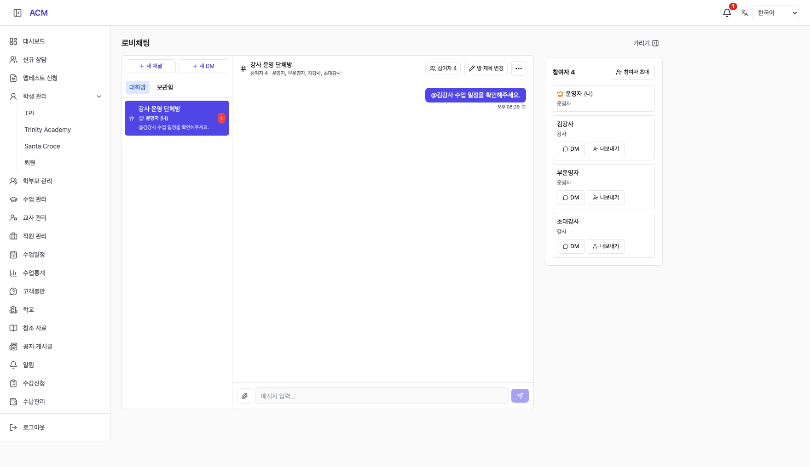

# Rename Button Visibility (방 제목 변경 버튼 노출 수정)

## 1. Finding (확인 내용)

현재 배포 코드에 제목 변경 기능은 존재하지만 `⋯ → 방 제목 변경`에만 노출된다. 관리자 모드의 현재 그룹 OWNER만 볼 수 있으며, 일반 참여자·강사와 DM에서는 표시하지 않는다. 소스 조건과 로컬 격리 브라우저로 확인했으며, 사용자가 보고한 특정 계정/방의 권한 상태는 확인하지 않았다.

## 2. Fix (수정)

그룹 방장에게 채팅 헤더의 참여자 버튼 옆에 `방 제목 변경` 텍스트 버튼을 직접 표시한다. 기존 메뉴 경로도 유지한다. 제목 변경 창을 닫으면 실제로 누른 버튼으로 포커스를 돌려주고, 좁은 화면에서는 헤더가 줄바꿈하도록 했다. 서버 권한과 DB는 변경하지 않았다.

## 3. Validation (검증)

- 프런트엔드 TypeScript/Vite 빌드 통과 (기존 번들 크기 경고 유지).
- 격리 HTTP fixture 브라우저: 방장의 직접 버튼 → 제목 변경/저장 → 목록/헤더 반영 확인.
- 일반 운영자·강사 버튼 미노출, 기존 참여자 초대/내보내기/DM 및 모바일 흐름 통과.
- git diff --check 통과.

## 4. Delivery (적용 상태)

`fix/chat-rename-button-261006` 브랜치에 구현했다. 사용자의 운영 반영 요청에 따라 아래 버전으로 배포했다. 소스는 기존 IDE 변경을 보존하는 독립 작업 디렉터리 `/private/tmp/acm-complaints-261006`에 있으며, 보고서와 캡처는 IDE에도 복사했다.

## 5. Production Deployment (운영 반영)

- PR #308 병합, 운영 SHA `515b08a7a47e0bb81b1eb3d938e4f4d76a803ea9`.
- 2026-10-06 22:41:11 KST / 20:41:11 ICT 반영.
- PR CI `37471421161`, main CI `37472020820`, staging CD `37472021033`, production CD `37472678603` 성공.
- 스테이징 및 운영 정적 UI를 대상으로 모든 API 요청을 격리 fixture로 처리하는 브라우저 검증 수행. 방장 직접 제목 변경/저장 및 일반 운영자·강사 버튼 미노출 확인. 실사용자 로그인이나 운영 데이터 변경은 하지 않았다.
- 운영 backend health OK, `/admin/chat` HTTP 200, 초기 backend 오류 로그 0건, 컨테이너 재시작 0회.
- DB 변경 없음. 직전 운영 이미지 `4272877`이 복구 기준이다.
