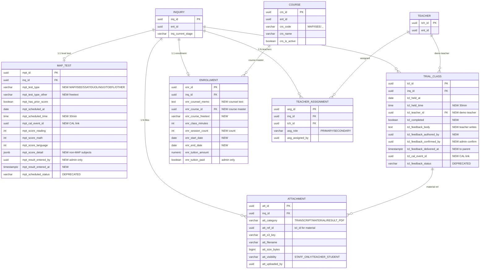
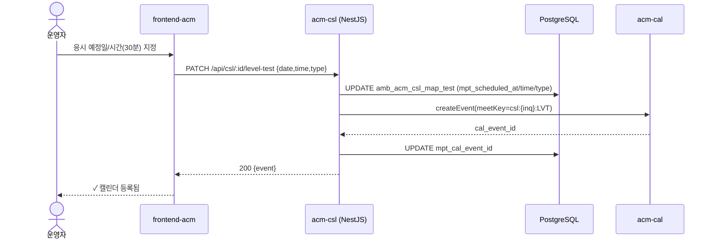
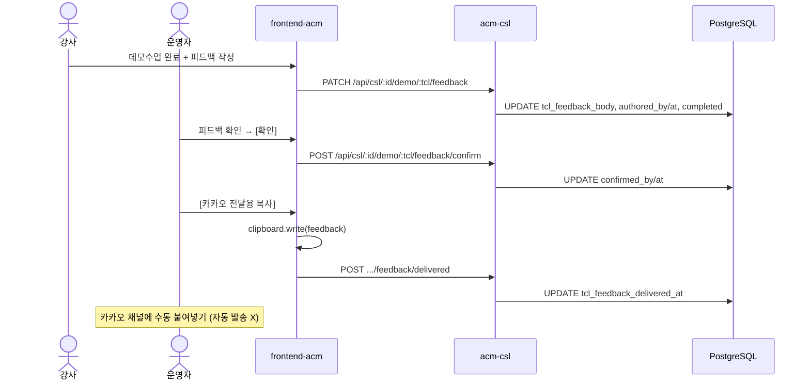

# DSN-260626 — ACM 상담관리 파이프라인 개편 설계서
## (CSL Pipeline Revision — Data Model · Screens · Functions · Sequences)

> 본 설계는 REQ-260626 승인(기본 제안 채택)에 따른 것이다. 내부 단계 enum(`INTAKE`…`CLASS_STARTED`)과
> 전이 게이트는 **변경하지 않고**(Q-CSL-110), **UI 라벨·입력 항목·보조 데이터**만 개편한다(BR-CSL-101).

---

## 1. 적용된 기본 제안 (Resolved Defaults)

| Q | 결정 (기본 제안 채택) | 설계 반영 |
|---|----------------------|-----------|
| Q-CSL-102 | MAP 점수는 CSL(`map_test`)에 보관, **수강 시작 시 STD로 승계** | §6.3 PRC-승계 |
| Q-CSL-104 | 시험별 점수 항목 **확정**(업로드 "시험별 점수표"): MAP=전용컬럼, 그 외=JSONB | §5.6 |
| Q-CSL-105 | 학년 옵션 **초1~고3 전체** | §4.1 SCR-CSL-01 |
| Q-CSL-106 | 성적표 **PDF/이미지, 10MB × 최대 10개** | §5.1, §3.2 attachment |
| Q-CSL-107 | CAL 일정 결합은 **REQ-260526 meetKey 패턴 준용** | §6.1 |
| Q-CSL-108 | 카카오 전달 = **수동 복사**(자동 발송 아님) | §4.3, §6.2 |
| Q-CSL-109 | 강좌코스 = **마스터 테이블 + 자유입력 허용** | §3.2 course |
| Q-CSL-110 | 단계 enum 코드 **개명 안 함**(라벨만) | 전반 |
| Q-CSL-111 | 레벨테스트 **결과 입력은 운영자 전용** | §5.2, §7 정책 |

---

## 2. 설계 원칙 (Design Principles)

1. **코드-라벨 분리 (BR-CSL-101)** — `MAP_TEST`→"레벨테스트", `TRIAL_CLASS`→"데모수업"은 UI i18n 라벨만 변경. 전이 로직·DB enum 불변.
2. **보조 테이블 확장 우선** — 기존 1:1/1:N 보조 테이블(`map_test`/`trial_class`/`enrollment`)을 ALTER로 확장. 신규 테이블은 첨부·복수강사·강좌마스터 4종만.
3. **삭제 필드는 deprecate** — `mpt_scheduled_status`(응시상태), `tcl_feedback_status`(피드백상태)는 컬럼을 **drop하지 않고** 신규 입력만 중단(데이터 호환). Phase 후속에서 정리.
4. **파일은 단일 첨부 테이블** — 성적표·수업자료·결과PDF를 `amb_acm_csl_attachment` 하나로 `att_category`로 구분, 가시성으로 다운로드 권한 분리.
5. **멀티테넌트·암호화 유지** — 모든 신규 테이블 `ent_id`, PII 정책(C-07) 및 첨부/ PDF 감사(NFR-CSL-104) 준수.

---

## 3. 데이터 모델 (Data Model)

### 3.1 ERD



### 3.2 변경 요약 (Change Summary)

**ALTER (기존 보조 테이블 확장)**

| 테이블 | 추가 컬럼 | Deprecate(유지) | FR |
|--------|-----------|------------------|----|
| `amb_acm_csl_map_test` | `mpt_test_type`, `mpt_test_type_other`, `mpt_scheduled_time`, `mpt_cal_event_id`, `mpt_score_detail JSONB`, `mpt_result_entered_by/at` | `mpt_scheduled_status` | 102,107,111~116 |
| `amb_acm_csl_trial_class` | `tcl_held_time`, `tcl_teacher_id`, `tcl_completed`, `tcl_feedback_body`, `tcl_feedback_authored_by/at`, `tcl_feedback_confirmed_by/at`, `tcl_feedback_delivered_at`, `tcl_cal_event_id` | `tcl_feedback_status` | 122~128 |
| `amb_acm_csl_enrollment` | `enr_counsel_memo`, `enr_course_id`, `enr_course_freetext`, `enr_session_count`, `enr_start_date`, `enr_end_date` | — | 131~135 |

**신규 테이블 (4종)**

| 테이블 | 목적 | 카디널리티 | FR |
|--------|------|-----------|----|
| `amb_acm_csl_attachment` | 성적표·수업자료·결과PDF 첨부 | inq 1:N | 105,116,126 |
| `amb_acm_csl_teacher_assignment` | 등록상담 복수 강사 1차 배정 | inq 1:N, (inq,tch) UNIQUE | 136 |
| `amb_acm_csl_course` | 강좌코스 마스터(테넌트별) | ent 1:N | 132 |
| — (PDF) | 결과 PDF는 런타임 생성, 선택적 `att_category='RESULT_PDF'` 캐시 | — | 116 |

> 상세 DDL은 `sql/acm/985-acm-csl-pipeline-revision.sql` 참조.

---

## 4. 화면 설계 (Screen Specification)

화면 목록 (모두 `/admin/csl/:id` 상세 내 좌측 단계 패널). 라벨은 한국어 UI 기준, R/M/L만 영문 고정.

| 화면 ID | 단계 | 패널명 |
|---------|------|--------|
| SCR-CSL-01 | 1 접수 | 접수/기본정보 + 이전점수 + 성적표 |
| SCR-CSL-02 | 2 레벨테스트 | 레벨테스트(종류·일정·결과·PDF) |
| SCR-CSL-03 | 3 데모수업 | 데모수업(일정·강사·자료·피드백) |
| SCR-CSL-04 | 4 등록상담 | 등록상담(상담내용·강좌·강사배정) |
| SCR-CSL-05 | 5 결제 | 결제 확인·승인 |

### 4.1 SCR-CSL-01 — 접수 (INTAKE)

```
┌────────────────────────────── 1. 접수 ───────────────────────────────┐
│ 신청 목적 (다중)                                                      │
│  [✔] MAP TEST Tutoring     [✔] ISEE Tutoring                         │
│  [ ] International School Admission Prep                              │
│  [ ] Customized GPA Management                                       │
│  [ ] Advanced Courses (SSAT/Duolingo/TOEFL/PSAT/AP/IB/ACT/SAT)       │
│                                                                      │
│ ── 기본정보 박스 (선택 목적에 따라 점수칸 동적 노출) ──               │
│  [*] MAP TEST Tutoring                                               │
│       Reading [___]  Math [___]  Language [___]   (100~300, 없으면 스킵)│
│  [*] ISEE Tutoring  (Scaled 760~940; Percentile·Stanine 상세는 2단계)│
│       Verbal [__] Reading [__] Quantitative [__] Mathematics [__]    │
│                                                                      │
│ 학생 이름*  [____________]   ( [ ] 익명 문의 )                        │
│ 학년        [▼ 초1 초2 초3 초4 초5 초6 중1 중2 중3 고1 고2 고3 ]      │
│ 보호자 이름* [____________]   전화번호* [______________] (상태 ▼)     │
│ 학교        [▼ 선택 / 자유입력 ]    유입경로 [▼]   신청유형 [▼]       │
│                                                                      │
│ 성적표 (멀티 업로드)  [ 파일 선택 ]  기존 성적표가 있으면 올려주세요. │
│   • report_2025.pdf  (1.2MB) [x]    • map_fall.png (0.4MB) [x]        │
│   (PDF/이미지, 개당 10MB, 최대 10개)                                 │
│                                                                      │
│                                   [  저장  ]                         │
│   ✓ 저장 완료되었습니다.                                             │
│                                   [ 다음 단계 ▶ 레벨테스트 ]          │ ← 저장버튼 아래
└──────────────────────────────────────────────────────────────────────┘
상단 스테퍼: (1)접수●─(2)레벨테스트○─(3)데모수업○─(4)등록상담○─(5)결제○─(6)수강시작○  ← 상태표시 전용
```

**구성 요소**

| 요소 | 타입 | 동작 | FR |
|------|------|------|----|
| 신청목적 | Checkbox×5 | 선택 시 해당 점수칸 노출 | 101 |
| Reading/Math/Language | Number×3 | 영문 라벨 고정, 100~300, 미입력 허용 | 102 |
| ISEE 과목 | Number×N | 목적=ISEE 시 노출 (시험별 스키마 §5.6) | 103 |
| 학년 | Select | 초1~고3 | 104 |
| 성적표 | File(multi) | 추가/삭제, 형식·용량·개수 검증 | 105 |
| 저장 | Button | 저장 후 "저장 완료" + 다음단계 버튼 활성 | 108 |
| 다음 단계 | Button | 저장 버튼 **아래** 배치, 전이 게이트 충족 시 진행 | 109 |

**상태**: 응시료/응시예정일/응시상태 입력란은 이 화면에서 **제거**(레벨테스트로 이동, FR-106/107).

### 4.2 SCR-CSL-02 — 레벨테스트 (MAP_TEST · 라벨 "레벨테스트")

```
┌────────────────────────────── 2. 레벨테스트 ──────────────────────────┐
│ 레벨테스트 종류 [▼ MAP | ISEE | SSAT | Duolingo | TOEFL | 기타 ]      │
│   (기타 선택 시) 직접입력 [________________]                          │
│                                                                      │
│ 응시 예정일 [ 2026-07-03 ]  시간 [▼ 14:00 ] (30분 단위)  ← 운영자 지정 │
│   └ [ 수업일정(CAL)에 등록 ]   상태: ✓ 캘린더 등록됨 (evt_…)          │
│                                                                      │
│ ── 결과 입력 (운영자 전용) ──                                        │
│  • MAP 유형:  Reading [210] Math [205] Language [198]                 │
│  • 기타 유형: [과목/점수 동적 입력 → JSONB]                           │
│  입력자: 김직원 / 2026-07-03 16:20                                    │
│                                                                      │
│  [ 결과 저장 ]   [ 강사 공유 PDF 다운로드 ⬇ ]                         │
│                                   [ 다음 단계 ▶ 데모수업 ]            │
└──────────────────────────────────────────────────────────────────────┘
```

| 요소 | 타입 | 동작 | FR |
|------|------|------|----|
| 종류 | Select+freetext | MAP/ISEE/SSAT/Duolingo/TOEFL/기타 | 112 |
| 예정일+시간 | Date+TimeSelect | 30분 단위, 운영자만 | 113 |
| CAL 등록 | Button | meetKey 결합 이벤트 생성 | 114 |
| 결과 | 동적 입력 | MAP=R/M/L, 그 외 JSONB, **운영자 전용** | 115 |
| PDF | Button | 학생+시험+점수 PDF 생성·다운로드 | 116 |

### 4.3 SCR-CSL-03 — 데모수업 (TRIAL_CLASS · 라벨 "데모수업")

```
┌────────────────────────────── 3. 데모수업 ───────────────────────────┐
│ [ + 데모수업 추가 ]                                                  │
│ ┌──────────────────────────────────────────────────────────────┐    │
│ │ 예정일 [2026-07-08] 시간 [▼ 16:30] (30분)  담당강사 [▼ 이강사] │    │
│ │ [ 수업일정(CAL) 등록 ]   완료 [ ]                              │    │
│ │                                                               │    │
│ │ 수업자료 (운영자 업로드 / 강사·학생 다운로드)                  │    │
│ │   • demo_unit1.pdf [⬇]   [ 자료 업로드 ]                       │    │
│ │                                                               │    │
│ │ 강사 피드백 (수업 종료 후 강사 작성)                          │    │
│ │   [___________________________________________]               │    │
│ │   작성: 이강사 / 2026-07-08 17:40                             │    │
│ │   운영자 확인 [ 확인 ]  → [ 카카오 전달용 복사 ⧉ ]            │    │
│ │   전달: 2026-07-08 18:05                                       │    │
│ └──────────────────────────────────────────────────────────────┘    │
│                                   [ 다음 단계 ▶ 등록상담 ]            │
└──────────────────────────────────────────────────────────────────────┘
```

| 요소 | 타입 | 동작 | FR |
|------|------|------|----|
| 예정일+시간 | Date+Time | 30분 단위 | 122 |
| 담당강사 | Select | 강사 마스터(AMA Client) | 123 |
| 완료 | Checkbox | 완료 표시(피드백상태 대체) | 124,125 |
| 수업자료 | File | 운영자 업로드 / 강사·학생 다운로드 | 126 |
| 강사 피드백 | Textarea | 강사 작성(종료 후) | 127 |
| 확인/복사 | Button | 운영자 확인 → 카카오 복사 전달 | 128 |

> "피드백 상태" 드롭다운은 제거(FR-124). 자동 발송 없음 — "복사" 버튼이 클립보드로 본문 복사(Q-CSL-108).

### 4.4 SCR-CSL-04 — 등록상담 (ENROLLMENT_COUNSELING)

```
┌────────────────────────────── 4. 등록상담 ───────────────────────────┐
│ 상담내용 (유선/대면 기록)                                            │
│   [_____________________________________________________________]    │
│                                                                      │
│ 강좌코스 [▼ MAP | ISEE | … (마스터) ] 또는 직접입력 [__________]     │
│ 수업시간 [▼ 60 / 90 / 120 분] 또는 직접입력 [___]분                  │
│ 회수     [___] 회                                                    │
│ 시작일 [2026-07-15]  종료일 [2026-12-15]                             │
│ 수강료   [ 1,000,000 ] 원                                            │
│                                                                      │
│ 담당강사 1차 배정 (복수 가능)                                        │
│   [✔ 이강사 (주)] [✔ 박강사 (부)]  [ + 강사 추가 ]                   │
│                                                                      │
│ 등록상담 완료 [ 완료 ▼ ]   ← 결제 진입 게이트                        │
│                                   [ 다음 단계 ▶ 결제 ]               │
└──────────────────────────────────────────────────────────────────────┘
```

| 요소 | 타입 | 동작 | FR |
|------|------|------|----|
| 상담내용 | Textarea | 운영자 기록 | 131 |
| 강좌코스 | Select+freetext | 마스터+자유입력 | 132 |
| 수업시간 | Preset+number | 60/90/120 또는 분단위 | 133 |
| 회수 | Number | 0~ 자유 | 134 |
| 시작/종료일 | Date×2 | — | 135 |
| 담당강사 | MultiSelect | 2명 이상 배정 | 136 |
| 등록상담 완료 | Select | 결제 게이트 | 138 |

### 4.5 SCR-CSL-05 — 결제 (PAYMENT)

```
┌────────────────────────────── 5. 결제 ───────────────────────────────┐
│ 수강료 1,000,000원                                                   │
│ 결제수단(확인) [▼ 카드 | 계좌이체 ]  메모 [__________]               │
│                                                                      │
│ ※ 결제 확정은 책임자(ADMIN)만 표시할 수 있습니다.                    │
│   [ 결제확인 승인 ]   ← 학부모가 카드/계좌이체한 사실을 직접 확인 후  │
│   승인: 원장 / 2026-07-16 10:00                                       │
│                                   [ 다음 단계 ▶ 수강 시작 ]           │
└──────────────────────────────────────────────────────────────────────┘
```

| 요소 | 타입 | 동작 | FR |
|------|------|------|----|
| 결제수단 | Select | 카드/계좌이체(확인용 기록) | 141 |
| 결제확인 승인 | Button | `enr_tuition_paid=true` (ADMIN/APP_ADMIN만), 처리자·시각 기록 | 142 |
| 다음 단계 | Button | 수강 시작(CLASS_STARTED) 진행 | 143 |

> 6단계 수강 시작은 기존 그대로 유지(별도 화면 변경 없음).

---

## 5. 기능 정의 (Functional Specification)

> ID 체계 `FN-CSL-2xx`. 각 FN은 §관련 FR과 §3 데이터에 매핑.

### 5.1 단계 1 — 접수
- **FN-CSL-201 동적 점수 패널**: 신청목적 선택값에 따라 점수 입력 컴포넌트 렌더. MAP→R/M/L(영문), ISEE→과목 세트. 입력값은 `map_test` 1:1 upsert(MAP), JSONB(ISEE)로 저장. (FR-101~103)
- **FN-CSL-202 성적표 업로드**: presigned S3 PUT → `amb_acm_csl_attachment(att_category='TRANSCRIPT', att_visibility='STAFF_ONLY')`. 검증: mime∈{pdf,jpeg,png}, ≤10MB, ≤10개. (FR-105)
- **FN-CSL-203 저장·다음단계**: 저장 성공 시 토스트 + 다음단계 버튼 enable. 전이는 기존 `assertEntryGate`(Q-CSL-003) 재사용. (FR-108/109)

### 5.2 단계 2 — 레벨테스트
- **FN-CSL-211 종류 선택**: `mpt_test_type` 저장, 기타 시 `mpt_test_type_other`. (FR-112)
- **FN-CSL-212 일정 지정·CAL 등록**: 운영자만. `mpt_scheduled_at`+`mpt_scheduled_time`(30분 그리드) 저장 후 CAL 이벤트 생성 → `mpt_cal_event_id`. (FR-113/114)
- **FN-CSL-213 결과 입력**: 운영자 전용(Q-CSL-111). 선택한 `mpt_test_type`에 따라 **시험별 점수 입력 폼이 동적 렌더**된다(§5.6). MAP=R/M/L 정수 컬럼(100~350), 그 외=`mpt_score_detail` JSONB. `mpt_result_entered_by/at` 기록. (FR-115)
- **FN-CSL-214 결과 PDF**: 학생 인적 + 시험종류/일자 + 점수표 렌더 → PDF 스트림. **선택한 시험 종류의 모든 점수 지표를 표기**(ISEE=Scaled·Percentile·Stanine, SSAT=Score·Percentile+총점, Duolingo 세부영역, TOEFL Jr 등 §5.6 전체). 다운로드 시 감사 로그(NFR-CSL-104). 선택적 `RESULT_PDF` 캐시. PDF 양식 §5.7. (FR-116)

### 5.3 단계 3 — 데모수업
- **FN-CSL-221 세션 등록**: `trial_class` insert with `tcl_held_at`+`tcl_held_time`(30분), `tcl_teacher_id`(강사 마스터 FK), CAL 등록 `tcl_cal_event_id`. (FR-122/123)
- **FN-CSL-222 수업자료**: 운영자 업로드→`attachment(att_category='MATERIAL', att_ref_id=tcl_id, att_visibility='TEACHER_STUDENT')`. 강사·학생 다운로드 허용. (FR-126)
- **FN-CSL-223 강사 피드백**: 강사(TEACHER)가 `tcl_feedback_body` 작성(`tcl_feedback_authored_by/at`), `tcl_completed` 표시. (FR-125/127)
- **FN-CSL-224 피드백 전달**: 운영자 확인(`tcl_feedback_confirmed_by/at`) 후 "복사" → 클립보드로 본문 + `tcl_feedback_delivered_at` 기록. 카카오 채널 수동 붙여넣기. (FR-128)

### 5.4 단계 4 — 등록상담
- **FN-CSL-231 상담 기록·커리큘럼**: `enr_counsel_memo`, `enr_course_id`(or freetext), `enr_class_minutes`, `enr_session_count`, `enr_start_date`/`enr_end_date`, `enr_tuition_amount` upsert. (FR-131~135/137)
- **FN-CSL-232 복수 강사 배정**: `teacher_assignment` 다건 insert(`asg_role` PRIMARY/SECONDARY), (inq,tch) UNIQUE. (FR-136)
- **FN-CSL-233 결제 게이트**: `enr_counsel_done='YES'` 시에만 결제 전이 허용(기존 게이트 유지). (FR-138)

### 5.5 단계 5 — 결제
- **FN-CSL-241 결제확인 승인**: ADMIN/APP_ADMIN만 `enr_tuition_paid=true`+actor/at 기록(BR-CSL-012). 결제수단은 확인용 메타. 온라인 PG 미연동. (FR-141/142)
- **FN-CSL-242 수강 시작 전이**: `enr_tuition_paid` 충족 시 CLASS_STARTED 진행, `enrolled_at` 기록(기존). (FR-143)

### 5.6 시험별 점수 입력 항목 (Score Schema by Test Type)

> 출처: 사용자 업로드 "시험별 점수표". 종류 선택(`mpt_test_type`)에 따라 입력 폼·검증·저장 위치가 달라진다.
> **MAP** 만 전용 정수 컬럼(`mpt_score_reading/math/language`)을 쓰고, **나머지는 모두 `mpt_score_detail` JSONB**.

**MAP** — 각 영역 100~350 정수 (전용 컬럼)

| 영역 | 컬럼 | 범위 |
|------|------|------|
| Reading | `mpt_score_reading` | 100~350 |
| Language Usage | `mpt_score_language` | 100~350 |
| Math | `mpt_score_math` | 100~350 |

**ISEE** — 영역별 3지표 (JSONB) · Scaled 760~940, Percentile 1~99, Stanine 1~9

| 영역 | scaled | percentile | stanine |
|------|--------|-----------|---------|
| Verbal / Reading / Quantitative / Mathematics | 760~940 | 1~99 | 1~9 |

```json
{ "verbal": {"scaled":850,"percentile":75,"stanine":6},
  "reading": {"scaled":...}, "quantitative": {...}, "mathematics": {...} }
```

**SSAT** — 영역별 Score 440~710, Percentile 0~100 + 총점 (JSONB)

| 항목 | score | percentile |
|------|-------|-----------|
| Verbal / Quantitative / Reading | 440~710 | 0~100 |
| 총점(total) | 1320~2082 | 0~100 |

```json
{ "verbal": {"score":600,"percentile":70}, "quantitative": {...}, "reading": {...},
  "total": {"score":1800,"percentile":72} }
```

**Duolingo** — 총점 및 각 영역 10~160 (JSONB)

| 항목 | 범위 |
|------|------|
| 총점(total), Speaking, Writing, Reading, Listening | 10~160 |
| Production, Literacy, Comprehension, Conversation (세부) | 10~160 |

```json
{ "total":120,"speaking":...,"writing":...,"reading":...,"listening":...,
  "production":...,"literacy":...,"comprehension":...,"conversation":... }
```

**TOEFL** — 총점 및 각 영역 1~6, 0.5 단위 (JSONB)

| 항목 | 범위 | 단위 |
|------|------|------|
| 총점(total), Speaking, Writing, Reading, Listening | 1~6 | 0.5 |

```json
{ "total":4.5,"speaking":4.0,"writing":5.0,"reading":4.5,"listening":4.5 }
```

**TOEFL Jr** — (JSONB)

| 항목 | 범위 |
|------|------|
| 총점(total) | 0~5 |
| Listening / LFM / Reading | 200~300 |

```json
{ "total":3,"listening":260,"lfm":250,"reading":270 }
```

**OTHER** — 자유입력. `mpt_test_type_other` 명칭 + `mpt_score_detail` 자유 키/값.

> 검증은 응용 계층(class-validator)에서 type별 스키마로 수행하고, MAP만 DB CHECK(100~350) 병행.

### 5.7 강사 공유 결과 PDF 양식 (Teacher Result PDF Layout)

**원칙**: 선택 시험 종류의 **모든 점수 지표를 빠짐없이 표기**한다(요청 2026-06-26). 종류별 표는 §5.6 스키마와 1:1.

```
┌───────────────────────────────────────────────────────────────┐
│  [학원 로고]            레벨테스트 결과지 (Level Test Result)   │
├───────────────────────────────────────────────────────────────┤
│  학생: 홍길동   학년: 중1   학교: ○○중                          │
│  시험: ISEE     응시일: 2026-07-03   입력자: 김직원             │
├───────────────────────────────────────────────────────────────┤
│  ── 점수 (시험 종류별 전체 지표) ──                            │
│  [§5.6의 해당 시험 표 그대로 — 모든 컬럼 표기]                  │
├───────────────────────────────────────────────────────────────┤
│  생성일시: 2026-07-03 16:25   (대외비 / 학원 내부 공유용)       │
└───────────────────────────────────────────────────────────────┘
```

**시험 종류별 PDF 점수 블록 (모든 지표 표기)**

| 시험 | PDF 표 컬럼 |
|------|-------------|
| MAP | 영역(Reading/Language Usage/Math) · 점수(100~350) |
| ISEE | 영역(Verbal/Reading/Quantitative/Mathematics) · **Scaled · Percentile · Stanine** |
| SSAT | 영역(Verbal/Quantitative/Reading) · **Score · Percentile**, + **총점(Score·Percentile)** 행 |
| Duolingo | 총점 + Speaking/Writing/Reading/Listening + **세부(Production/Literacy/Comprehension/Conversation)** · 점수 |
| TOEFL | 총점 + Speaking/Writing/Reading/Listening · 점수(1~6) |
| TOEFL Jr | 총점(0~5) + Listening/LFM/Reading(200~300) |
| OTHER | 자유 항목명 · 값 (입력된 키/값 전부) |

**구현 노트**: 미입력(NULL) 지표는 "-"로 표기(빈칸 누락 방지). 헤더 학생정보는 PII 최소 노출(이름·학년·학교만).
PDF 생성은 서버 사이드 렌더(HTML→PDF, 예: pdf 스킬/엔진) on-demand, 다운로드 감사(POL-CSL-204).

---

## 6. 시퀀스 (Key Sequences)

### 6.1 레벨테스트 일정 → CAL 등록 (FN-CSL-212)



### 6.2 데모수업 피드백 → 학부모 전달 (FN-CSL-223/224)



### 6.3 수강 시작 시 MAP 점수 STD 승계 (Q-CSL-102, PRC)
- CLASS_STARTED 전이 시: `map_test` R/M/L → 학생(STD) MAP 필드로 복사(REQ-260621 필드). 상담→학생 매칭(REQ-260511 §D7) 후 1회 승계, 멱등 처리.

---

## 7. 정책 (Policy)

| POL | 내용 | 근거 |
|-----|------|------|
| POL-CSL-201 | 레벨테스트 **결과 입력·수정은 운영자(STAFF↑)** 만 | Q-CSL-111 |
| POL-CSL-202 | **결제확인 승인은 ADMIN/APP_ADMIN** 만, 처리자·시각 자동 기록 | BR-CSL-012 |
| POL-CSL-203 | 성적표(`TRANSCRIPT`)는 **STAFF_ONLY**, 수업자료(`MATERIAL`)는 **TEACHER_STUDENT** 다운로드 | NFR-CSL-103 |
| POL-CSL-204 | 성적표/결과PDF/자료 **다운로드 시 감사 로그**(처리자·IP) | NFR-CSL-104, C-07 |
| POL-CSL-205 | 첨부 제약: PDF·JPEG·PNG, ≤10MB, inquiry당 성적표 ≤10개 | Q-CSL-106 |
| POL-CSL-206 | 피드백 전달은 **수동 복사**(카카오 자동 발송 미연동) | Q-CSL-108 |
| POL-CSL-207 | enum 코드 불변, **라벨만 변경**(MAP_TEST→레벨테스트, TRIAL_CLASS→데모수업) | Q-CSL-110 |

---

## 8. 추적성 (Traceability)

| FR | FN | 화면 | 테이블/컬럼 |
|----|----|----|-------------|
| FR-CSL-102 | FN-201 | SCR-01 | map_test.score_reading/math/language, has_prior_score |
| FR-CSL-105 | FN-202 | SCR-01 | **attachment**(TRANSCRIPT) |
| FR-CSL-107 | — | SCR-01/02 | map_test.scheduled_status (deprecate) |
| FR-CSL-109 | FN-203 | SCR-01 | (전이 게이트, UI) |
| FR-CSL-112 | FN-211 | SCR-02 | map_test.test_type/_other |
| FR-CSL-113/114 | FN-212 | SCR-02 | map_test.scheduled_at/time, cal_event_id |
| FR-CSL-115 | FN-213 | SCR-02 | map_test.score_detail, result_entered_by/at |
| FR-CSL-116 | FN-214 | SCR-02 | (PDF, optional RESULT_PDF) |
| FR-CSL-122/123 | FN-221 | SCR-03 | trial_class.held_time, teacher_id, cal_event_id |
| FR-CSL-124/125 | FN-223 | SCR-03 | trial_class.completed (feedback_status deprecate) |
| FR-CSL-126 | FN-222 | SCR-03 | **attachment**(MATERIAL) |
| FR-CSL-127/128 | FN-223/224 | SCR-03 | trial_class.feedback_body/authored/confirmed/delivered |
| FR-CSL-131~135 | FN-231 | SCR-04 | enrollment.counsel_memo/course_id/session_count/start_date/end_date |
| FR-CSL-136 | FN-232 | SCR-04 | **teacher_assignment** |
| FR-CSL-141/142 | FN-241 | SCR-05 | enrollment.tuition_paid/actor/at |
| FR-CSL-143 | FN-242 | — | inquiry.enrolled_at (CLASS_STARTED) |

---

## 9. 미해결·후속 (Follow-ups)
- 시험별 점수 스키마는 업로드 "시험별 점수표" 기준 **확정**(§5.6). MAP 범위는 100~350(기존 매뉴얼 100~300에서 정정).
- 데모수업→이슈/고객사 프로젝트 모델은 **별도 REQ**로 구체화(REQ-260626 §7.3, 본 설계 범위 외).
- 학생 포털(`/my`)에서 수업자료·결과PDF 다운로드 노출은 후속 화면 설계 대상.

> 본 설계 승인 후 → 작업계획서(PLN)+WBS → 구현(`frontend-acm` + `acm-csl`) → 테스트.
