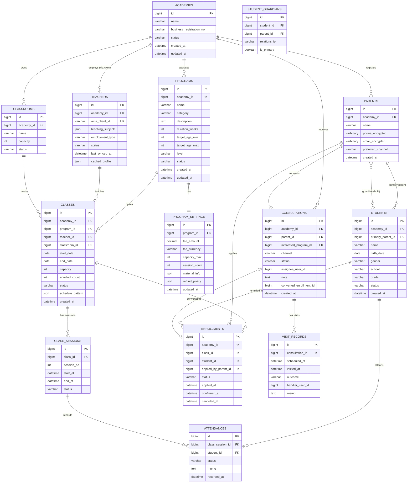

# Trinity Academy — ERD (트리니티 아카데미 데이터 모델)

## Entity Overview (엔티티 개요)

- **Tenant boundary**: `tac_academies` — 모든 주요 테이블은 `academy_id` 컬럼으로 테넌트 격리 (NFR-004)
- **External reference**: `tac_teachers.ama_client_id` → AMA Client (로컬 미저장, API 조회)
- **Strong relationships**:
  - Parent (1) ─ Student (N) via `tac_students.primary_parent_id`
  - Parent (N) ─ Student (N) via `tac_student_guardians` (공동 보호자)
  - Program (1) ─ Class (N) ─ ClassSession (N)
  - Student (N) ─ Class (N) via `tac_enrollments`

## ER Diagram

## Table Definitions (주요 테이블)

### tac_academies
| Column | Type | Null | Default | Description |
|--------|------|------|---------|-------------|
| id | BIGINT | NO | AUTO_INCREMENT | PK |
| name | VARCHAR(200) | NO | | 학원명 |
| business_registration_no | VARCHAR(30) | YES | | 사업자번호 |
| status | VARCHAR(20) | NO | 'ACTIVE' | ACTIVE/SUSPENDED |
| created_at | DATETIME | NO | CURRENT_TIMESTAMP | |
| updated_at | DATETIME | NO | CURRENT_TIMESTAMP ON UPDATE | |

### tac_programs
| Column | Type | Null | Default | Description |
|--------|------|------|---------|-------------|
| id | BIGINT | NO | AUTO_INCREMENT | PK |
| academy_id | BIGINT | NO | | FK tac_academies.id |
| name | VARCHAR(100) | NO | | 프로그램명 |
| category | VARCHAR(30) | NO | | MATH/LANG/MUSIC/ART/PE/OTHER |
| description | TEXT | YES | | |
| duration_weeks | INT | YES | | 총 진행 주수 |
| target_age_min | INT | YES | | |
| target_age_max | INT | YES | | |
| level | VARCHAR(20) | YES | | BEGINNER/INTERMEDIATE/ADVANCED |
| status | VARCHAR(20) | NO | 'DRAFT' | DRAFT/ACTIVE/PUBLISHED/ARCHIVED |
| created_at | DATETIME | NO | | |
| updated_at | DATETIME | NO | | |

Indexes: `(academy_id, status)`, `(academy_id, name)` unique

### tac_program_settings
| Column | Type | Null | Default | Description |
|--------|------|------|---------|-------------|
| id | BIGINT | NO | | PK |
| program_id | BIGINT | NO | | FK tac_programs.id (unique) |
| fee_amount | DECIMAL(12,2) | YES | | 수강료 |
| fee_currency | CHAR(3) | NO | 'KRW' | |
| capacity_max | INT | YES | | 최대 정원 |
| session_count | INT | YES | | 총 회차 |
| material_info | JSON | YES | | 교재 메타 |
| refund_policy | JSON | YES | | 환불 규칙 |

### tac_teachers
| Column | Type | Null | Default | Description |
|--------|------|------|---------|-------------|
| id | BIGINT | NO | | PK |
| academy_id | BIGINT | NO | | FK |
| ama_client_id | VARCHAR(64) | NO | | **AMA 거래처 ID — 단일 진실 원천** |
| teaching_subjects | JSON | YES | | ["수학","물리"] 등 |
| employment_type | VARCHAR(20) | NO | | FULL_TIME/PART_TIME/FREELANCE |
| status | VARCHAR(20) | NO | 'ACTIVE' | ACTIVE/SUSPENDED/TERMINATED |
| last_synced_at | DATETIME | YES | | AMA 동기화 시각 |
| cached_profile | JSON | YES | | 표시용 캐시 (name, phone 등) |

Indexes: `(academy_id, ama_client_id)` unique

### tac_classrooms
학원 내 강의실 마스터. `(academy_id, name)` unique.

### tac_classes
| Column | Type | Null | Description |
|--------|------|------|-------------|
| id | BIGINT | NO | PK |
| academy_id | BIGINT | NO | FK |
| program_id | BIGINT | NO | FK |
| teacher_id | BIGINT | NO | FK |
| classroom_id | BIGINT | YES | FK |
| start_date | DATE | NO | |
| end_date | DATE | YES | |
| capacity | INT | NO | |
| enrolled_count | INT | NO | 캐시 (tac_enrollments 트리거/이벤트로 갱신) |
| status | VARCHAR(20) | NO | DRAFT/OPEN_FOR_ENROLLMENT/IN_PROGRESS/CLOSED |
| schedule_pattern | JSON | NO | `[{weekday, start_time, end_time}]` |

Indexes: `(teacher_id, start_date)`, `(classroom_id, start_date)`

### tac_class_sessions
회차 단위 세션. `tac_classes.schedule_pattern` × `tac_program_settings.session_count`로 자동 생성.

| Column | Type | Null | Description |
|--------|------|------|-------------|
| id | BIGINT | NO | PK |
| class_id | BIGINT | NO | FK |
| session_no | INT | NO | 1,2,3... |
| start_at | DATETIME | NO | |
| end_at | DATETIME | NO | |
| status | VARCHAR(20) | NO | SCHEDULED/COMPLETED/CANCELED/RESCHEDULED |

Indexes: `(class_id, session_no)` unique, `(start_at)`

### tac_parents
개인정보 컬럼(`phone_encrypted`, `email_encrypted`)은 애플리케이션 레벨 AES-GCM 암호화 (NFR-005).

### tac_students
| Column | Type | Null | Description |
|--------|------|------|-------------|
| id | BIGINT | NO | PK |
| academy_id | BIGINT | NO | FK |
| primary_parent_id | BIGINT | NO | **FK tac_parents.id — 주 보호자 (A-001)** |
| name | VARCHAR(100) | NO | |
| birth_date | DATE | YES | |
| gender | CHAR(1) | YES | M/F/O |
| school | VARCHAR(100) | YES | |
| grade | VARCHAR(20) | YES | |
| status | VARCHAR(20) | NO | ACTIVE/INACTIVE |

Indexes: `(primary_parent_id)`, `(academy_id, name)`

### tac_student_guardians (M:N 공동보호자)
| Column | Type | Null | Description |
|--------|------|------|-------------|
| id | BIGINT | NO | PK |
| student_id | BIGINT | NO | FK |
| parent_id | BIGINT | NO | FK |
| relationship | VARCHAR(20) | YES | FATHER/MOTHER/GRANDPARENT/OTHER |
| is_primary | BOOLEAN | NO | FALSE |

Unique: `(student_id, parent_id)`

### tac_consultations
| Column | Type | Null | Description |
|--------|------|------|-------------|
| id | BIGINT | NO | PK |
| academy_id | BIGINT | NO | |
| parent_id | BIGINT | YES | FK (temp 시 null 가능) |
| interested_program_id | BIGINT | YES | FK |
| channel | VARCHAR(20) | NO | PHONE/ONLINE/VISIT/REFERRAL |
| status | VARCHAR(20) | NO | OPEN/FOLLOW_UP/CONVERTED/LOST |
| assignee_user_id | BIGINT | YES | 담당 직원 |
| note | TEXT | YES | |
| converted_enrollment_id | BIGINT | YES | FK tac_enrollments.id (전환 시) |
| created_at | DATETIME | NO | |

### tac_visit_records
| Column | Type | Null | Description |
|--------|------|------|-------------|
| id | BIGINT | NO | PK |
| consultation_id | BIGINT | NO | FK |
| scheduled_at | DATETIME | YES | 예약 일시 |
| visited_at | DATETIME | YES | 실제 방문 |
| outcome | VARCHAR(20) | YES | INTERESTED/DECLINED/PENDING |
| handler_user_id | BIGINT | YES | |
| memo | TEXT | YES | |

### tac_enrollments (수강)
| Column | Type | Null | Description |
|--------|------|------|-------------|
| id | BIGINT | NO | PK |
| academy_id | BIGINT | NO | |
| class_id | BIGINT | NO | FK |
| student_id | BIGINT | NO | FK |
| applied_by_parent_id | BIGINT | NO | FK — 신청 주체 학부모 |
| status | VARCHAR(20) | NO | PENDING/CONFIRMED/WAITLIST/IN_PROGRESS/COMPLETED/CANCELED/WITHDRAWN |
| applied_at | DATETIME | NO | |
| confirmed_at | DATETIME | YES | |
| canceled_at | DATETIME | YES | |

Unique: `(class_id, student_id)` — 동일 강의 중복 등록 방지
Indexes: `(academy_id, status)`, `(student_id, status)`

### tac_attendances
| Column | Type | Null | Description |
|--------|------|------|-------------|
| id | BIGINT | NO | PK |
| class_session_id | BIGINT | NO | FK |
| student_id | BIGINT | NO | FK |
| status | VARCHAR(20) | NO | PRESENT/ABSENT/LATE/EARLY_LEAVE |
| memo | TEXT | YES | |
| recorded_at | DATETIME | NO | |

Unique: `(class_session_id, student_id)`

## v1.2 Additional Entities — MAP / Timetable / Trinity Pay / Portal

### tac_class_sessions (v1.2 확장)
기존 테이블에 컬럼 추가:
| Column | Type | Null | Description |
|--------|------|------|-------------|
| planned_duration_hours | DECIMAL(3,1) | YES | 계획 수업 시간 (0.5h 단위) |
| actual_duration_hours | DECIMAL(3,1) | YES | 실제 수업 시간 (A-007: 0.5h 단위) |
| session_status | VARCHAR(20) | NO | HELD/CANCELLED/MAKEUP (FR-032) |
| cancel_reason | VARCHAR(100) | YES | 결강 사유 (수업 확인표 비고란) |
| makeup_of_session_id | BIGINT | YES | FK self — 보강 원 세션 (FR-033) |
| memo | TEXT | YES | |

### tac_map_passages (MAP 지문)
| Column | Type | Null | Description |
|--------|------|------|-------------|
| id | BIGINT | NO | PK |
| academy_id | BIGINT | YES | FK — NULL=공용 풀 (Q-006) |
| title | VARCHAR(200) | NO | |
| body | TEXT | NO | 지문 본문 |
| grade_level | VARCHAR(10) | NO | G2, G3, G4, G5 |
| domain | VARCHAR(20) | NO | 'RC' (지문은 RC 한정) |
| pair_group_id | BIGINT | YES | Passage 1/2 대비쌍 묶음 |
| source | VARCHAR(200) | YES | 출처 |
| version | INT | NO | 버전 (FR-028) |
| status | VARCHAR(20) | NO | DRAFT/ACTIVE/ARCHIVED |

### tac_map_passage_assets
지문에 포함된 이미지/표. S3 URL 저장 (Q-012 결정안).

### tac_map_items (MAP 문항)
| Column | Type | Null | Description |
|--------|------|------|-------------|
| id | BIGINT | NO | PK |
| academy_id | BIGINT | YES | |
| passage_id | BIGINT | YES | FK (RC 문항 시) |
| parent_item_id | BIGINT | YES | FK self — Part A-B의 Part B (A-006) |
| domain | VARCHAR(20) | NO | RC/MATH/LANGUAGE |
| grade_level | VARCHAR(10) | NO | |
| difficulty | VARCHAR(20) | NO | BASIC/INTERMEDIATE/ADVANCED |
| type | VARCHAR(20) | NO | SINGLE/MULTI/PART_AB |
| stem | TEXT | NO | 문두(질문) |
| options | JSON | NO | 보기 배열 |
| answer_keys | JSON | NO | **복수 정답 가능한 정답 인덱스 배열** |
| explanation | TEXT | YES | |
| points | INT | NO | 배점 (기본 1) |
| version | INT | NO | |
| status | VARCHAR(20) | NO | DRAFT/ACTIVE/ARCHIVED |

### tac_map_item_tags (M:N 스킬/주제 태그)
`(item_id, tag)` unique — tag 예: 'main_idea', 'vocabulary', 'inference'

### tac_map_test_sets (시험지)
| Column | Type | Null | Description |
|--------|------|------|-------------|
| id | BIGINT | NO | PK |
| academy_id | BIGINT | NO | |
| name | VARCHAR(100) | NO | |
| composition_mode | VARCHAR(20) | NO | FIXED/AUTO |
| filter_criteria | JSON | YES | AUTO 모드 시 필터 |
| total_points | INT | NO | |
| status | VARCHAR(20) | NO | DRAFT/PUBLISHED/ARCHIVED |

### tac_map_test_set_items
시험지-문항 연결. `item_version_snapshot` JSON 컬럼으로 배정 당시 문항 스냅샷 저장 (FR-028).

### tac_map_assignments (시험지 배정)
| Column | Type | Null | Description |
|--------|------|------|-------------|
| id | BIGINT | NO | PK |
| test_set_id | BIGINT | NO | FK |
| target_type | VARCHAR(20) | NO | CLASS/STUDENT |
| target_id | BIGINT | NO | |
| due_at | DATETIME | NO | |
| status | VARCHAR(20) | NO | ASSIGNED/SUBMITTED/GRADED |

### tac_map_responses (응시 답안)
| Column | Type | Null | Description |
|--------|------|------|-------------|
| id | BIGINT | NO | PK |
| assignment_id | BIGINT | NO | FK |
| student_id | BIGINT | NO | FK |
| item_id | BIGINT | NO | FK |
| answer | JSON | NO | 선택 인덱스 배열 |
| is_correct | BOOLEAN | NO | |
| points_earned | INT | NO | |
| submitted_at | DATETIME | NO | |

### tac_map_scores (성적 이력, FR-034)
| Column | Type | Null | Description |
|--------|------|------|-------------|
| id | BIGINT | NO | PK |
| student_id | BIGINT | NO | FK |
| assessed_at | DATE | NO | 시험 일자 |
| reading_score | INT | YES | |
| math_score | INT | YES | |
| language_score | INT | YES | |
| source | VARCHAR(30) | NO | 'SYSTEM'(자동) / 'IMPORT'(xlsx) / 'MANUAL' |

### tac_external_test_scores (FR-035)
SSAT/ISEE/GPA 등 외부 시험 점수.
`{ student_id, test_type, test_date, score_raw, score_percentile?, note }`

### tac_counseling_records (FR-036)
`{ student_id, counseled_at, counselor_id, topics_json, goals_json, satisfaction_note, next_action }`

### Trinity Pay — tac_pay_orders (FR-039, FR-040)
| Column | Type | Null | Description |
|--------|------|------|-------------|
| id | BIGINT | NO | PK |
| enrollment_id | BIGINT | NO | FK |
| academy_id | BIGINT | NO | |
| order_no | VARCHAR(40) | NO | 자체 주문번호 (사용자 노출) |
| idempotency_key | VARCHAR(64) | NO | **UNIQUE** — Webhook 중복 방어 |
| amount | DECIMAL(12,2) | NO | 결제 요청액 |
| currency | CHAR(3) | NO | 'KRW' |
| method | VARCHAR(20) | YES | CARD/TRANSFER/VACCOUNT/EASY_PAY |
| pg_provider | VARCHAR(20) | NO | **고정값 'TOSS'** (A-011) |
| pg_order_id | VARCHAR(64) | YES | Toss `orderId` (=order_no) |
| pg_payment_key | VARCHAR(200) | YES | **Toss `paymentKey`, 카드 원본 PAN 미저장 (NFR-011)** |
| status | VARCHAR(30) | NO | READY/IN_PROGRESS/DONE/CANCELED/PARTIAL_CANCELED/ABORTED/EXPIRED (Toss status mirror) |
| refund_policy_version_id | BIGINT | NO | **FK → tac_pay_refund_policies.id** — 발행 시점 정책 snapshot (A-012) |
| expires_at | DATETIME | YES | 가상계좌 입금 만료 등 |
| approved_at | DATETIME | YES | Confirm API 성공 시각 |
| canceled_at | DATETIME | YES | 전액 취소 시각 |
| created_at | DATETIME | NO | |

### tac_pay_refund_policies (FR-041, FR-047) ★ v1.3 신규
학원의 환불 규정을 버전 관리. 기본값은 **학원법 시행령 제18조** 템플릿.
| Column | Type | Null | Description |
|--------|------|------|-------------|
| id | BIGINT | NO | PK |
| academy_id | BIGINT | NO | |
| version | INT | NO | 1, 2, 3... (academy_id 내 증가) |
| basis | VARCHAR(20) | NO | 'SESSION'(수업일·회차 기준) / 'CALENDAR'(달력일) — 기본 SESSION |
| label | VARCHAR(100) | NO | "학원법 시행령 제18조 기본 3단계" 등 |
| effective_from | DATE | NO | 이 정책이 적용되는 결제 생성일 시작 |
| effective_to | DATE | YES | NULL = 현재 |
| is_default_template | TINYINT(1) | NO | 0/1, 시스템 시드 여부 |
| created_by | BIGINT | NO | FK users |
| created_at | DATETIME | NO | |

UNIQUE (academy_id, version)

### tac_pay_tac_pay_refund_policy_tiers (FR-041, FR-047) ★ v1.3 신규
정책 한 버전에 대해 경과 구간별 환불률. 학원법 기본값은 3개 tier:
`elapsed ≤ 0 → 100%`, `elapsed ≤ 1/3 → 66.67%`, `elapsed ≤ 1/2 → 50%`, `elapsed > 1/2 → 0%`.
| Column | Type | Null | Description |
|--------|------|------|-------------|
| id | BIGINT | NO | PK |
| policy_id | BIGINT | NO | FK tac_pay_refund_policies |
| tier_order | TINYINT | NO | 0,1,2,3... (정렬/표시) |
| elapsed_ratio_min | DECIMAL(5,4) | NO | 초과(`>`) 기준. 0.0000 = 교습 시작 |
| elapsed_ratio_max | DECIMAL(5,4) | NO | 이하(`≤`) 기준. 1.0000 = 교습 종료. 개구간 표현 위해 min< x ≤max |
| refund_rate | DECIMAL(5,4) | NO | 0.0000 ~ 1.0000 (예: 0.6667) |
| note | VARCHAR(200) | YES | 예: "교습 개시 전" |

UNIQUE (policy_id, tier_order), CHECK (elapsed_ratio_min < elapsed_ratio_max)

경과율(`elapsed`)은 `payment_orders → enrollments → tac_classes → tac_class_sessions` 로부터
`진행된 세션 수 / 전체 세션 수` 로 계산한다 (basis='SESSION').

### tac_pay_ledger (FR-042)
| Column | Type | Null | Description |
|--------|------|------|-------------|
| id | BIGINT | NO | PK |
| payment_order_id | BIGINT | NO | FK |
| entry_type | VARCHAR(20) | NO | CHARGE/REFUND/ADJUSTMENT |
| amount | DECIMAL(12,2) | NO | 부호 있음 (환불=음수) |
| balance_after | DECIMAL(12,2) | NO | 주문 누적 |
| refund_tier_id | BIGINT | YES | FK tac_pay_refund_policy_tiers — 환불 시 적용된 구간 (감사용) |
| elapsed_ratio_at_refund | DECIMAL(5,4) | YES | 환불 계산 시 경과율 snapshot |
| memo | VARCHAR(200) | YES | |
| recorded_at | DATETIME | NO | |

### tac_pay_receipts (간이영수증/현금영수증 기록, FR-042) — **v1.3 재정의**
세금계산서는 별도 `tac_pay_tax_invoices`로 분리되었으며, 본 테이블은 간이/현금영수증 PDF 보관 용도.
| Column | Type | Null | Description |
|--------|------|------|-------------|
| id | BIGINT | NO | PK |
| payment_order_id | BIGINT | NO | FK |
| receipt_type | VARCHAR(20) | NO | CASH_RECEIPT(현금영수증) / SIMPLE(간이영수증) |
| issued_at | DATETIME | NO | |
| pdf_url | VARCHAR(500) | YES | S3 URL |
| cash_receipt_no | VARCHAR(64) | YES | 현금영수증 승인번호(NTS) |
| buyer_identifier | VARCHAR(40) | YES | 휴대폰번호/주민번호(암호화) — 현금영수증용 |

### tac_pay_tax_invoices (전자세금계산서 자체 발행, FR-048) ★ v1.3 신규
국세청 홈택스 eTax API로 자체 발행한 전자세금계산서의 발행 상태·승인번호 추적.
| Column | Type | Null | Description |
|--------|------|------|-------------|
| id | BIGINT | NO | PK |
| payment_order_id | BIGINT | NO | FK |
| academy_id | BIGINT | NO | |
| invoice_no | VARCHAR(40) | NO | 자체 일련번호 (학원별 연도-순번) |
| nts_issue_no | VARCHAR(24) | YES | 국세청 발급승인번호 (24자리) |
| supplier_biz_no | VARCHAR(13) | NO | 공급자(학원) 사업자등록번호 |
| buyer_biz_no | VARCHAR(13) | YES | 공급받는자 사업자번호 (개인은 NULL) |
| buyer_type | VARCHAR(20) | NO | CORP(사업자) / INDIVIDUAL(개인) |
| supply_amount | DECIMAL(12,2) | NO | 공급가액 |
| tax_amount | DECIMAL(12,2) | NO | 부가세 |
| total_amount | DECIMAL(12,2) | NO | 합계 (= supply + tax) |
| issue_date | DATE | NO | 작성일자 |
| status | VARCHAR(20) | NO | DRAFT/SUBMITTED/APPROVED/REJECTED/CANCELED |
| nts_submitted_at | DATETIME | YES | 홈택스 전송 시각 (NFR-013 공급 익월 10일 마감) |
| nts_approved_at | DATETIME | YES | |
| nts_error_code | VARCHAR(30) | YES | 전송 실패 시 |
| nts_error_message | VARCHAR(500) | YES | |
| xml_payload_url | VARCHAR(500) | YES | S3 저장된 전자세금계산서 XML (전자서명 포함) |
| pdf_url | VARCHAR(500) | YES | 학부모 교부용 PDF |

UNIQUE (academy_id, invoice_no)

### tac_consultation_intake_form (FR-044)
포털 Contact 페이지 제출 버퍼. 스팸/중복 검사 후 `tac_consultations`로 승격.
`{ id, parent_name, phone, child_grade, program_interest, preferred_date, message, consent_pi, captcha_score, ip, user_agent, status(NEW/PROMOTED/SPAM) }`

### tac_posts (FR-043 News)
자체 관리 시: `{ id, academy_id, slug, title, body_md, author_user_id, published_at, cover_image_url }`
Q-017에 따라 헤드리스 CMS로 대체 가능.

## Migration Notes (마이그레이션)
- v1.0 → v1.2: 위 엔티티 모두 신규 테이블 또는 `tac_class_sessions` 컬럼 추가. 기존 row 영향 없음.
- `enrolled_count` 컬럼은 캐시이므로 `enrollment.created/canceled` 이벤트 구독 배치로 정합 (RabbitMQ)
- AMA Client 매핑 테이블은 별도 `tac_teachers.ama_client_id`만으로 연결 — 중간 매핑 테이블 불필요
- Excel Import(FR-038): `tac_map_scores.source='IMPORT'` 로 구분하여 재가공 가능하게 보존

## Referential Integrity / Data Rules
- 학생(tac_students)은 반드시 `primary_parent_id` 필수 — Application level enforce (FN-022)
- Enrollment 생성 시 `applied_by_parent_id`는 student의 primary_parent이거나 `tac_student_guardians`에 등록된 parent여야 함 — Application level enforce (FN-042)
- Class의 `enrolled_count`가 `capacity`를 초과하지 않도록 transaction 잠금 (SELECT ... FOR UPDATE) 적용 권장
- **Trinity Pay 결제 트랜잭션은 `idempotency_key` unique constraint로 중복 Webhook 방어**
- **카드 PAN·CVC는 절대 저장 금지** (NFR-011 PCI-DSS SAQ-A). 오직 Toss `paymentKey` (`pg_payment_key`) 만 보관
- **환불 정책 snapshot**: `tac_pay_orders.refund_policy_version_id` 는 결제 시점 정책에 고정되어, 이후 정책 개정이 과거 결제 환불액에 소급되지 않는다 (A-012, FR-047)
- **세금계산서 시한 준수**: `tax_invoices.nts_submitted_at` 은 `tac_pay_orders.approved_at` 익월 10일 이내여야 한다 (NFR-013 전자세금계산서법). 배치 스케줄러가 미전송 건을 익월 5일 경고.
- `item_versions` / `tac_map_test_set_items.item_version_snapshot`으로 문항 수정 후에도 과거 시험지 일관성 유지
