# Trinity Academy — Sequence Diagrams (트리니티 아카데미 시퀀스 다이어그램)

본 문서는 주요 시나리오의 컴포넌트 간 상호작용을 Mermaid `sequenceDiagram`으로 정의한다.
Frontend는 **React 18 + Next.js 14 App Router** (포털 + 관리 콘솔 공통), Backend는 **Next.js Route Handlers**, Queue는 **RabbitMQ**, DB는 **MySQL 8**, Storage는 **S3 호환**을 사용한다.

> **AMA 경계 원칙**: 아래 시퀀스에서 AMA는 교사 마스터 참조(Scenario 3, 7) 와 알림(AmoebaTalk, 여러 시나리오)에만 등장한다. **결제(Scenario 10)에는 AMA가 등장하지 않는다.**

---

## Scenario 1: Consultation Intake (학부모 상담 접수) — FN-010

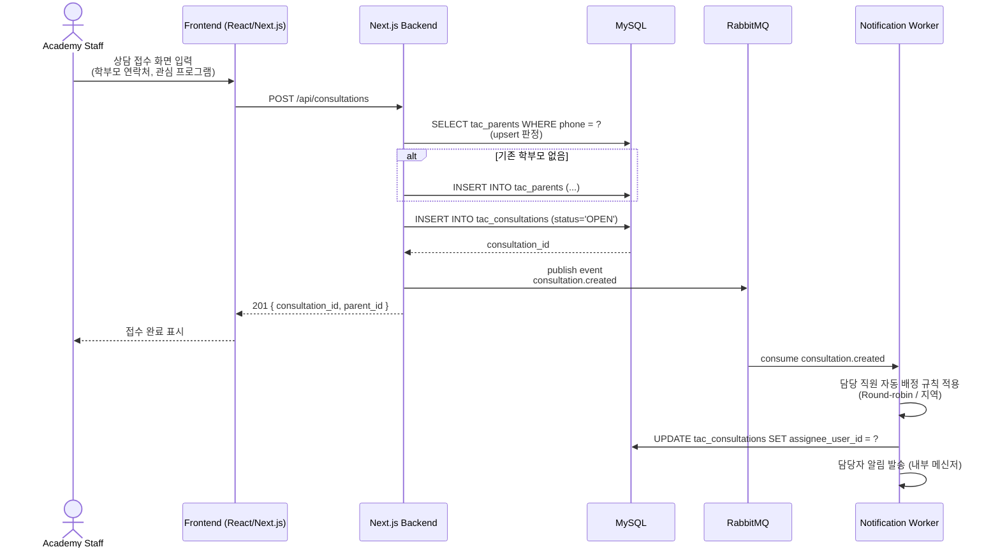

---

## Scenario 2: Visit Record & Conversion (방문→등록 전환) — FN-011, FN-012

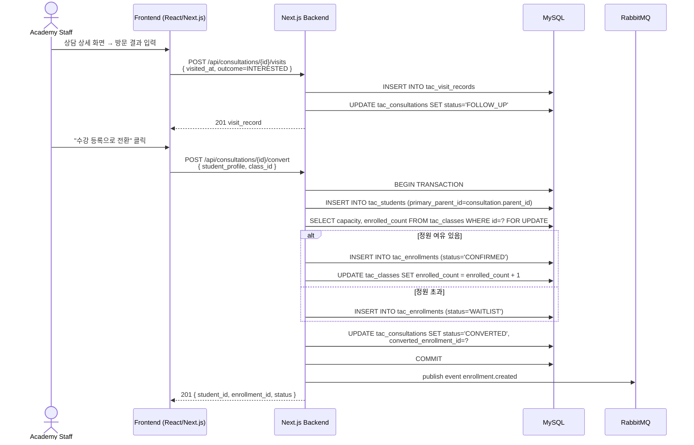

---

## Scenario 3: Teacher Registration via AMA (교사 등록 — AMA Client 참조) — FN-030

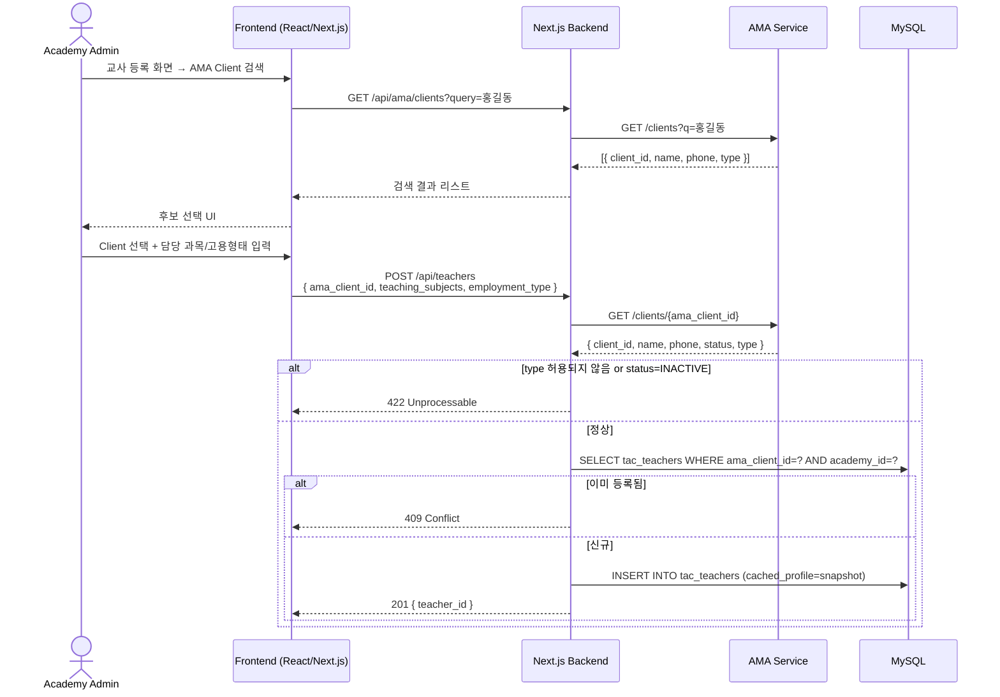

---

## Scenario 4: Class Creation + Session Generation (강의 개설 & 회차 자동 생성) — FN-040

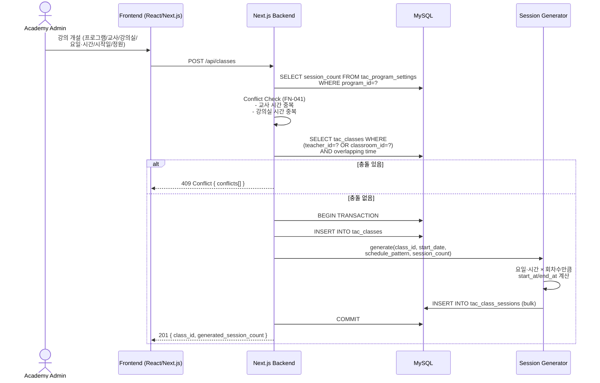

---

## Scenario 5: Teacher Schedule View (교사 스케줄 조회) — FN-050

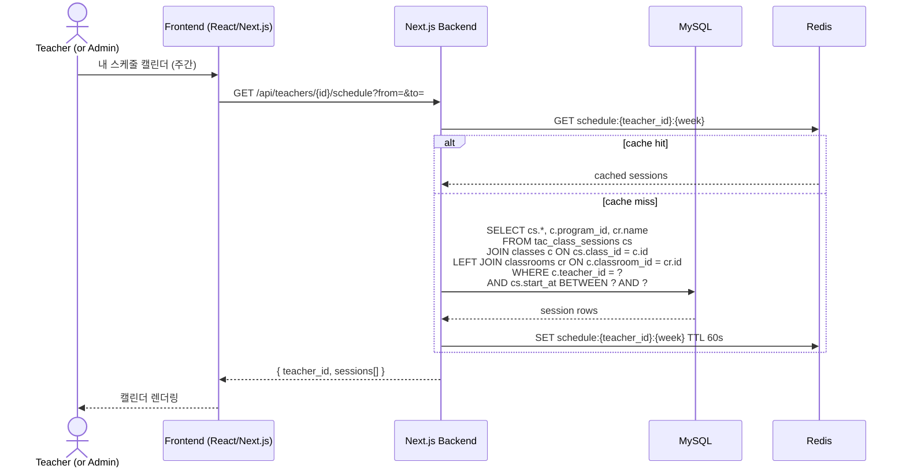

---

## Scenario 6: Parent Enrolls Student to Class (학부모 수강 등록) — FN-042

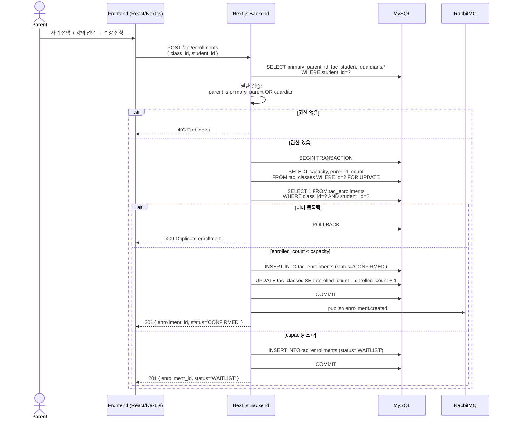

---

## Scenario 7: AMA Teacher Sync via Webhook (교사 정보 동기화) — FN-031

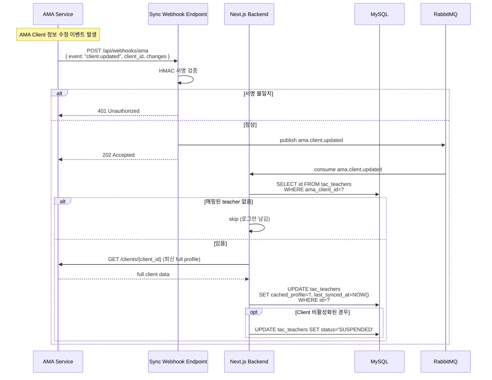

---

## Scenario 8: Portal Intake → Consultation Promotion (포털 상담 승격) — FN-114, PRC-080

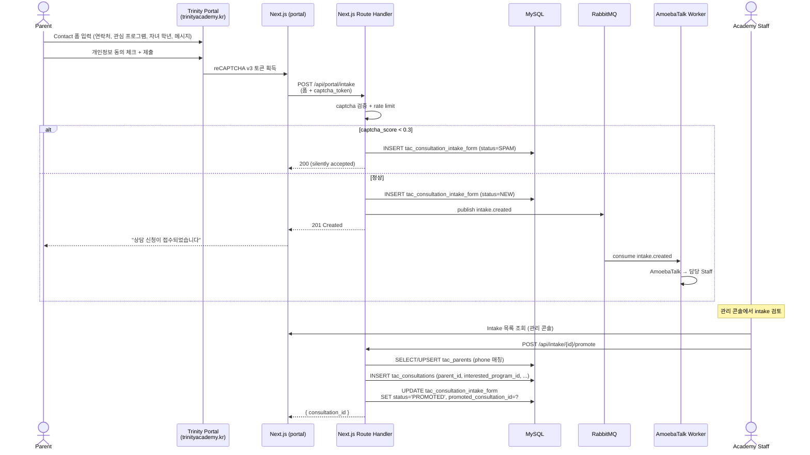

---

## Scenario 9: MAP Assignment & Grading (MAP 시험지 배정 및 채점) — FN-074, FN-075

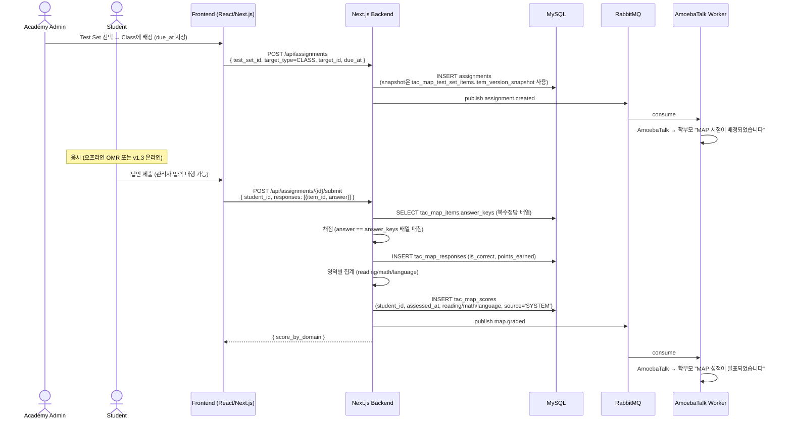

---

## Scenario 10: Trinity Pay — Enrollment Payment (Toss 직결) — FN-100, FN-101, PRC-070

> **중요**: 이 시나리오에 **AMA는 등장하지 않는다.** 결제는 Trinity ↔ **Toss Payments** ↔ 학부모 사이에서만 이루어진다 (C-003 revised, A-009, A-011).

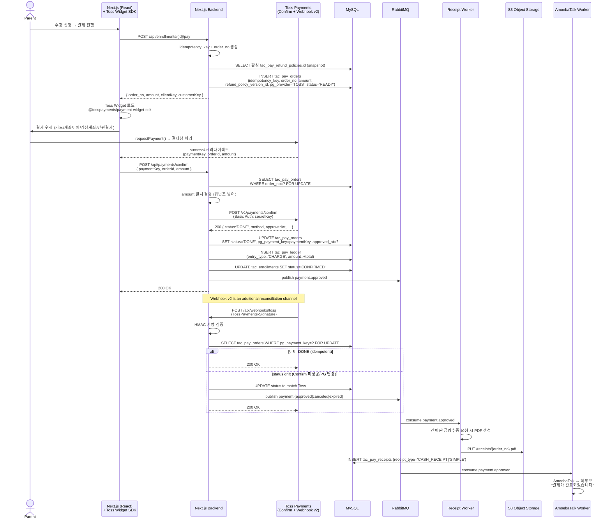

---

## Scenario 11: Session Recording with Color Code (수업 회차 기록 — 초록/빨강) — FN-082, PRC-060

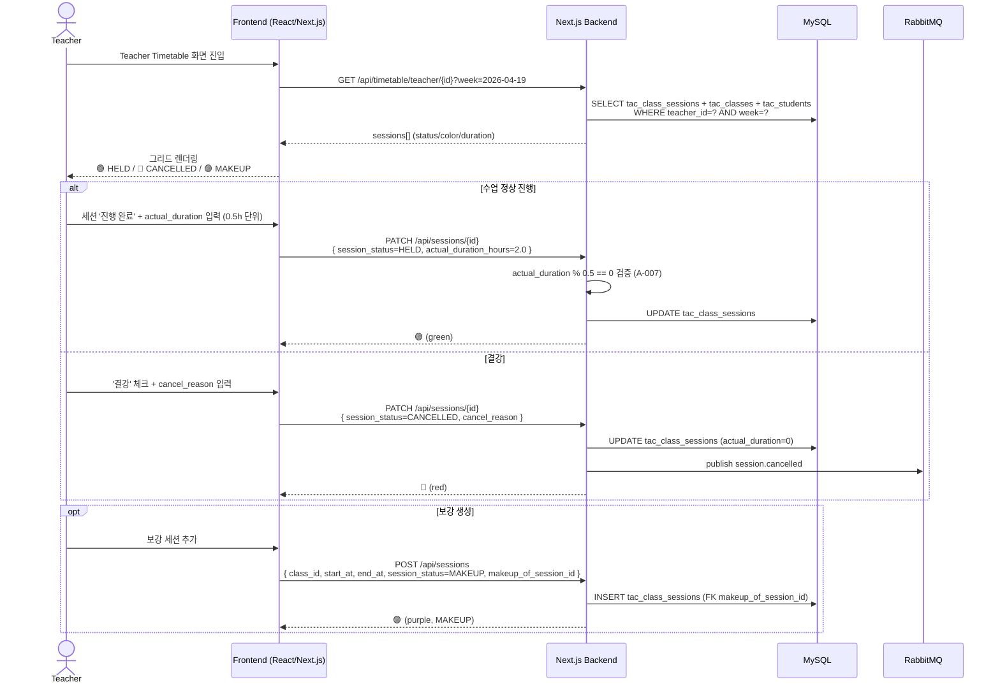

---

## Scenario 12: Refund — Session-based (수업일 기준 환불) — FN-102, PRC-075

> 환불율은 결제 시점 snapshot 된 `tac_pay_orders.refund_policy_version_id` 의 tier table 로 계산한다 (A-012).
> 학원법 시행령 제18조 3단계 기본값: `0 → 100%`, `≤1/3 → 66.67%`, `≤1/2 → 50%`, `>1/2 → 0%`.

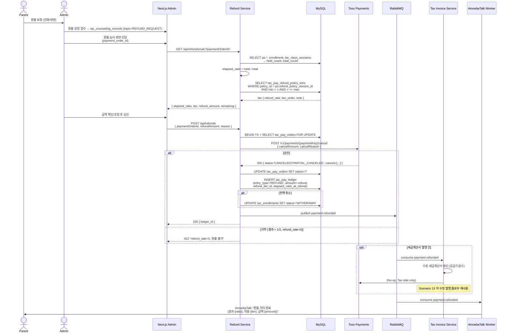

---

## Scenario 13: Tax Invoice Issuance — NTS Hometax eTax 직결 — FN-106, PRC-076

> 팝빌/바로빌 등 SaaS 중계 없이 **국세청 홈택스 전자세금계산서 발급 API** 에 직접 제출한다 (A-013).
> 공동인증서는 서버 HSM/KMS 에 보관하고 XML 전자서명 시에만 언커버된다.

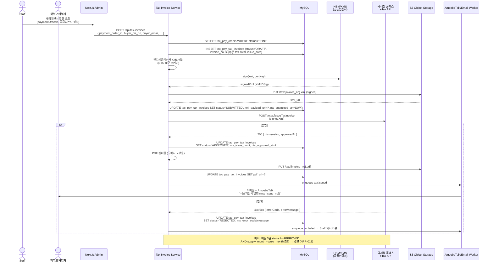

