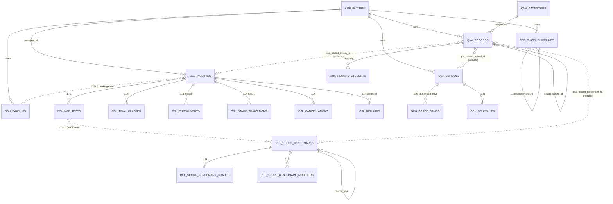
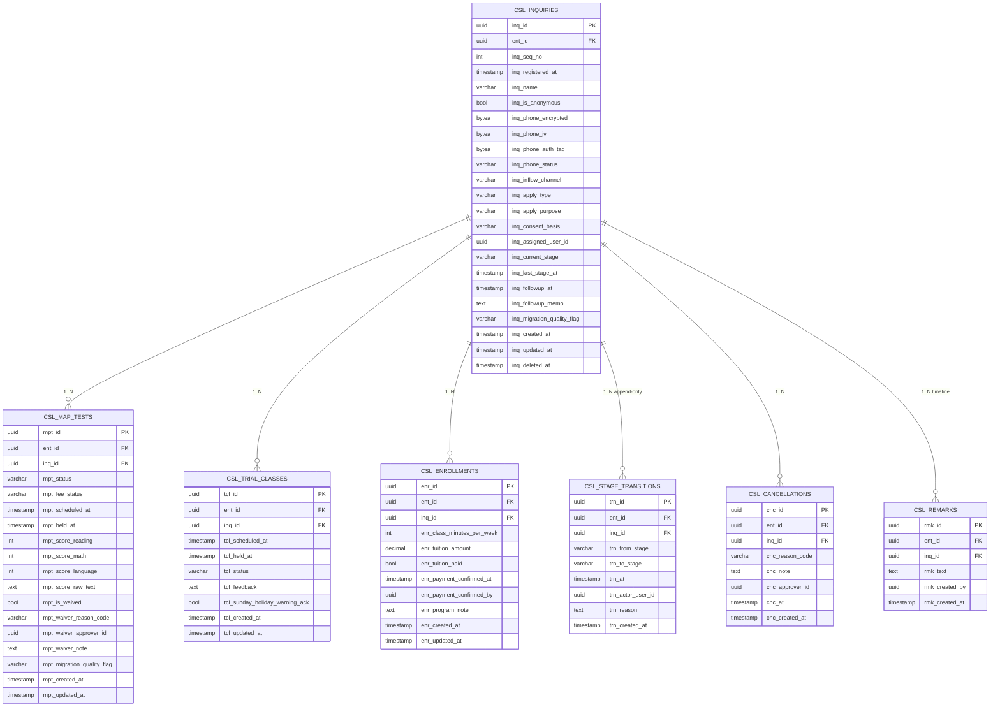
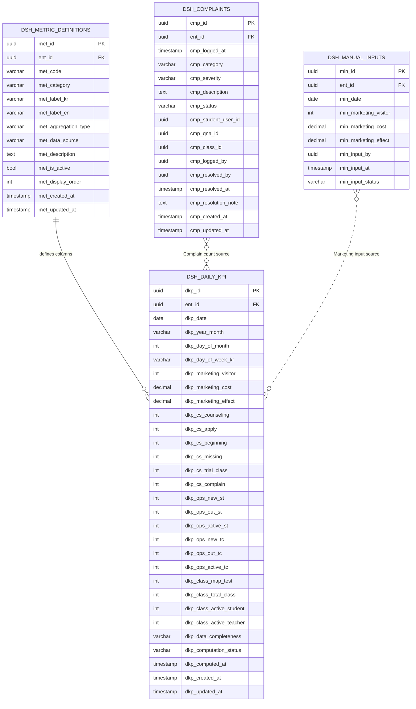
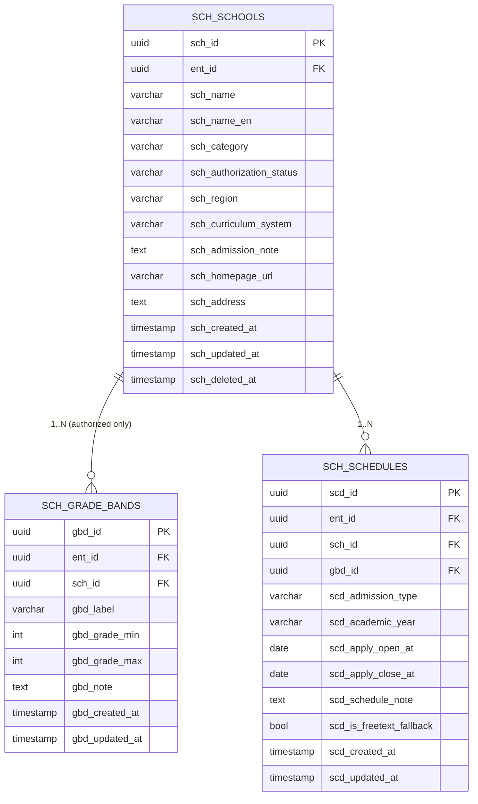
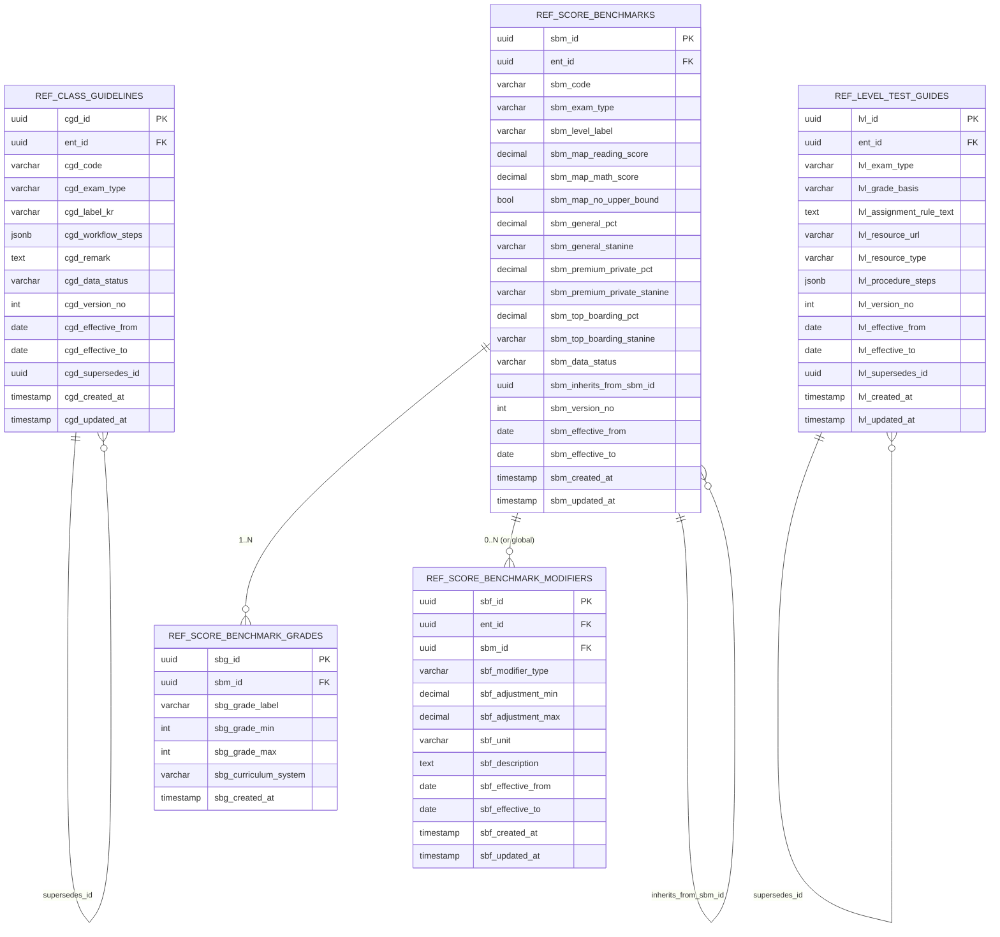
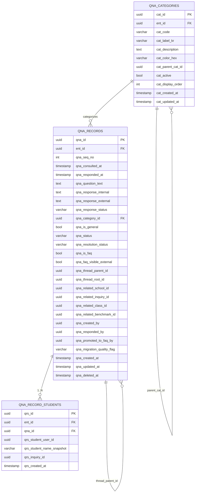

# ACM v1.0a — Entity Relationship Diagram (학원관리앱 ERD)

> **Scope**: 5 modules in v1.0a (DSH, CSL, SCH, REF, QNA) — total **22 tables**.
> **Database**: `db_amb` (shared with AMB Core). Prefix: `amb_acm_*`.
> **Tenant boundary**: Every business table carries `ent_id UUID NOT NULL` (FK → `amb_entities.ent_id`); enforced by `OwnEntityGuard`.
> **CLS module**: Out of scope for this ERD (covered in ACM-ERD-CLS-001 for v1.0b).

---

## 1. Overview (개요)

### 1.1 Conventions (규약)

| Item | Rule | Example |
|---|---|---|
| Schema | `db_amb` shared | — |
| Table | `amb_acm_{module}_{plural}` | `amb_acm_csl_inquiries` |
| PK | `{prefix}_id UUID v4` | `inq_id` (CHAR(36)) |
| FK | matching parent column name | `inq_id` in child tables |
| Tenant | `ent_id UUID NOT NULL` (every business table) | indexed, OwnEntityGuard enforced |
| Audit | `{prefix}_created_at`, `{prefix}_updated_at` (TIMESTAMP NOT NULL DEFAULT now()) | — |
| Soft-delete | `{prefix}_deleted_at` (TIMESTAMP NULL) | NFR-013 |
| ENUM | Stored as `VARCHAR(40)` with CHECK constraint; UPPER_SNAKE values | `INTAKE`, `MAP_TEST` |
| Encryption | 3-field: `*_encrypted` (BYTEA) + `*_iv` (BYTEA) + `*_auth_tag` (BYTEA) | `inq_phone_encrypted` |
| Versioning | `{prefix}_version_no` + `{prefix}_effective_from/to` (REF only) | `cgd_version_no` |
| JSONB | for flexible/array structures | `cgd_workflow_steps` |

### 1.2 Module → Table Map

| Module | Tables | Count |
|---|---|---|
| **CSL** | inquiries, map_tests, trial_classes, enrollments, stage_transitions, cancellations, remarks | 7 |
| **DSH** | daily_kpi, manual_inputs, metric_definitions, complaints | 4 |
| **SCH** | schools, grade_bands, schedules | 3 |
| **REF** | class_guidelines, level_test_guides, score_benchmarks, score_benchmark_grades, score_benchmark_modifiers | 5 |
| **QNA** | records, record_students, categories | 3 |
| **Total** | — | **22** |

### 1.3 External References (외부 참조)

| FK | Refers to | Module |
|---|---|---|
| `ent_id` | `amb_entities.ent_id` (AMB Core) | All tables |
| `*_user_id` | `amb_users.user_id` (AMB Core) | actor / advisor / approver fields |
| (future) `cls_*_id` | `amb_acm_cls_*` (v1.0b) | CSL.F-24 trigger; placeholder column only in v1.0a |

---

## 2. High-Level Cross-Module ERD (모듈 간 통합 다이어그램)



### 2.1 Key Cross-Module Relationships

| From | To | Type | Purpose |
|---|---|---|---|
| `csl_map_tests` (F-13 score) | `ref_score_benchmarks` | Soft lookup by (exam_type, grade, asOfDate) | Inline gap analysis (BR-CSL-010) |
| `csl_inquiries` (F-24 class_started) | `cls_classes` (v1.0b) | Cross-module event `CSL.CLASS_STARTED → CLS.SCHEDULE_INITIATED` | v1.0a: emits event only, no FK |
| `csl_*` (any CRUD) | `dsh_daily_kpi` | Domain event → STALE marking | Lazy recompute |
| `qna_records` | `sch_schools` / `csl_inquiries` / `ref_score_benchmarks` | Optional FK (nullable) | Cross-module Q&A attach |
| Any module SLA breach | AMB Core Issue API | One-way HTTP | `source:acm` labeled tasks |

---

## 3. CSL — Counseling Management (신규상담)

### 3.1 Module ERD



### 3.2 ENUM Catalog (CSL)

| ENUM | Values | Source |
|---|---|---|
| `inq_phone_status` | `VALID`, `DECLINED`, `INVALID`, `MISSING` | Q-CSL-010 |
| `inq_inflow_channel` | `HOMEPAGE`, `KAKAOTALK`, `PHONE`, `REFERRAL`, `OTHER` | F-02 |
| `inq_apply_type` | `COUNSELING_ONLY`, `EXAM_ONLY`, `BOTH` | Q-CSL-009 |
| `inq_apply_purpose` | `MAP_SCORE_UP`, `GPA`, `INTL_SCHOOL_PREP`, `STD_TEST`, `BOARDING`, `OTHER` | F-08 |
| `inq_consent_basis` | `HOMEPAGE_FORM`, `KAKAO_TOS`, `PHONE_VERBAL`, `MIGRATION_LEGACY` | Q-CSL-010 |
| `inq_current_stage` | `INTAKE`, `MAP_TEST`, `TRIAL_CLASS`, `ENROLLMENT_COUNSELING`, `PAYMENT`, `CLASS_STARTED`, `DROPPED` | Pipeline |
| `inq_migration_quality_flag` | `NONE`, `MIGRATION_OK`, `AMBIGUOUS`, `STAGE_INCONSISTENT`, `ERROR` | M03-M06 |
| `mpt_status` | `SCHEDULED`, `HELD`, `WAIVED`, `NO_SHOW`, `CANCELLED` | — |
| `mpt_fee_status` | `PAID`, `WAIVED`, `OVERDUE`, `REFUNDED` | F-12 |
| `mpt_waiver_reason_code` | `RECENT_RETEST_90D`, `TRIAL_PROMOTION`, `SISTER_ACADEMY_TRANSFER` | Q-CSL-002 |
| `tcl_status` | `SCHEDULED`, `HELD`, `NO_SHOW`, `CANCELLED` | — |
| `cnc_reason_code` | `ACADEMY`, `STUDENT_ILLNESS`, `SCHEDULE_CHANGE`, `PAYMENT_DECLINED`, `LOST_TO_COMPETITOR`, `OTHER` | Q-CSL-006 |

### 3.3 Index Strategy (CSL)

| Index | Columns | Purpose |
|---|---|---|
| `idx_csl_inq_ent_stage` | `(ent_id, inq_current_stage)` | List filter by stage |
| `idx_csl_inq_ent_registered` | `(ent_id, inq_registered_at DESC)` | Default sort |
| `idx_csl_inq_assigned` | `(ent_id, inq_assigned_user_id, inq_current_stage)` | "내가 담당하는 진행 중" |
| `uq_csl_inq_seq` | `(ent_id, inq_seq_no)` UNIQUE | Per-tenant sequence |
| `idx_csl_trn_inq` | `(inq_id, trn_at DESC)` | Stage history view |
| `idx_csl_rmk_inq` | `(inq_id, rmk_created_at DESC)` | Timeline view |

### 3.4 Constraints (CSL)

- `inq_is_anonymous=TRUE` ⇒ `inq_name = 'unknown'` enforced at app layer
- `inq_current_stage` transition validated by `StageTransitionService` (only allowed transitions per state machine BR-CSL-006)
- `enr_payment_confirmed_by` MUST be a user with `senior_manager` role (BR-CSL-012, app layer check)
- `enr_tuition_amount > 50,000,000` ⇒ requires `admin` role override (Q-CSL-008)

---

## 4. DSH — Dashboard

### 4.1 Module ERD



### 4.2 ENUM Catalog (DSH)

| ENUM | Values |
|---|---|
| `dkp_data_completeness` | `COMPLETE`, `PARTIAL_PENDING_MANUAL`, `PARTIAL_FUTURE`, `STALE`, `ERROR` |
| `dkp_computation_status` | `FRESH`, `STALE`, `RECOMPUTING`, `FAILED` |
| `met_category` | `MARKETING`, `CS`, `OPERATING`, `CLASS` |
| `met_aggregation_type` | `VOLUME_COUNT`, `STATUS_SNAPSHOT`, `DAILY_DISTINCT`, `NET_DELTA`, `COMPUTED` |
| `met_data_source` | `CSL_INQUIRIES`, `CSL_MAP_TESTS`, `CSL_TRIAL_CLASSES`, `CLS_SESSIONS`, `CLS_CLASSES`, `DSH_MANUAL_INPUTS`, `DSH_COMPLAINTS`, `EXTERNAL_ANALYTICS` |
| `min_input_status` | `DRAFT`, `SUBMITTED`, `LOCKED` |
| `cmp_category` | `CLASS_QUALITY`, `INSTRUCTOR`, `SCHEDULING`, `PAYMENT`, `FACILITIES`, `OTHER` |
| `cmp_severity` | `LOW`, `MEDIUM`, `HIGH`, `CRITICAL` |
| `cmp_status` | `LOGGED`, `INVESTIGATING`, `RESOLVED`, `UNRESOLVED` |

### 4.3 Index Strategy (DSH)

| Index | Columns | Purpose |
|---|---|---|
| `uq_dsh_dkp_ent_date` | `(ent_id, dkp_date)` UNIQUE | One row per day per tenant |
| `idx_dsh_dkp_ent_ym` | `(ent_id, dkp_year_month)` | Monthly view |
| `idx_dsh_dkp_status` | `(dkp_computation_status)` partial WHERE `STALE` | Recompute batch |
| `uq_dsh_min_ent_date` | `(ent_id, min_date)` UNIQUE | One marketing input per day |
| `idx_dsh_cmp_ent_logged` | `(ent_id, cmp_logged_at DESC)` | Complaint feed |
| `uq_dsh_met_code` | `(ent_id, met_code)` UNIQUE | Metric definitions |

### 4.4 Aggregation Rules (DSH)

| Aggregation Type | Sum Behavior | Average Behavior |
|---|---|---|
| `VOLUME_COUNT` | Σ daily values | Σ / day count |
| `STATUS_SNAPSHOT` | **Last day's value** (NOT sum) | Average across days |
| `DAILY_DISTINCT` | Σ daily distinct counts | Σ / day count |
| `NET_DELTA` | Σ (positive - negative) | — |
| `COMPUTED` | Defined per metric (e.g., Effect = Visitor / Cost) | Defined per metric |

> Critical rule (BR-DSH-003): `dkp_ops_active_st` and `dkp_ops_active_tc` use `STATUS_SNAPSHOT` aggregation — monthly Sum row shows the value of the last day of the month, NOT cumulative sum.

---

## 5. SCH — School Admission Information (학교 입학 정보)

### 5.1 Module ERD



### 5.2 ENUM Catalog (SCH)

| ENUM | Values |
|---|---|
| `sch_category` | `INTERNATIONAL_KR`, `FOREIGN_SCHOOL`, `BOARDING`, `OTHER` |
| `sch_authorization_status` | `AUTHORIZED`, `UNAUTHORIZED` |
| `sch_curriculum_system` | `US_GRADE`, `UK_GRADE`, `IB`, `MIXED`, `OTHER` |
| `scd_admission_type` | `REGULAR`, `ROLLING`, `MIXED`, `UNDETERMINED` |

### 5.3 Constraints (SCH)

- `sch_authorization_status='UNAUTHORIZED'` ⇒ `sch_grade_bands` count MAY be 0 (flat schedule allowed)
- `scd_is_freetext_fallback=TRUE` ⇒ `scd_apply_open_at`, `scd_apply_close_at` MAY be NULL (`scd_schedule_note` required) — C-105

### 5.4 Index Strategy (SCH)

| Index | Columns |
|---|---|
| `idx_sch_ent_auth` | `(ent_id, sch_authorization_status)` |
| `idx_sch_ent_name` | `(ent_id, sch_name)` |
| `idx_sch_gbd_school` | `(sch_id, gbd_grade_min)` |
| `idx_sch_scd_dates` | `(sch_id, scd_apply_close_at)` partial WHERE NOT NULL |

---

## 6. REF — Reference Materials (참조 자료)

### 6.1 Module ERD



### 6.2 ENUM Catalog (REF)

| ENUM | Values |
|---|---|
| `cgd_exam_type` / `lvl_exam_type` / `sbm_exam_type` | `MAP`, `SSAT`, `ISEE`, `WRITING_COMPETITION`, `SUMMER_CAMP`, `JUNIOR_BOARDING`, `BOARDING`, `INTL_SCHOOL_KR`, `FOREIGN_SCHOOL_KR` |
| `cgd_data_status` / `sbm_data_status` | `COMPLETE`, `INHERITED_FROM`, `PARTIAL`, `PLACEHOLDER` |
| `lvl_grade_basis` | `TARGET_GRADE` (ISEE), `CURRENT_GRADE` (SSAT) — **opposite!** (BR-REF-003) |
| `lvl_resource_type` | `DRIVE_FOLDER`, `DRIVE_FILE`, `EXTERNAL_URL` |
| `sbf_modifier_type` | `FOREIGN_SCHOOL`, `INTL_BOARDING`, `OTHER` |
| `sbf_unit` | `POINTS`, `PERCENTILE` |

### 6.3 Versioning Strategy (REF)

- All REF tables follow **per-update versioning** (Q-003 RESOLVED).
- New version: insert new row with `version_no = max+1`, `effective_from = today`; update previous row's `effective_to = today - 1 day`.
- Lookup pattern (BR-REF-001):
  ```sql
  SELECT * FROM amb_acm_ref_score_benchmarks
  WHERE ent_id = :ent_id
    AND sbm_exam_type = :exam
    AND sbm_effective_from <= :asOfDate
    AND (sbm_effective_to IS NULL OR sbm_effective_to >= :asOfDate)
  ```
- Inherited benchmarks: when a row has `sbm_data_status='INHERITED_FROM'`, resolver follows `sbm_inherits_from_sbm_id` chain.

### 6.4 Index Strategy (REF)

| Index | Columns |
|---|---|
| `uq_ref_cgd_code_version` | `(ent_id, cgd_code, cgd_version_no)` UNIQUE |
| `idx_ref_cgd_lookup` | `(ent_id, cgd_exam_type, cgd_effective_from, cgd_effective_to)` |
| `uq_ref_sbm_code_version` | `(ent_id, sbm_code, sbm_version_no)` UNIQUE |
| `idx_ref_sbm_lookup` | `(ent_id, sbm_exam_type, sbm_effective_from, sbm_effective_to)` |
| `idx_ref_sbg_sbm` | `(sbm_id, sbg_grade_min)` |

> Lookup result cached in Redis with key `ref:bm:{ent_id}:{exam}:{grade}:{date}`, TTL 1h, invalidated on REF write.

---

## 7. QNA — Regular Counseling (정기상담 Q&A)

### 7.1 Module ERD



### 7.2 ENUM Catalog (QNA)

| ENUM | Values |
|---|---|
| `qna_response_status` | `DRAFT`, `INTERNAL_ONLY`, `EXTERNAL_READY`, `DELIVERED` |
| `qna_status` | `OPEN`, `IN_PROGRESS`, `RESPONDED`, `RESOLVED`, `CLOSED` |
| `qna_resolution_status` | `UNCONFIRMED`, `CONFIRMED`, `UNSATISFIED` |
| `qna_migration_quality_flag` | `NONE`, `MIGRATED_OK`, `AUTO_CATEGORIZED`, `THREAD_RECONSTRUCTED`, `MIGRATION_AMBIGUOUS` |
| `cat_code` (seed) | `MAP_TEST_LOGISTICS`, `SCHOOL_ADMISSION_CRITERIA`, `PAYMENT_AND_SCHEDULING`, `CURRICULUM_AND_PRACTICE`, `INSTRUCTOR_MANAGEMENT`, `OTHER` |

### 7.3 Constraints (QNA)

- `qna_is_faq=TRUE` ⇒ `qna_status IN ('RESOLVED','CLOSED')` (BR-QNA-002)
- `qna_is_general=TRUE` ⇒ `qna_record_students` count MAY be 0
- `qna_thread_root_id` denormalized — set to root's `qna_id` (or self if root)
- Full-text search index on `(qna_question_text, qna_response_internal, qna_response_external)` via `tsvector` generated column

### 7.4 Index Strategy (QNA)

| Index | Columns |
|---|---|
| `uq_qna_seq` | `(ent_id, qna_seq_no)` UNIQUE |
| `idx_qna_ent_consulted` | `(ent_id, qna_consulted_at DESC)` |
| `idx_qna_ent_status` | `(ent_id, qna_status, qna_resolution_status)` |
| `idx_qna_faq` | `(ent_id, qna_is_faq, qna_category_id)` partial WHERE `qna_is_faq=TRUE` |
| `idx_qna_thread_root` | `(qna_thread_root_id)` |
| `idx_qna_related_school` | `(qna_related_school_id)` partial WHERE NOT NULL |
| `idx_qna_related_inq` | `(qna_related_inquiry_id)` partial WHERE NOT NULL |
| `idx_qna_fts` | GIN on tsvector | Full-text search S01-S10 |
| `idx_qrs_qna` | `(qna_id)` |
| `idx_qrs_student` | `(qrs_student_user_id, qrs_created_at DESC)` |

---

## 8. Cross-Cutting Patterns (공통 패턴)

### 8.1 Multi-Tenancy Enforcement (멀티테넌시 강제)

Every business table has `ent_id` as **first column after PK** with:

```sql
ent_id UUID NOT NULL REFERENCES amb_entities(ent_id),
```

Every query path goes through `OwnEntityGuard` which injects `WHERE ent_id = :session.entId` (NFR-008). Lint rule rejects raw queries without `ent_id` filter.

### 8.2 Encryption (암호화)

3-field pattern (NFR-006) for personally identifiable data:

| Logical Field | Storage Columns |
|---|---|
| `inq_phone` | `inq_phone_encrypted BYTEA`, `inq_phone_iv BYTEA(16)`, `inq_phone_auth_tag BYTEA(16)` |

Algorithm: AES-256-GCM. Key managed via AMB KMS. `*_status` ENUM (`VALID`/`DECLINED`/etc.) stored in clear for filtering without decryption.

### 8.3 Audit Logging (감사 로깅)

NestJS `AuditInterceptor` writes to AMB Core's `amb_audit_logs` table for all CSL/QNA/CLS CRUD (NFR-009). Schema (AMB-managed):

```
amb_audit_logs {
  audit_id UUID PK,
  ent_id UUID,
  audit_actor_user_id UUID,
  audit_action VARCHAR (CREATE|UPDATE|DELETE|VIEW),
  audit_entity_type VARCHAR ('csl_inquiry', 'qna_record', ...),
  audit_entity_id UUID,
  audit_payload JSONB,
  audit_at TIMESTAMP
}
```

### 8.4 Soft Delete (소프트 삭제)

`{prefix}_deleted_at TIMESTAMP NULL` on:
- `amb_acm_csl_inquiries`
- `amb_acm_sch_schools`
- `amb_acm_qna_records`

(DSH/REF tables excluded — daily KPIs and reference data are immutable historical records; "delete" = new version with effective_to.)

Repository default: `WHERE {prefix}_deleted_at IS NULL`.

### 8.5 Cross-Module Event Bus (크로스 모듈 이벤트)

In-process event emitter (NestJS `@EventEmitter()`) for:

| Event | Publisher | Subscribers |
|---|---|---|
| `csl.inquiry.created` | CSL | DSH (STALE mark) |
| `csl.inquiry.stage_changed` | CSL | DSH (STALE mark), QNA (suggest related Q&A) |
| `csl.class_started` | CSL | **CLS (v1.0b — schedule init)**, DSH |
| `csl.dropped` | CSL | DSH |
| `cls.session.created` (v1.0b) | CLS | DSH |
| `qna.faq_promoted` | QNA | DSH (FAQ usage widget v1.2) |
| `dsh.marketing_input_missing_3d` | DSH cron | AMB Issue API |
| `csl.sla_breached` | CSL cron | AMB Issue API |

---

## 9. Migration Impact Map (마이그레이션 영향 맵)

| Source | Target Tables | Active Rows | Quality Strategy |
|---|---|---|---|
| `신규` sheet | `csl_inquiries` (+ child tables) | 140 | Field-level validators; ambiguous score → manual review queue (Q-CSL-001) |
| `INDEX` sheet | `dsh_daily_kpi` + `dsh_manual_inputs` | 132 | Mar marketing missing → `PARTIAL_PENDING_MANUAL`; status metrics from last day value |
| `학교입학 정보` sheet | `sch_schools` + `sch_grade_bands` + `sch_schedules` | 41 | 7 인가 + grade-bands; 11+ 비인가 flat with note |
| `수업별 가이드라인` + `시험별 적정 점수대` sheets | `ref_class_guidelines` + `ref_score_benchmarks` (+ grades, modifiers) | ~45 | Inherit-from-above auto backfill; placeholder rows flagged |
| `Q&A` sheet | `qna_records` + `qna_record_students` | 83 (from 1035) | Drop empty (Q-004); thread reconstruction; auto-categorization heuristic |

---

## 10. Out-of-Scope Tables (v1.0b/v1.1 — Reference Only)

For traceability — these will be added in subsequent ERD documents:

| Sub-Phase | Module | Tables |
|---|---|---|
| v1.0b | CLS | `amb_acm_cls_classes`, `cls_class_students`, `cls_recurrence`, `cls_sessions`, `cls_attendance`, `cls_makeups`, `cls_feedbacks`, `cls_video_config`, `cls_settlements` (9 tables) |
| v1.1 | CLS external | OAuth tokens (per-user GCal scope), `cls_gcal_push_log`, `cls_bodaschool_room_log` |

CSL F-24 (`cls_started=YES`) emits `csl.class_started` event with payload `{inq_id, student_info, suggested_class_minutes, suggested_tuition}` for CLS to consume in v1.0b.

---

## 11. DDL Generation Plan (DDL 생성 계획)

| File | Content |
|---|---|
| `sql/acm-v1.0a/000-extensions.sql` | `CREATE EXTENSION IF NOT EXISTS "uuid-ossp"; CREATE EXTENSION IF NOT EXISTS "pg_trgm"; CREATE EXTENSION IF NOT EXISTS "btree_gin";` |
| `sql/acm-v1.0a/010-csl-tables.sql` | 7 CSL tables + indexes + ENUM CHECK constraints |
| `sql/acm-v1.0a/020-dsh-tables.sql` | 4 DSH tables + indexes + metric definition seeds |
| `sql/acm-v1.0a/030-sch-tables.sql` | 3 SCH tables + indexes |
| `sql/acm-v1.0a/040-ref-tables.sql` | 5 REF tables + indexes |
| `sql/acm-v1.0a/050-qna-tables.sql` | 3 QNA tables + tsvector generated column + GIN index + category seeds |
| `sql/acm-v1.0a/099-cross-module-views.sql` | Read-only views for drill-down (DSH metric → CSL filtered list etc.) |

> DDL files to be authored in Stage 3 (Implementation). This ERD is the source of truth for those scripts.

---

## 12. Approval (승인)

| Role | Name | Status |
|---|---|---|
| Product Owner | 김태윤 팀장 | Pending review |
| Backend Lead | TBA | Pending |
| Database Reviewer | TBA | Pending |
| Amoeba Platform Lead | TBA | Pending (FK to `amb_entities` / `amb_users` confirmation) |

---

**End of Document (문서 끝)**

> 이 ERD는 v1.0a 5개 모듈 22 테이블을 다룬다. CLS 9 테이블은 ACM-ERD-CLS-001 (v1.0b)에서 별도 문서화한다.
> Next document: `ACM-FN-CSL-001` (CSL functional specification — endpoint signatures, request/response DTOs, validation rules per FR ID).
