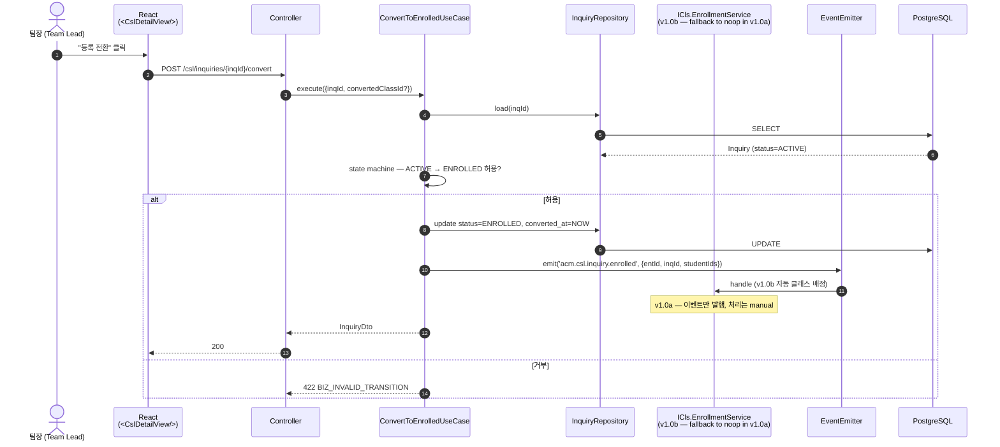
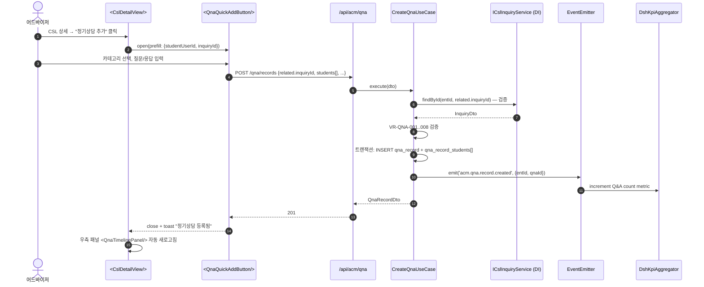
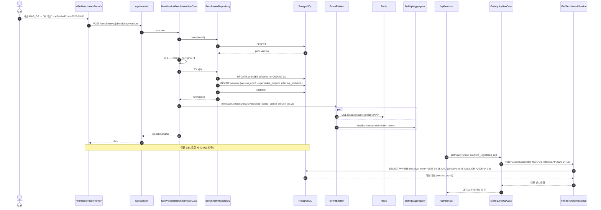
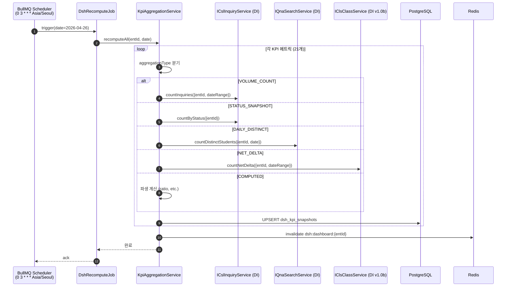
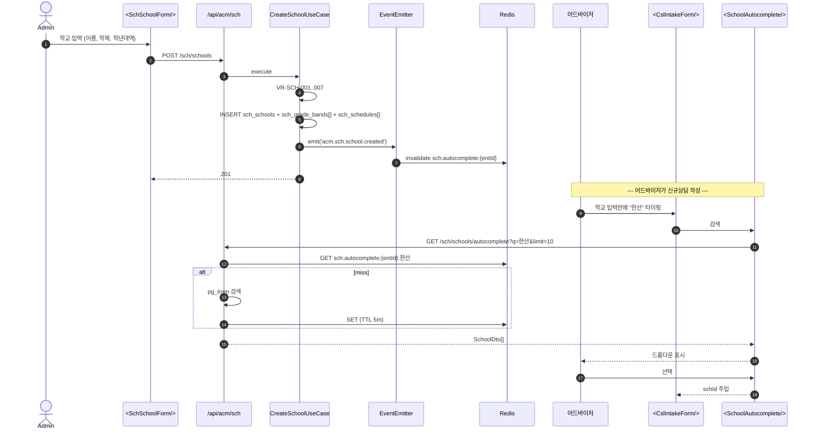
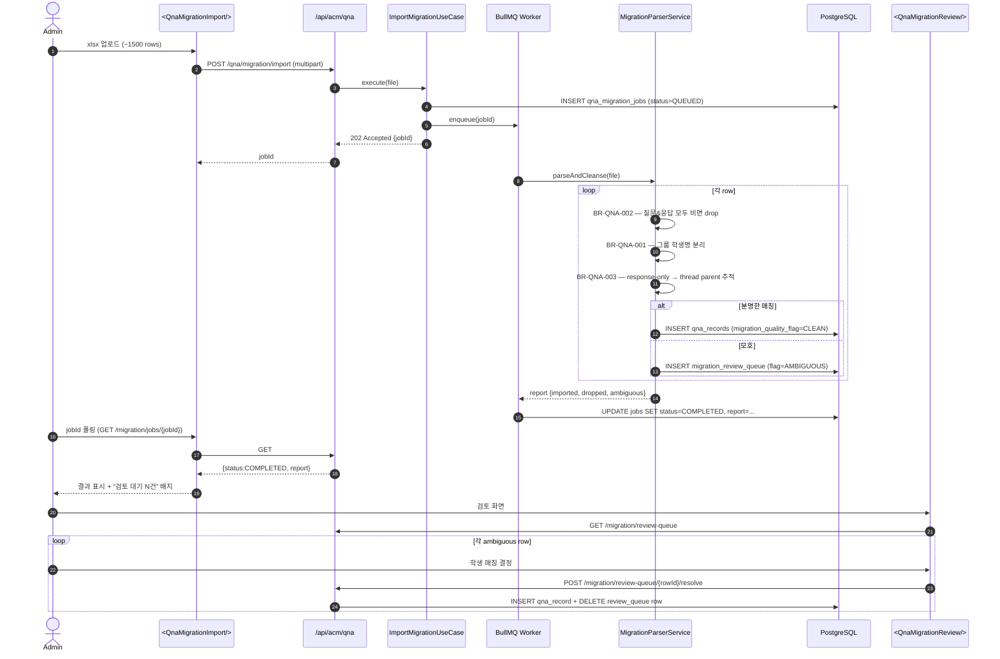

# ACM-SEQ-001 — Sequence Diagrams (시퀀스 다이어그램)

> Cross-module end-to-end flows. Each section uses Mermaid `sequenceDiagram`. Actors are labeled by clean-architecture layer where relevant.

---

## 1. CSL — 신규상담 등록 → 학생 매칭 → MAP 점수 → Gap Analysis

```mermaid
sequenceDiagram
  autonumber
  actor Advisor as 어드바이저 (User)
  participant FE as React SPA<br/>(<CslIntakeForm/>)
  participant API as NestJS Controller<br/>(/api/acm/csl)
  participant UC as CreateInquiryUseCase
  participant Dom as InquiryDomainService
  participant Repo as InquiryRepository
  participant DB as PostgreSQL
  participant SchSvc as ISchSchoolService<br/>(REF DI port)
  participant Bus as EventEmitter (in-process)
  participant DSH as DshKpiAggregator
  participant RefSvc as IRefBenchmarkService
  participant Cache as Redis

  Advisor->>FE: 폼 입력 (학부모/학생/학교/검색기준)
  FE->>FE: Zod 검증 + RHF submit
  FE->>API: POST /csl/inquiries (JWT)
  API->>API: AuthGuard + OwnEntityGuard (entId 주입)
  API->>UC: execute(dto, ctx)
  UC->>SchSvc: findById(entId, schId) - 검증
  SchSvc-->>UC: SchoolDto | null
  alt 학교 없음 (freetext fallback C-105)
    UC->>UC: schoolNameSnapshot 사용
  end
  UC->>Dom: validate(dto) - VR-CSL-001..010
  Dom-->>UC: ok
  UC->>Repo: save(inquiry, students[])
  Repo->>DB: BEGIN; INSERT csl_inquiries; INSERT csl_students[]; COMMIT
  DB-->>Repo: inq_id
  Repo-->>UC: Inquiry
  UC->>Bus: emit('acm.csl.inquiry.created', {entId, inqId})
  par 비동기 핸들러
    Bus->>DSH: handle inquiry.created
    DSH->>DB: UPDATE dsh_kpi_snapshots SET volume_count++
  and
    Bus->>Cache: invalidate('csl:list:'+entId)
  end
  UC-->>API: InquiryDto
  API-->>FE: 201 Created
  FE-->>Advisor: 상담 카드 생성 + 학생 목록 표시

  Note over Advisor,FE: --- MAP 점수 입력 단계 ---
  Advisor->>FE: MAP 점수 입력 (Reading 215, Math 222, G3)
  FE->>API: POST /csl/students/{id}/map-scores
  API->>UC: RecordMapScoreUseCase
  UC->>Repo: save mapScore
  UC->>RefSvc: gapAnalysis({examType:MAP, grade:G3, reading:215, math:222})
  RefSvc->>Cache: GET ref:benchmark:{entId}:MAP:G3:2026-04-26
  alt cache miss
    RefSvc->>DB: SELECT benchmark WHERE effective_from<=NOW AND (effective_to IS NULL OR >NOW)
    DB-->>RefSvc: BenchmarkRow
    RefSvc->>Cache: SET (TTL 1h)
  end
  RefSvc-->>UC: GapAnalysisDto {axes, modifierApplied}
  UC-->>API: {mapScore, gapAnalysis}
  API-->>FE: 201
  FE-->>Advisor: Gap 패널 렌더 (READING -5 BELOW, MATH +2 ABOVE)
```

---

## 2. CSL — 상담 → 등록 전환 (Convert to Enrolled)



---

## 3. CSL → QNA 크로스 링크 (학생 정기상담 등록)



---

## 4. QNA — Unsatisfied 해결 → DSH 컴플레인 자동 연결

```mermaid
sequenceDiagram
  autonumber
  actor Adv as 어드바이저
  participant FE as <QnaDetailView/>
  participant API as /api/acm/qna
  participant UC as ResolveQnaUseCase
  participant Bus as EventEmitter
  participant DshHandler as DshComplaintHandler
  participant DshUC as LogComplaintUseCase
  participant FE2 as <DshComplaintLogModal/>

  Adv->>FE: 해결 버튼 → "UNSATISFIED" 선택
  FE->>API: POST /qna/records/{id}/resolve {resolutionStatus:UNSATISFIED}
  API->>UC: execute
  UC->>UC: BR-QNA-006 — emit unsatisfied event
  UC->>Bus: emit('acm.qna.unsatisfied', {entId, qnaId, studentIds})
  Bus->>DshHandler: handle
  DshHandler->>DshUC: createComplaintHint({qnaId, status:PENDING_REVIEW})
  Note over DshHandler: hint = 자동 PoolItem; 사용자 검토 후 최종 등록
  UC-->>API: 200 {qnaId, resolutionStatus}
  API-->>FE: 200
  FE-->>Adv: "🔔 컴플레인 로그가 대기열에 추가되었습니다" 토스트
  Adv->>FE: "지금 등록" 클릭 (선택)
  FE->>FE2: open prefilled
  Adv->>FE2: 분류/원인 보강 후 제출
  FE2->>API: POST /dsh/complaints
  API-->>FE2: 201
```

---

## 5. REF — 벤치마크 새 버전 발행 → 캐시 무효화 → CSL 영향



---

## 6. DSH — 일일 KPI 재집계 (Cron)



---

## 7. SCH — 학교 마스터 등록 → CSL 자동완성 사용



---

## 8. QNA — 마이그레이션 임포트 (Q-004 cleanse)



---

## 9. Sequence Diagram Index

| § | Flow | 주요 모듈 | 핵심 검증 |
|---|---|---|---|
| 1 | 신규상담 + MAP + Gap | CSL → SCH → REF | Q-003 versioning, BR-CSL-010 |
| 2 | 등록 전환 | CSL (→ CLS v1.0b) | state machine |
| 3 | CSL → QNA 크로스 | CSL → QNA | DI port |
| 4 | UNSATISFIED → DSH | QNA → DSH | event-driven hint |
| 5 | REF 새 버전 + 캐시 | REF → DSH/CSL | Q-003 historical lookup |
| 6 | DSH 일일 재집계 | DSH ← all modules | DI ports |
| 7 | SCH 등록 → autocomplete | SCH → CSL | pg_trgm |
| 8 | QNA 마이그레이션 | QNA | Q-004 cleanse |

---

## 10. Approval

| Role | Name | Status |
|---|---|---|
| PO | 김태윤 팀장 | _Pending_ |
| Architect | TBD | — |

_End of ACM-SEQ-001 v1.0.0._
