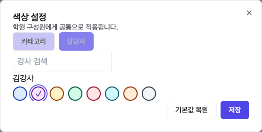
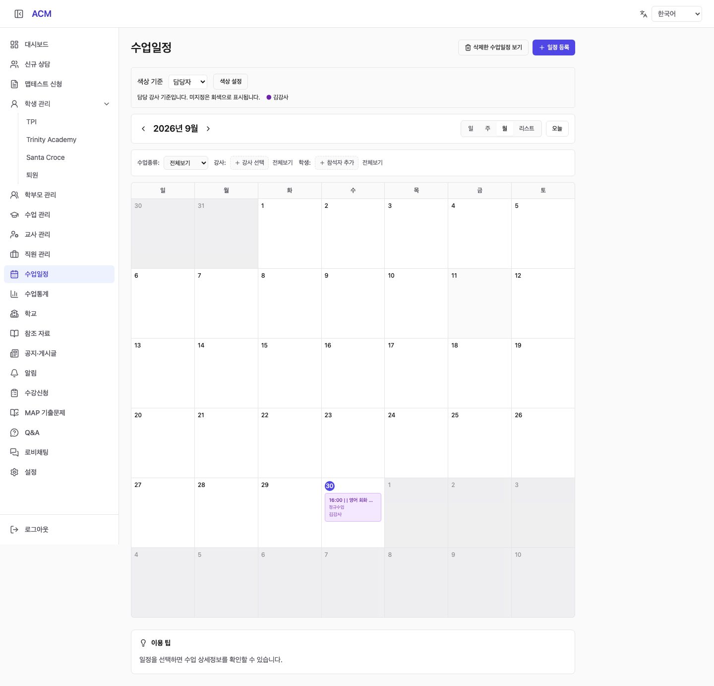
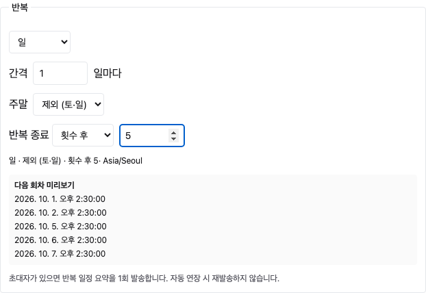

# Calendar Colors and Recurrence (캘린더 색상·반복 일정 결과)

## 1. Result (결과)

사용자 “진행” 승인에 따라 다음을 구현했다. **운영 사이트에는 아직 배포하지 않았다.**

- 카테고리·담당 강사별 8색 팔레트 설정 및 기본값 복원. 관리자만 설정하며 학원 공통으로 저장한다.
- 표시 기준 전환과 사용자·학원별 선택 기억. 일·주·월·목록에 같은 색상 규칙을 사용한다. 담당자 미지정은 회색이며 작성자와 구분한다.
- 일·주·월·특정 날짜 복수 선택 반복. 일 반복의 주말 포함/제외, 주 반복의 요일 복수 선택, 종료 없음/종료 날짜/횟수.
- 저장 전 다음 5회 미리보기. 주말 제외 시 제외한 회차는 횟수에 포함하지 않는다. 31일 등 없는 월 날짜는 건너뛴다.
- 이번 회차/이후/전체 수정·삭제와 적용 수 확인. 과거 일정·수업/상담/피드백/자료/진행된 BODA 방 연결 회차를 보호한다. 개별 수정 회차는 일괄 변경에서 유지한다.
- 원래 회차 키와 변경 이력을 저장해 자동 연장 시 수정·삭제한 회차가 되살아나지 않게 한다. ICS 원본 규칙·예외 저장 모델은 그대로 유지한다.
- 생성 요청 멱등 키 및 테넌트 잠금, 일정·참석자·BODA 대기실·회차 매핑의 트랜잭션 저장. 반복 초대는 최초 요약 1회이며 자동 연장 시 재발송하지 않는다.
- 화상 설정 변경이나 참조 데이터 문제로 자동 연장이 실패하면 기존 일정은 조회하고 해당 시리즈를 보류 상태로 표시한다.
- ko/en/vi/zh-CN 번역.

## 2. Verification (검증)

| 검증 | 결과 |
|---|---|
| Backend unit tests | **90 suites / 687 tests passed** |
| Backend build | 통과 |
| Frontend TypeScript + Vite build | 통과. 기존 대형 번들 경고 있음 |
| 신규 서비스·DTO·컨트롤러 정적 검사 | 오류·경고 없음 |
| 로컬 PostgreSQL 통합 검증 | 색상 저장/테넌트 격리/실패 롤백, 동시 등록 중복 방지, 1회 알림 claim, 수정 범위, 버전 충돌, 개별 예외, 삭제 보존, 자동 연장·중단, BODA 대기실, 연결 이력 보호, 설정 변경에 따른 연장 보류 통과 |
| 기존 Google/BODA 화면 회귀 | 설정 전환·Google 링크 검증·BODA 비노출·직접 입장·포털·모바일 통과 |
| 실제 React 화면 + API fixture | 색상 저장·담당자 표시 기준 재접속 유지·담당자 선택·평일 반복 미리보기/요청·수정 범위/보호 수 확인·특정 날짜 모드·모바일 너비·페이지 오류 없음 확인 |

DB 검증은 로컬 `acm_lifecycle_test_260929`의 별도 테스트 테넌트에서 수행했으며 생성 데이터는 정리했다. 실제 외부 초대 메일이나 BODA 서버 호출은 수행하지 않았다.

재실행 파일:

- `backend/src/modules/acm-cal/application/recurrence-calculator.spec.ts`
- `backend/src/modules/acm-cal/application/dto/recurrence.dto.spec.ts`
- `backend/test/recurrence-pg-check.ts`
- `frontend-acm/test/calendar-recurrence.smoke.cjs`

## 3. Screenshots (화면 캡처)

아래는 **구현한 실제 React 화면을 로컬에서 샘플 데이터/API fixture로 확인한 캡처**이다. 운영 반영 화면은 아니다. DB 저장·동시성은 위의 별도 PostgreSQL 통합 검증으로 확인했다.

### In Charge colors (담당자별 색상 설정)

### Calendar display (캘린더 표시)

### Weekday recurrence (평일 반복)

10월 1일부터 평일 5회인 경우 10/1, 10/2, 10/5, 10/6, 10/7로 미리보기된다.

## 4. Implementation Notes (구현 사항)

- 작업 브랜치: `feat/cal-colors-recurrence-260930`
- 기준 main: `3138ae2` (기존 ICS 이관 기능 포함)
- 격리 작업 공간: `/private/tmp/acm-cal-colors-260930`
- 기존 사용자 작업 디렉터리의 소스 변경은 덮어쓰지 않았다. 이 분석·계획·보고서와 캡처는 사용자 작업 디렉터리에도 복사했다.
- DB 마이그레이션: `sql/acm/1024-cal-colors-recurrence.sql`
- 새 테이블: `amb_acm_cal_color_setting`, `amb_acm_cal_recurrence_series`, `amb_acm_cal_recurrence_occurrence`.
- 주요 API: `/api/acm/cal/color-settings`, `/api/acm/cal/recurrence/{preview|series|status}`, `/api/acm/cal/recurrence/events/:id/{impact|update|delete}`.
- 수동 반복의 원래 규칙은 유지하고 범위별 일정 속성·시각 변경을 `crs_changes`로 순서대로 적용한다. 시리즈를 복제하는 방식 대신 회차 식별자를 보존하여 중복·예외 복구를 방지했다.

## 5. Boundaries and Deployment (범위·배포)

- 특정 날짜는 최대 1,000개, 간격은 1~365, 횟수는 1~100,000을 검증한다. 종료 없음은 원본 규칙을 유지하며 선행 1년과 조회 구간을 점진 생성한다. 월말 보정은 자동 마지막 날 이동이 아니라 없는 달 건너뛰기다.
- 반복 주기 종류를 바꾸는 별도 시리즈 재설정 UI는 포함하지 않는다. 등록 후 수정 범위는 일정 속성·시각에 적용한다. 기존 ICS의 복잡한 원본 규칙을 수동 반복 폼으로 변환하지 않는다.
- 초대 발송은 중복을 피하도록 발송 전 claim을 저장한다. 실패 상태는 초대자 정보에 남기며 시스템 중단 뒤 자동 재발송을 강제하지 않는다.
- **배포 대기**: 스테이징·운영 반영은 하지 않았다. 배포 시 DB 백업 → 1024 마이그레이션 → 백엔드 → 프론트엔드 → 실제 API/화면 확인 순으로 진행한다. 신규 API가 추가 테이블에 의존하므로 스키마를 먼저 적용해야 한다.
- 롤백 시 코드 및 신규 자동 연장 작업을 중지하되 기존 단일/ICS 일정과 신규 업무 데이터는 자동 삭제하지 않는다.

참조: [요구사항](../analysis/REQ-260930B-cal-colors-recurrence.md), [구현 계획](../plan/PLN-260930B-cal-colors-recurrence.md).
