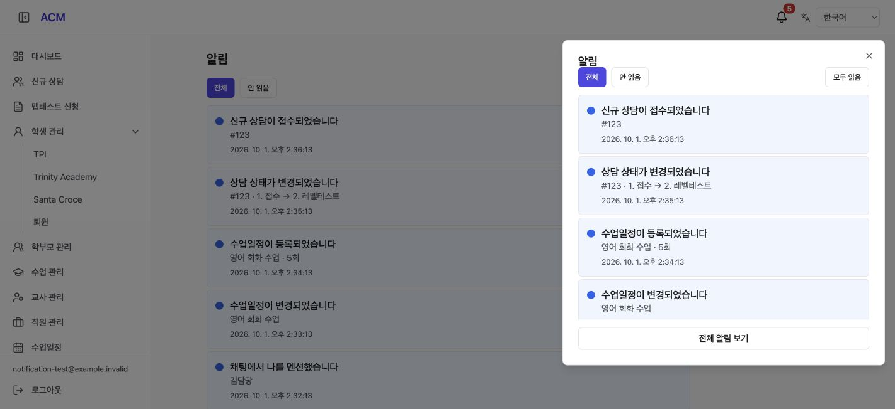
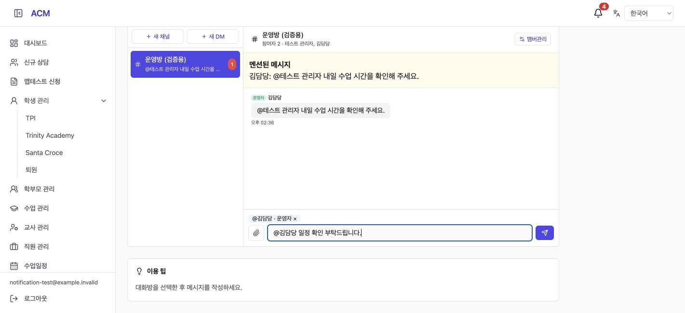
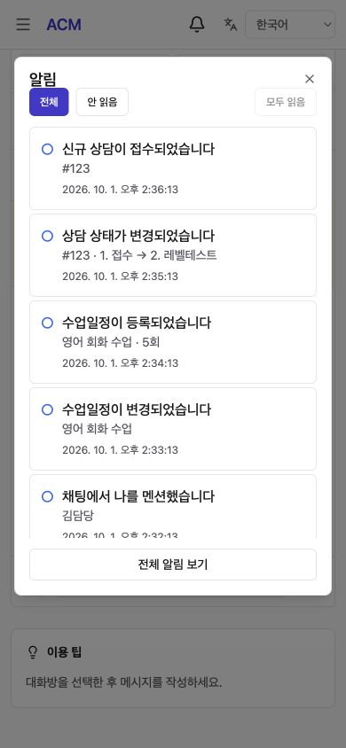

# Unified Notification Inbox (통합 알림함 구현 결과)

## 1. Result (결과)

사용자의 “진행” 승인에 따라 구현 및 로컬 검증을 완료했다. **운영에는 아직 배포하지 않았다.**

- ACM 관리자 공통 헤더: 언어 선택 왼쪽 종 아이콘, 미확인 수(0 숨김, 100 이상 99+).
- 우측 알림 패널: 최신순 목록, 전체/안 읽음, 개별 읽음, 모두 읽음, 전체 보기.
- 전체 목록 `/admin/notification-inbox`: 커서 페이지네이션, 오류·재시도·빈 상태.
- 상담 접수·상태 변경, 일정 등록·변경, 채팅 멘션의 5종 알림. 상담 상세·일정 상세·해당 채팅방의 멘션 메시지로 바로가기.
- `@` 입력 후 구성원 검색·선택, 방향키/Enter 선택 및 Esc 닫기. 멘션 대상을 kind/refId로 저장하고 서버에서 같은 방 구성원인지 검증한다. 선택한 대상은 입력창 위 칩으로 표시한다.
- 개인별 읽음 상태를 DB에 저장하고 개인 SSE 갱신 신호와 15초 폴링으로 동기화한다. 인메모리 SSE의 다른 인스턴스·재접속 누락은 재조회로 복구한다.
- ko/en/vi/zh-CN 번역.

## 2. Delivery and Access Rules (전달·접근 규칙)

- 상담: 같은 학원의 활성 ADMIN/STAFF/APP_ADMIN. 일정: 이들 및 담당 강사와 연결된 활성 TEACHER 콘솔 계정. 본인의 작업은 본인 알림에서 제외한다.
- 멘션: 현재 방의 USER 구성원 중 명시적으로 지정된 활성 ADMIN/APP_ADMIN 콘솔 계정. 채팅 권한이 없는 STAFF에게 범위를 확대하지 않았다. 포털에서 운영자를 멘션하면 운영자 알림함에도 전달된다. 포털 전용 강사의 개인 알림함은 이번 관리자 헤더 범위에 포함하지 않는다.
- 반복 일정 생성·범위 변경은 작업당 요약 한 건. 생성 멱등 재요청·자동 연장·동일 값 저장은 추가 알림을 만들지 않는다. 참석자 변경도 일정 변경으로 포함한다.
- 저장 트랜잭션 내 수신자 스냅샷과 outbox 기록 → 5초 주기 전달 작업 → 수신자별 inbox 멱등 적재. 전달 실패는 pending 상태로 재시도한다.
- 일반 일정 저장·참석자 변경·BODA 대기실·수정 이력과 알림 기록을 같은 DB 트랜잭션으로 묶었다. 외부 초대 발송은 커밋 뒤 기존 경로로 처리한다.
- 상담 상태와 전환 이력·알림도 한 트랜잭션으로 처리한다.
- 목록/숫자/읽음/바로가기에서 수신자, 테넌트, 활성 상태, 원본 존재 및 현재 접근 권한을 다시 확인한다. 삭제된 메시지·일정이나 탈퇴한 방의 알림 내용은 숨긴다.
- 모두 읽음에는 서버 시각을 사용하고 마이크로초 정밀도를 보존하여 동시에 도착한 새 알림이 섞이지 않게 한다.
- 과거 업무 데이터의 알림 역생성, 일정 삭제·취소, @전체, 메시지 수정 후 재알림, 브라우저 푸시·소리·추가 메일 발송은 포함하지 않는다.

## 3. Verification (검증)

| 검증 | 결과 |
|---|---|
| 기존 Backend unit tests | 90 suites / 687 tests 통과 |
| Backend build | 통과 |
| Frontend TypeScript / Vite build | 통과; 기존 대형 번들 경고 있음 |
| 신규 알림 백엔드 파일 ESLint | 오류·경고 없음 |
| PostgreSQL 알림 통합 | 5종 유형, 학원·수신자 격리, 동시 worker 중복 방지, 롤백, 개별/모두 읽음, 페이지네이션, 삭제 대상, 멘션 검증·본인 제외·채팅방 탈퇴, 비활성 계정 통과 |
| 실제 업무 서비스 + PostgreSQL | 상담 접수/상태 변경 알림, 전환 이력 실패 롤백, 일정 생성/수정 알림, 무변경 제외, BODA 대기실 실패 시 일정·알림 롤백 통과 |
| 반복 일정 PostgreSQL 회귀 | 생성 동시성·멱등 재요청에서 요약 1건, 범위 수정/개별 예외/버전 충돌/삭제 보존/자동 연장/중단/BODA 저장 통과 |
| 실제 React 화면 + 로컬 API fixture | 종 위치·5건 배지·목록·멘션 바로가기 후 4건·구성원 키보드 선택/전송·모두 읽음 후 0건·필터·새로고침·390px 패널 확인 |

로컬 DB `acm_lifecycle_test_260929`의 무작위 격리 테넌트로 수행하고 생성 데이터를 정리했다. 화면 fixture는 메모리 데이터이며 운영 DB나 외부 사용자에게 메시지·메일을 발송하지 않았다. 브라우저 콘솔에는 기존 React Router future 경고와 확장 메시지 채널 오류가 관찰됐으며, 위 기능 동작은 정상 확인했다.

재실행 파일:

- `backend/test/notification-inbox-pg-check.ts`
- `backend/test/recurrence-pg-check.ts`
- `frontend-acm/test/notification-inbox-fixture.cjs` (UI fixture 서버; 실제 영속성은 PG 검증으로 확인)

## 4. Screenshots (화면 캡처)

아래는 구현된 React 화면을 **로컬 샘플 데이터**로 확인한 캡처이며 운영 화면은 아니다.

## 5. Implementation and Release (구현·배포)

- 기준: main `8371126`.
- 브랜치: `feat/notification-inbox-261001`.
- 작업 공간: `/private/tmp/acm-notification-261001`. 기존 사용자 작업 디렉터리의 미커밋 소스 변경은 덮어쓰지 않았다.
- 마이그레이션: `sql/acm/1025-notification-inbox.sql` (outbox/inbox 테이블 및 메시지 mentions JSONB 추가).
- API: `/api/acm/notifications/inbox`, `/count`, `/events`, `/:id/read`, `/read-all`.
- 기존 외부 발송 로그 `/admin/notifications`는 유지한다. 개인 알림함은 별도 경로다.
- 운영 배포 전 DB 백업, 1025 마이그레이션 선행, 백엔드·프론트엔드 배포, 스테이징/운영 인증 API 확인이 필요하다. 아직 원격 푸시·운영 DB 변경·배포는 하지 않았다.

참조: [요구사항](../analysis/REQ-261001-acm-notification-inbox.md), [계획](../plan/PLN-261001-acm-notification-inbox.md).
