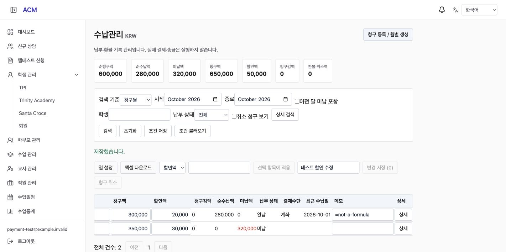
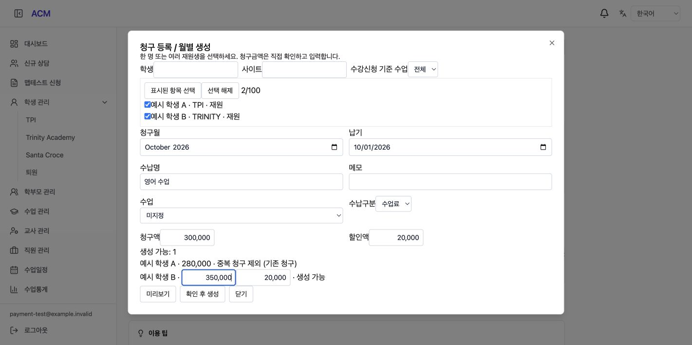
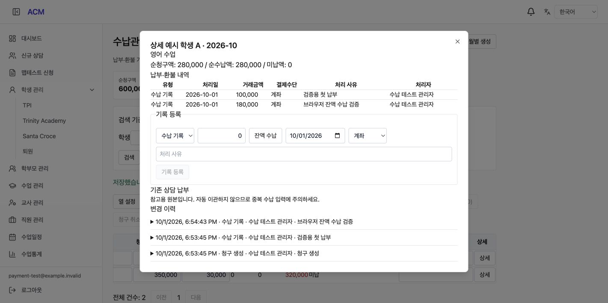

# Payment Management Implementation (수납관리 구현 보고서)

## 1. Result (구현 결과)

사용자 “구현 진행” 승인에 따라 [작업계획](../plan/PLN-261001C-payment-management.md)의 Phase 1을 구현했다. 관리자 수강신청 다음에 **수납관리** 메뉴를 추가했으며 `/admin/pay`에서 월별 청구·납부·미납·환불 기록을 관리한다. 운영 배포는 아직 수행하지 않았다.

원본 작업 디렉터리의 기존 변경을 보존하기 위해 production main `22d9263`에서 분리한 `feat/payment-management-261001` 브랜치, `/private/tmp/acm-payment-261001`에 구현했다. 원본 프로젝트에는 분석서·계획서·본 보고서·캡처만 반영했다.

## 2. Features (기능)

- 청구월 또는 수납기록 기간, 이전 달 미납, 납기, 학생·학교·학년·재원 상태·사이트·수업·강사·수납구분·결제수단·메모 필터. 조회 전체 기준 요약과 50건 페이징.
- 학생 단건/복수 월별 청구 생성, 대상 미리보기와 학생별 금액 조정. 재원 상태·수업 연결 검증 및 기존 청구/동일 요청 중복 방지.
- 청구액·할인·수납명·납기·메모 직접 편집, 선택 행 일괄 적용과 변경 사유 저장. 저장 오류 시 초안 유지. 새로고침/링크 이탈 시 미저장 경고.
- 분할 수납·잔액 수납, 원 납부를 참조한 환불/납부취소, 청구감액/복구 기록. 납부 이력이 없는 청구 취소·복구. 일괄 수정·취소·복구는 전부 성공하거나 전부 롤백한다.
- 계산은 서버에서 수행하며 초과납부·초과환불·할인/감액 초과를 차단한다. 원장·감사 기록은 추가 방식으로 보존한다.
- 상세 모달에 납부/환불 내역·처리자·변경 전후·사유 및 연결된 기존 상담 납부 참고 표시.
- 사용자/테넌트별 검색조건·선택 열 저장, XLSX(최대 10,000건) 및 요약 시트. `=`로 시작하는 문자열을 수식으로 내보내지 않는다.
- 3자리 콤마, 한국어/영어/베트남어/중국어, 가로 스크롤 목록 및 좁은 화면 대응.

상세는 기존 공통 모달로 제공한다. 목록과 주요 요약은 **순수납액**을 표시하며 원납부·환불 금액은 상세 원장 및 엑셀에서 구분한다. 초기 통화는 KRW다. 자동 일할계산은 하지 않으며 미리보기에서 금액을 직접 확인한다.

## 3. Data and Access (데이터 및 권한)

마이그레이션: `sql/acm/1026-pay-collections.sql`.

| 신규 테이블 | 용도 |
|---|---|
| amb_acm_pay_bill | 청구·버전·취소상태·중복방지 키 |
| amb_acm_pay_collection | 납부/환불/납부취소 원장 |
| amb_acm_pay_bill_adjustment | 청구 감액 및 복구 |
| amb_acm_pay_bill_audit | 전후 값·사유·처리자 |
| amb_acm_pay_request | 요청 해시와 결과를 보존하는 멱등 처리 |

모든 조회·변경에 테넌트를 적용한다. 청구 행 잠금과 버전 확인, 테넌트 생성 잠금, 요청별 잠금으로 동시 입력을 보호한다. 학생·수업 소속은 서버 검증, 원장 간 참조는 테넌트 포함 FK를 사용한다.

ADMIN/APP_ADMIN은 전체, STAFF는 조회·청구 생성/편집·수납 기록, 환불·납부취소·청구조정·취소/복구는 관리자만 허용한다. 강사 및 학부모는 API에서도 차단한다.

기본 API는 `/api/acm/pay/bills`: 목록(요약 포함), `options`, `:id`, `batch-preview`, `batch-create`, `batch`, `batch-state`, `:id/collections`, `:id/refunds`, `:id/adjustments`, `:id/cancel`, `:id/restore`, `export`이다.

기존 PG 주문·상담 승인·New St 통계 데이터는 변경하지 않는다. 이 화면은 실제 결제/송금/카드취소를 실행하지 않는다. MakeEdu 데이터 이관, 영수증 발급, 문자, 자동결제, 학부모 결제 통합은 Phase 2다.

## 4. Verification (검증)

| 검증 | 결과 |
|---|---|
| Backend build / frontend TypeScript + Vite build | 통과. 기존 Vite 청크 크기 경고 존재 |
| Backend 기존 Jest | 90 suites / 699 tests 통과 |
| 신규 서비스·DTO·컨트롤러 ESLint | 오류 및 경고 0 |
| PostgreSQL 실제 통합 검증 | 테넌트 격리, 중복/멱등 요청, 요청 불일치, 동시 납부, 초과납부/환불 차단, 분할납부·환불·납부취소·감액/복구, 일괄 수정 및 취소 실패 롤백, 복구, 기간 수납 합계, 날짜 검증 통과 |
| 실제 Nest HTTP 검증 | DTO 400, 교사 403, STAFF 수납 허용/환불 거부, 저장 후 잔액 및 XLSX 문자열 안전성 통과 |
| 브라우저 | 메뉴, 중복 제외 미리보기, 학생별 350,000원 조정 후 생성, 할인 20,000→30,000 저장, 잔액 180,000원 수납 후 완납 및 이력 확인 |
| 반응형 | 390×844 화면에서 헤더·요약·필터·액션 배치 확인 |

통합 테스트는 전용 로컬 DB `acm_lifecycle_test_260929`의 무작위 테넌트에서 수행했다. HTTP 검증은 JWT를 가상 계정으로 대체하고 실제 RolesGuard·ValidationPipe·Controller·Service·PostgreSQL을 사용했다. 운영 인증 및 운영 전체 페이지의 E2E 검증을 의미하지 않는다. 테스트 서버의 관련 없는 대시보드 응답은 구현하지 않아 로그인 후에는 `/admin/pay`로 직접 이동해 검증했다. 실제 결제나 외부 발송은 없었다.

재현 스크립트(backend 디렉터리):

```sh
ACM_TEST_ENV_FILE=/path/to/local-test.env npx ts-node --transpile-only test/pay-collections-pg-check.ts
ACM_TEST_ENV_FILE=/path/to/local-test.env npx ts-node --transpile-only test/pay-collections-http-check.ts
```

테스트 DB는 localhost:5434 및 위 이름으로 고정한다. 테스트 계정의 임의 테넌트 데이터는 종료 시 정리한다. `PAY_UI_FIXTURE=1`은 가상 로그인과 화면 검증용 localhost:4009 서버를 유지하는 테스트 전용 옵션이다.

## 5. Screenshots (화면 증빙)

모든 캡처는 로컬 개발 환경의 가상 학생·가상 금액이다.

목록 및 수정/잔액 수납 후 결과:



중복 제외 및 학생별 금액 조정:



분할 수납과 변경 이력:



[최초 목록](screenshots/261001-pay/list.png) · [모바일 폭](screenshots/261001-pay/mobile.png)

## 6. Deployment Preparation (배포 준비)

운영 미반영. 배포 시 DB 백업 후 1026 마이그레이션을 먼저 적용하고 backend/frontend-acm을 함께 배포한다. 운영의 기존 결제 원장은 이관하거나 수정하지 않는다. 메뉴 허용 목록을 별도 지정한 계정은 수납관리 권한이 포함되는지 확인한다. 운영 인증으로 역할·목록 조회를 확인하고 실제 수납 데이터 생성 검증은 별도 합의한 테스트 범위에서 수행한다. 롤백 시 앱을 이전 버전으로 되돌리되 새 원장 테이블과 기록은 보존한다.
