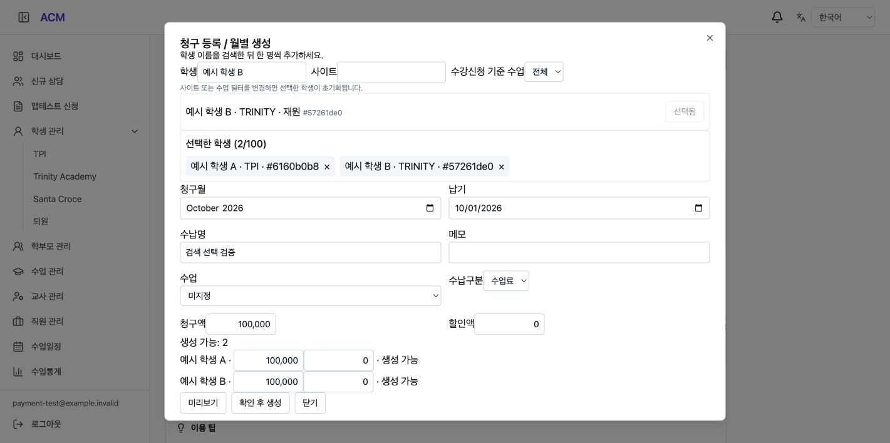
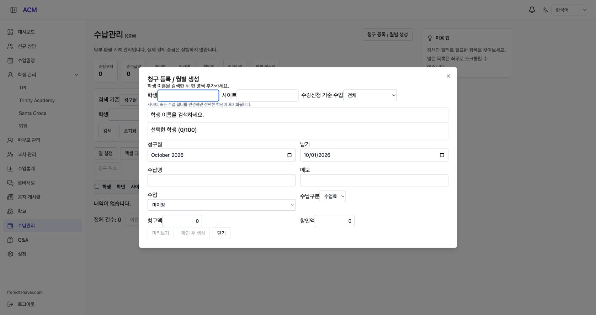

# Student Selection Implementation (학생 검색 선택 구현)

## 1. Result (구현 결과)

청구 등록 모달은 검색 전 학생 목록 대신 안내를 표시한다. 이름 검색 결과의 추가 버튼으로 학생을 한 명씩 선택하고 별도 선택 목록에서 개별 삭제한다. 전체 선택을 제거했으며 검색어가 바뀌어도 기존 선택을 유지한다. 같은 학생 중복 및 100명 초과 선택은 차단한다. 이름·사이트·상태와 짧은 식별값으로 결과를 구분한다.

검색 입력에 250ms 지연을 적용하고 이전 검색 결과를 잘못 선택하지 않도록 새 결과 수신까지 로딩을 표시한다. 사이트/수업 필터를 바꾸면 선택을 초기화한다는 안내를 추가했다. 기존 수업 옵션 조회는 유지한다. 4개 언어 반영, 서버/DB 변경 없음.

## 2. Verification (검증)

- Frontend TypeScript/Vite build 통과 (기존 청크 크기 경고).
- 가상 데이터 브라우저: 검색 전 목록 비노출, A 검색/추가 후 B 검색 시 A 유지, B 개별 추가, 선택됨 버튼 비활성화, 2명 청구 미리보기 성공, A 개별 제외 시 선택 1명 및 미리보기 초기화 확인.
- 기존 실제 Nest HTTP 가상 계정 검증 통과. 운영 업무 데이터 변경 없음.
- 작업 위치 `/private/tmp/acm-payment-261001`, 브랜치 `feat/pay-student-search-261001`. 원본 프로젝트 소스의 미커밋 변경 보존.
- 운영 배포 완료 (`f8f8d49`). 기존 상담 납부 이관은 실제 납부일·총 청구액 회신 대기 상태로 유지.

## 3. Screenshot (화면 증빙)

로컬 가상 학생 데이터로 확인한 화면이다.

## 4. Production Release (운영 배포)

- 배포 SHA `f8f8d4905005cafac909cff9246fb30380370926`, 2026-10-02 00:17:35 KST (2026-10-01 22:17:35 베트남 시간).
- [PR #294](https://github.com/amoeba-devops/appAcademy2/pull/294), [CI](https://github.com/amoeba-devops/appAcademy2/actions/runs/36882109199): 모든 단계 통과.
- [스테이징](https://github.com/amoeba-devops/appAcademy2/actions/runs/36882693908): 성공. 새 화면 번들 반영 및 격리 가상 학원의 실제 인증 API 청구·수납·환불·엑셀 회귀 통과, 가상 데이터 정리.
- [운영 배포](https://github.com/amoeba-devops/appAcademy2/actions/runs/36883016555): 성공. backend/frontend 모두 `:f8f8d49`, running, restarts=0.
- 운영 인증 목록·옵션 조회와 health 정상. 배포 직후 로그 ERROR 0건. 장기 관찰 결과는 아님.
- 운영 브라우저의 청구 등록 모달에서 검색 안내, 검색 전 학생 목록 비노출, 선택 학생 영역 및 전체 선택 제거 확인. 운영 업무 데이터 생성 없음.
- DB/API 변경 없음. 복구 기준은 직전 이미지 `2e7efd2`.
- 배포용 브랜치 `release/pay-student-search-261001`은 최신 main에서 이번 화면 변경만 분리했다.

