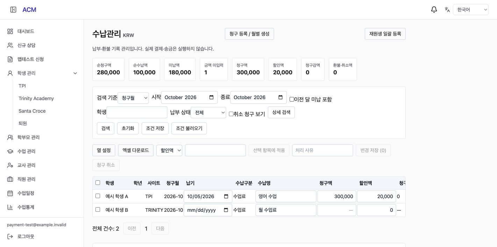
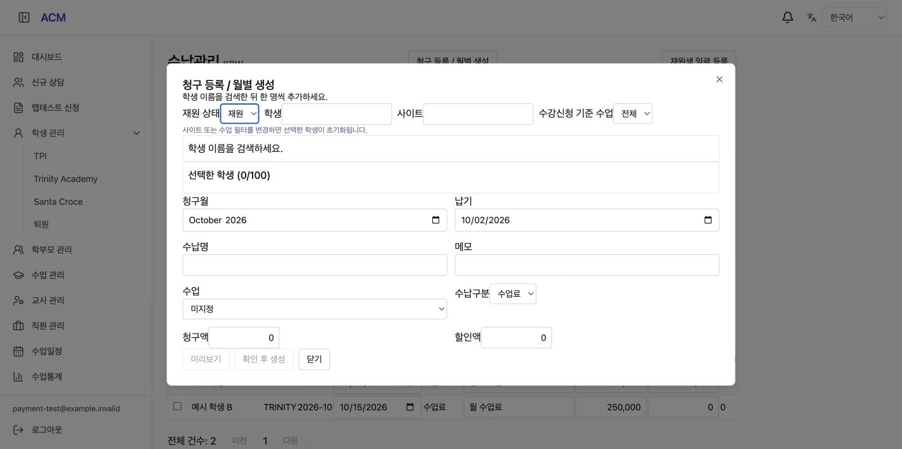
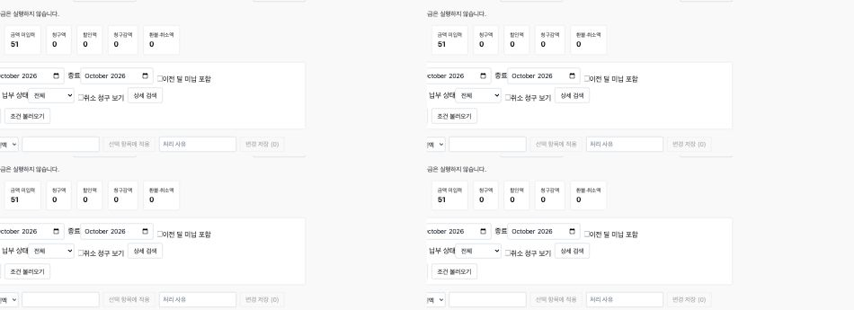

# Active Student Billing Drafts (재원생 일괄 등록 구현)

## 1. Result (구현 결과)

수납관리의 **재원생 일괄 등록**에서 청구월과 수납명을 확인하고 미리보기 후 등록한다. 삭제되지 않은 재원생 전체를 서버에서 조회하므로 학생 검색 100명 제한으로 누락되지 않는다. 같은 달 기존 수업료 청구(준비/취소 포함)가 있는 학생은 제외하고 재시도/동시 실행 중복을 차단한다. 기존 청구액은 덮어쓰지 않는다.

신규 행은 DRAFT, 청구액·납기 null이다. 목록에서 금액 입력란이 비어 있으며 미입력 건수를 표시한다. 순청구액·미납액 합계에 영향을 주지 않고 0원 납부불필요와 구분한다. 금액·납기·처리 사유를 입력해 변경 저장하면 ACTIVE 청구로 확정된다. 일부 필수값만 입력한 상태에서는 저장할 수 없다. 준비 상태에서 수납/환불/감액을 직접 호출하는 것도 서버에서 차단한다.

학생 검색은 서버 기본값 ACTIVE 및 화면 재원 필터를 적용했다. 전체/휴원/퇴원 검색으로 전환할 수 있으나 신규 청구 학생 추가는 재원생만 가능하다. 검색 후 한 명씩 추가하는 기존 동작은 유지한다. 4개 언어에 반영했다.

## 2. Data and API (데이터 및 API)

- `sql/acm/1027-pay-bill-drafts.sql`: 청구액·납기 nullable, DRAFT 상태, 상태별 필수값 CHECK 및 학생/월 인덱스. 기존 청구 데이터 값 변경 없음.
- POST `/api/acm/pay/bills/active-drafts-preview`, `/active-drafts`: 기존 관리자/직원 권한 적용. 월·수납명·requestId 입력, 대상/생성가능/제외/생성 건수 반환.
- 테넌트 생성 잠금, 학생 행 공유 잠금, 원장 재검사 및 원자적 저장. 기존 건 수정 및 일괄 생성과 같은 잠금 기준 사용.
- 금액/납기 입력 후 기존 batch 편집 API로 확정. 취소한 준비 행 복구 시에도 DRAFT 유지.
- 기존 상담 승인·학생 상태·PG 주문·납부 원본 이관과 독립. 실제 납부나 외부 알림을 생성하지 않는다.

## 3. Verification (검증)

| 항목 | 결과 |
|---|---|
| Backend build 및 전체 TypeScript 검사 | 통과 |
| Frontend TypeScript/Vite build | 통과, 기존 청크 크기 경고 |
| 변경 서비스/DTO/Controller ESLint | 오류·경고 0 |
| 기존 Jest | 90 suites / 699 tests 통과 |
| 신규 PG 통합 | 105명 재원생, 기존 청구 1명 제외 후 104명 생성, 비재원 제외, 검색 100명 상한과 독립 처리, 동시 실행/멱등성, NULL/0 구분, 합계 제외, 수납 차단, 취소/복구/확정, 테넌트 격리 통과 |
| 기존 수납 PG 회귀 | 부분납·환불·감액·취소·기간합계·원자적 수정 회귀 통과 |
| 실제 Nest HTTP | 교사 403, 직원 허용, 잘못된 월/빈 확정금액 400, 준비 수납 차단, XLSX 금액 빈 셀·DRAFT 표시 통과 |
| 브라우저 | 2명 중 기존 청구 1명 제외, 1명 미입력 생성, 기존 금액 합계 유지, 금액/납기 입력 후 미납 반영, 검색 기본 재원 확인 |

격리된 로컬 DB `acm_lifecycle_test_260929`에서 임의 테넌트를 사용했다. HTTP 검증은 JWT만 가상 계정으로 대체하며 실제 Controller/ValidationPipe/RolesGuard/Service/PG를 사용한다. 테스트 데이터는 종료 시 정리했다. 아래 운영 등록과 별도로 수행한 로컬 검증이다.

재현: backend에서 `ACM_TEST_ENV_FILE=/path/to/local.env npx ts-node --transpile-only test/pay-drafts-pg-check.ts`; 기존 `pay-collections-pg-check.ts`, `pay-collections-http-check.ts`도 migration 1027을 적용하도록 갱신했다.

## 4. Screenshots (화면 증빙)

로컬 가상 데이터다.

## 5. Delivery (반영 상태)

- 작업 브랜치 `feat/pay-active-drafts-261002`, `/private/tmp/acm-payment-261001`.
- 원본 프로젝트의 기존 미커밋 소스를 보존하고 문서/캡처만 복사했다.
- 사용자 승인에 따라 백업→스테이징 검증→운영 배포→2026-10 재원생 51명 일괄 등록 완료. 상세 결과는 아래와 같다.
- DRAFT 생성 후 예전 코드로 롤백하면 null 의미를 처리하지 못한다. 준비 원장을 보존하면서 호환 코드로 복구하거나 수납 기능 접근을 일시 제한한 상태에서 복구해야 한다. 운영 기록을 0원으로 바꾸거나 삭제하는 롤백은 하지 않는다.
- 상담 납부 3,040,000원 이관은 실제 납부일·총 청구액 확인 대기 상태로 유지한다.

## 6. Production Release (운영 배포 및 등록)

- 배포 완료: **2026-10-02 09:57:53 KST**, `69a0debf1ef3bd1dabb4b247c66b3fc640e17ad7` (PR [#295](https://github.com/amoeba-devops/appAcademy2/pull/295)).
- [CI](https://github.com/amoeba-devops/appAcademy2/actions/runs/36948031936), [스테이징](https://github.com/amoeba-devops/appAcademy2/actions/runs/36948350400), [운영 배포](https://github.com/amoeba-devops/appAcademy2/actions/runs/36948568844) 성공.
- 운영 백업: `/home/appacademy/app-academy-backups/db_acm-before-payment-20261002T005045Z.dump` (7,176,667 bytes). 파일 권한 600 및 pg_restore 목록 확인.
- 스테이징 가상 테넌트 2명 등록/재시도/미입력/수납 차단/확정/재원 검색 검증 통과, 데이터 정리 완료.
- 운영은 관리자 인증 API를 통해 **2026-10 / 월 수업료**로 실행했다. 대상 **51명**, 신규 생성 **51건**, 제외 **0건**.
- DB 확인: DRAFT **51건**, 금액·납기 모두 NULL **51건**, 연결된 납부 내역 **0건**. 청구·납부·미납 금액 합계 변화 없음.
- 동일 요청 재시도와 재미리보기로 중복 방지 확인. requestId: `9e16f311-d197-4243-b3f0-078c8b9de9a0`.
- 운영 화면에서 2026년 10월 금액 미입력 **51건**, 전체 목록 **51건**, 빈 금액·납기 확인.
- 배포 직후 backend/frontend 이미지 모두 `69a0deb`, running/restarts=0. 확인 시점 최근 3분 backend 로그 ERROR 0건 (장기 모니터링 결과는 아님).

학생 개인정보를 제외한 운영 집계 화면:

