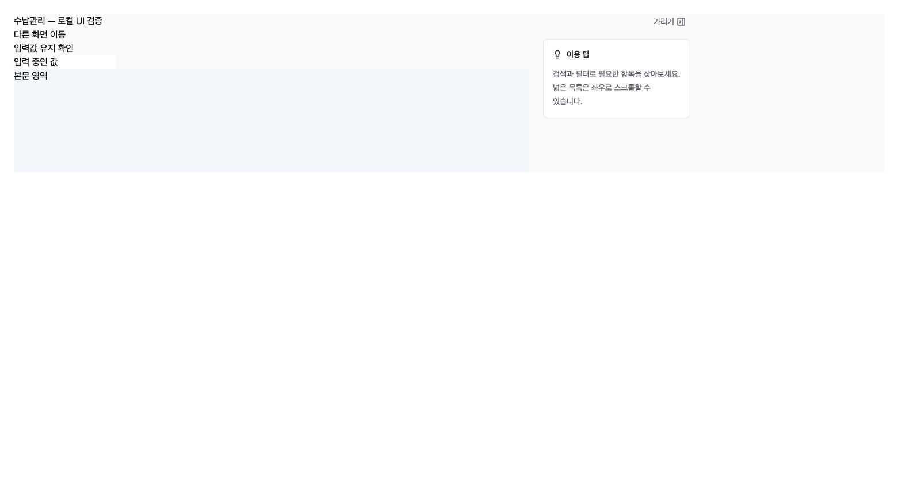
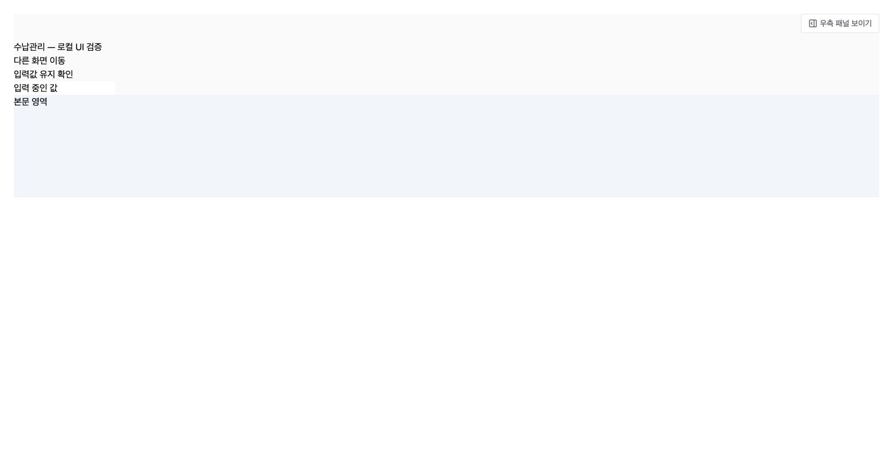

# Admin Support Panel Toggle (공통 우측 패널 가리기)

## 1. Result (구현 결과)

공통 AdminContentLayout에 가리기/보이기를 추가했다. 표시 중에는 패널 상단의 가리기 버튼, 숨김 중에는 본문 위 우측의 보이기 버튼을 제공한다. 숨기면 패널 열을 제거하고 본문이 가용 폭을 사용한다. 본문 DOM은 유지해 전환 중 입력을 보존한다.

테넌트/사용자 ID별 브라우저 저장소에 설정을 저장한다. 저장소 실패 시 현재 화면에서는 계속 조작 가능하다. 공통 레이아웃 적용 관리자 페이지에 동일 반영되며 기존 제외 대상 대시보드는 유지된다. 한국어·영어·베트남어·중국어 버튼 및 키보드 접근/aria 상태를 제공한다.

## 2. Verification (검증)

- frontend-acm TypeScript + Vite build 통과. 기존 큰 청크 경고 유지.
- 실제 공통 컴포넌트를 사용하는 로컬 가상 화면에서 숨김/복원, 입력값 유지, 클라이언트 이동 및 새로고침 후 숨김 유지, Enter 키 복원을 확인했다.
- 개별 업무 페이지 전체 및 모바일 실화면 검증은 수행하지 않았다. 공통 AppShell 연결과 기존 반응형 분기를 코드로 확인했다.
- DB/API 및 운영 데이터 변경 없음. 운영 배포는 아직 수행하지 않았다.

## 3. Screenshots (로컬 검증 화면)

## 4. Delivery (작업 위치)

격리 작업 공간 `/private/tmp/acm-payment-261001`, 브랜치 `feat/admin-support-toggle-261002`. 원본 프로젝트에는 해당 UI 변경 및 문서만 반영했으며 기존 번역 변경을 보존했다.
