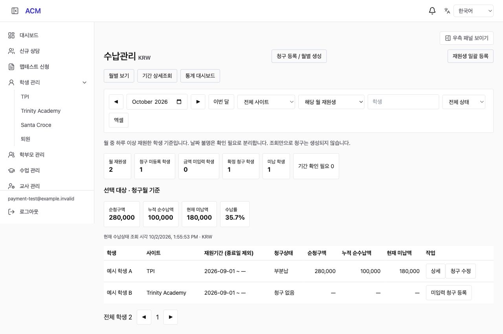
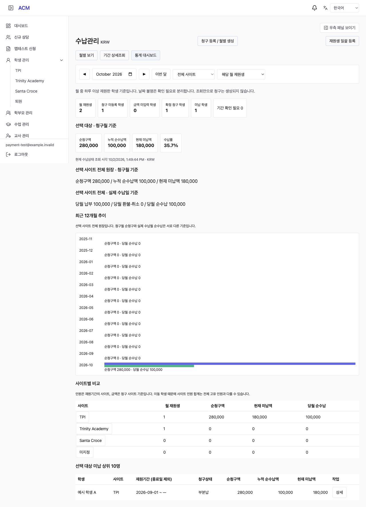
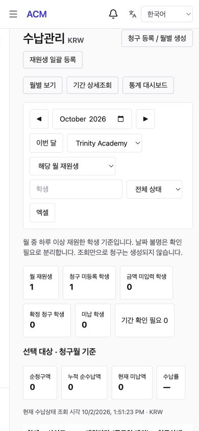

# Monthly Payment View and Dashboard (월별 수납 및 통계 구현 결과)

## 1. Result (구현 결과)

수납관리 기본 화면을 월별 학생 목록으로 구성했다. 이전/다음 달·이번 달, 사이트 선택, 해당 월 재원/전체 원장 포함/기간 확인 필요, 학생·청구상태 필터와 엑셀을 제공한다. 월·사이트·탭은 URL에 유지된다. 청구가 없는 학생도 표시하며 학생 한 명의 여러 청구는 합산하고 개별 상세/기존 편집 화면으로 연결한다.

미입력 등록은 선택 월·사이트 및 선택 학생을 서버에 전달하고 미리보기 후 명시적으로 생성한다. 과거 월에 재원한 현재 퇴원생도 해당 월 DRAFT를 생성할 수 있다. 같은 월 기존 수업료 청구가 있으면 사이트에 관계없이 중복 생성하지 않는다. 불확실한 기간 학생은 자동 생성 대상에서 제외한다. 조회는 원장을 생성하지 않는다.

대시보드는 선택 대상의 재원·청구 미등록·미입력·확정 청구·미납 인원, 순청구·누적 순수납·현재 미납·수납률을 제공한다. 전체 원장 금액 및 실제 납부일 기준 납부/환불/순수납은 구분해 표시한다. 최근 12개월 청구·실제 순수납 그래프, 사이트 비교, 미납 상위 10명 및 카드→필터 목록 이동을 지원한다.

기존 기간 상세조회·청구 수정·납부/환불 기록·선택 편집 기능을 유지한다. 직전 구현된 공통 우측 패널 가리기와 호환하며 4개 언어를 제공한다.

## 2. Calculation Rules (계산 기준)

- 첫 재원 경계는 입원일, 복귀 이후는 확정 재원 기간이다. 기존 운영 대시보드의 `studentEnrollmentIntervals`를 추출해 양쪽에서 공유한다. 월과 기간이 하루 이상 겹치면 포함하고 종료일은 제외한다. 취소 이력을 자동 복원하지 않는다.
- 입원일 누락, 미확정/모순/중복 기간, 종료일 없는 비재원 기록은 확인 필요 표시. 현재 상태만으로 과거 재원을 추정하지 않는다. 확인 필요 학생은 학생 정보 링크에서 검토할 수 있다.
- 재원 인원은 학생 ID로 중복 제거. 사이트 이동 학생은 월중 재원한 각 사이트에 나타날 수 있어 사이트 합계와 전체 고유 인원은 다를 수 있다.
- 학생 사이트는 기간 이력, 금액은 청구 사이트 스냅샷 기준. 미지정도 별도 선택 가능. 전체 사이트에서 월 청구를 새로 만들 때는 그 월의 가장 늦은 재원 기간 사이트를 사용한다.
- 청구 없음/금액 미입력은 금액 `null`, 0원 확정은 납부불필요. 미입력은 금액 합계·수납률 분모에서 제외한다. 확정 순청구 0원일 때 수납률은 ‘—’.
- 청구월 수납액은 해당 청구에 연결된 현재 누적 순수납이며 월말 당시 잔액이 아니다. 실제 수납월 통계는 과거 월 청구에 대한 해당 월 입금/환불도 포함한다. 기준 시각을 표시한다.
- 목록과 선택 대상 집계/엑셀은 동일 필터를 사용한다. 전체 원장·수납일 집계 및 사이트 비교는 별도 제목으로 범위를 표시한다. 페이지가 바뀌어도 집계는 전체 대상 기준이다.
- 기존 수납 원장은 KRW 단일 통화다. 다중 통화 원장을 새로 도입하지 않았다.

## 3. API and Data (API 및 데이터)

- GET `/api/acm/pay/bills/monthly`: month, site, scope, q, status, page. 학생별 목록/집계/최근 12개월/사이트 비교 반환. 한 페이지 50명.
- GET `/api/acm/pay/bills/monthly-export`: 동일 조건 엑셀, 10,000명 초과 시 오류.
- 기존 active-drafts(-preview): 선택적 roster=MONTH, site, studentId 추가. 기존 CURRENT 동작 유지. 테넌트 생성 잠금·학생 공유 잠금 및 멱등키 유지.
- 월별 조회는 REPEATABLE READ로 일관된 원장/학생/이력 스냅샷을 사용한다. 조회에 새 테이블이나 마이그레이션이 필요하지 않다.
- 기존 ADMIN/APP_ADMIN/STAFF 권한 유지, 교사 접근 차단. 모든 SQL에 테넌트 조건 적용.

## 4. Verification (검증)

| 항목 | 결과 |
|---|---|
| Backend 전체 Jest | 91 suites / 706 tests 통과 |
| 기존 운영 대시보드 계산 회귀 | 9 tests 통과 (전체 Jest에도 포함) |
| 신규 월별 단위 테스트 | 7 tests 통과: 월 경계, 취소 이력, 불명 기간, 미지정, 중복 기간, 미입력/0원 |
| Backend build / 전체 tsc | 통과 |
| Frontend TypeScript / Vite build | 통과, 기존 큰 청크 경고 유지 |
| 변경 backend ESLint / git diff check | 통과 |
| PostgreSQL 월별 통합 | 입퇴원 경계·복귀 공백·사이트 이동/중복 제거·날짜 누락·여러 청구·다른 달 납부·환불·원장 사이트·테넌트 격리·조회 무변경 통과 |
| 105명 조회 | 50명 페이지 1/2, 전체 집계 동일, 엑셀 105명, 검색 상한과 무관한 배치 미리보기 통과 |
| 월별 등록 | 사이트/학생 제한, 과거 재원생 생성, 미지정 사이트 유지, 재시도 중복 방지, 잘못된 월 차단 통과 |
| 기존 DRAFT PG 회귀 | 105명 대상 처리, NULL/0, 수납 차단, 취소/복원/확정 등 통과 |
| 실제 Nest HTTP | STAFF 허용/교사 403, 잘못된 월·사이트 400, 월 재원 목록, 사이트별 XLSX 및 기존 수납/환불 검증 통과 |
| 실제 브라우저 | 월/사이트/통계 탭, 카드→목록, 단일 학생 등록 미리보기, 원장 편집 연결, 새로고침 조건 유지, 공통 패널 가리기 확인 |
| 모바일 | 390×844에서 document width/scrollWidth 모두 390, 필터 줄바꿈·표 내부 스크롤 확인 |

가상 테넌트를 사용하는 로컬 PostgreSQL `acm_lifecycle_test_260929`에서 검증했다. HTTP 테스트는 JWT 인증만 가상 계정으로 대체하고 실제 Controller/ValidationPipe/RolesGuard/Service/DB를 사용했다. 테스트 종료 시 가상 데이터를 정리했다. 대규모 운영 데이터 부하 벤치마크는 수행하지 않았다.

재현: backend에서 `ACM_TEST_ENV_FILE=/path/to/local.env npx ts-node --transpile-only test/pay-monthly-pg-check.ts` 및 기존 `pay-collections-http-check.ts`.

## 5. Production Data Check (운영 원천 데이터 확인)

읽기 전용 트랜잭션으로 건수만 확인했다. 대상 테넌트 전체 학생 299명, 현재 재원 51명, 현재 재원생 입원일 누락 0명이다. 전체 입원일 누락 177명, 비재원 학생 마스터 종료일 누락 175명, 재원 이력 91건 중 미확정 1건이다. 마스터 날짜 누락은 별도 기간 이력의 존재 여부까지 반영한 최종 월 판정 건수가 아니다.

운영 데이터 변경 및 날짜 보정은 수행하지 않았다. 과거 정보가 불완전한 학생은 확인 필요 목록에서 근거를 검토해야 한다.

## 6. Screenshots (화면 증빙)

모두 로컬 가상 학생 데이터다.

## 7. Delivery (반영 상태)

격리 작업 공간 `/private/tmp/acm-payment-261001`, 브랜치 `feat/pay-monthly-dashboard-261002`. 이전 공통 우측 패널 가리기 구현을 포함한다. 원본 프로젝트의 미커밋 소스를 덮어쓰지 않고 문서와 캡처만 복사했다. **운영 배포 전**이며 이번 작업으로 운영 청구·납부 내역은 변경하지 않았다.
