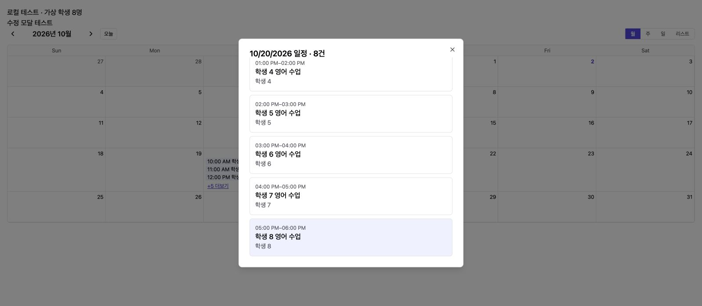
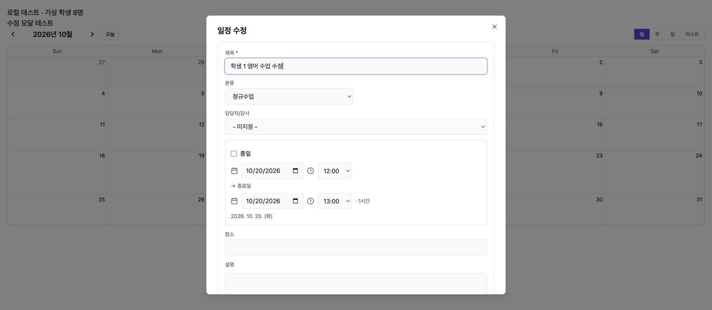
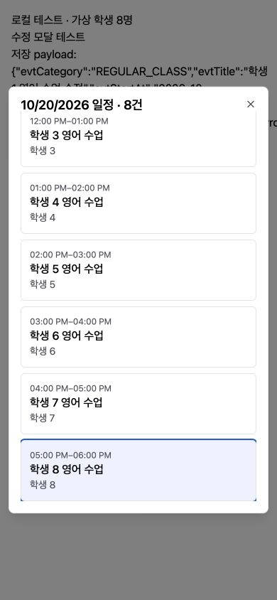

# Calendar Corrections Report (수업일정 수정 보고서)

## 1. Result (결과)

사용자의 “진행” 승인으로 [계획](../plan/PLN-261002D-cal-category-repeat-portal.md)에 따른 구현을 완료했다. **운영 배포와 실제 데이터 이관·반복 종료를 완료했다.** 변경은 최신 운영 main `0fe757e` 기반 독립 작업 디렉터리 `/private/tmp/acm-payment-261001`, 브랜치 `feat/cal-corrections-261002`에 있다. 원래 작업 디렉터리의 다른 구현은 덮어쓰지 않았다.

- 수업/개인/행사 선택지를 제거하고 신규 수업 기본값을 정규수업으로 변경했다. 회의는 편집 시 회의로 유지한다. 구형 저장값은 읽기/필터/통계/색상 응답에서 정규수업·기타로 호환한다.
- 대상 테넌트의 기존 수업 → 정규수업, 행사 → 기타 이관 및 11월 이후 반복 회차 soft-delete 도구를 추가했다. 기존 정규수업 색상을 우선 보존한다.
- 수정 사유는 선택, 공백/미입력은 null로 처리한다. 수정자/변경내용 이력은 보존하고 삭제 사유 검증은 유지한다.
- 강사 포털 월 달력의 +N 버튼에서 전체 날짜 목록을 열고 마지막 항목도 상세로 진입한다. 목록 내 스크롤과 Escape 복귀, 원래 버튼으로 포커스 복원을 지원한다.

## 2. Production Preview (운영 미리 실행)

운영 DB READ ONLY 트랜잭션으로 실제 도구를 실행했다. 기준은 **2026-11-01 00:00 Asia/Seoul**, UTC `2026-10-31T15:00:00Z`다.

| 항목 | 예정 건수 |
|---|---:|
| 활성 수업 → 정규수업 | 6,373 |
| 활성 행사 → 기타 | 9 |
| 활성 개인 → 기타 | 0 |
| 삭제할 ICS 반복 회차 | 827 |
| 삭제할 자체 반복 회차 | 1 |
| 종료할 ICS 수업 원본 | 656 |
| 종료할 자체 반복 원본 | 8 |

앞선 문자열 검색 집계와 달리 ICS 원본은 실제 iCalendar VEVENT의 RRULE/RDATE 속성을 파싱하여 판별했다. 카테고리 이관 건수에는 삭제 예정 회차도 포함되며, 두 숫자를 합산하지 않는다. 실행 직전 최신 dry-run이 필요하다.

미리 실행 digest: `d855d293049c6c2bdd057871261823352e0513b39f75e7635e6403beb0f95679`.
비공개 미리 실행 파일은 운영 backend 컨테이너의 `/tmp/cal-correction-261002-implementation-preview.json`에 권한 0600으로 저장했다. 컨테이너 재배포 시 사라질 수 있으므로 실제 실행 자료는 영속 백업 위치에 저장해야 한다.

## 3. Verification (검증)

- Backend Nest 빌드, frontend TypeScript/Vite 프로덕션 빌드 통과. 기존 큰 JS 청크 경고가 있다.
- CAL 관련 6개 테스트 스위트, **74개 테스트 통과**: 선택 수정 사유/잘못된 사유/삭제 사유, 폐기 카테고리 입력 차단과 구형 값 호환, 실제 수정 revision의 null 사유, Meet 링크 선택 유지, 반복 계산/ICS, 즉시 수업 등.
- 날짜 이동 후 반복 종료: 11월 기준 회차가 10월로 이동한 경우 보존하고, 10월 기준 회차가 11월로 이동하면 생성하지 않는 테스트 통과.
- PostgreSQL 세션 전용 TEMP 테이블 통합 검사 통과: 한국 시간 컷오프 직전/정각, 단일 미래 일정·다른 테넌트 보존, 행사/개인 기타 이동, 기존 정규수업 색상 우선, 재실행 변경 0, 데이터 복구 및 후속 변경 시 복구 거부. 실제 앱 테이블은 건드리지 않았다.
- 로컬 Chrome 가상 데이터 화면 검증: 8개 일정의 +5 버튼 → 전체 목록 → 8번째 학생 상세 → Escape 목록 복귀 및 포커스 복원. 390×844 모바일에서도 마지막 일정 접근 확인.
- 수정 화면에 사유를 입력하지 않고 제목을 바꿔 저장하여 `evtEditReason: null`, 빈 Meet URL의 요청 payload와 모달 닫힘 확인. 이는 로컬 API fixture 검증이며 운영 저장 검증은 아니다.

### Screenshots (로컬 가상 데이터 화면)





재현 화면: Vite 로컬 실행 후 `/test/cal-corrections-fixture.html`. 실제 API 대신 fixture adapter만 사용한다. 프로덕션 빌드의 HTML 진입점에 포함되지 않는다.

## 4. Rollout (운영 반영 절차)

1. 운영 DB 백업 및 복구 가능 여부 확인. `1028-cal-category-repeat-cutoff.sql`을 먼저 적용한다. 카테고리 DB 기본값과 nullable `crs_start_before`만 추가하며 테넌트 데이터는 자동 변경하지 않는다.
2. backend/frontend를 함께 배포하고 기본 health/API를 확인한다.
3. 배포된 backend 작업 경로에서 아래 dry-run을 실행한다. script는 배포 checkout에서 backend 컨테이너로 복사해 실행할 수 있다. `--snapshot`은 비공개 영속 백업 볼륨의 새 파일 경로를 사용한다.

```sh
node correct-cal-october.cjs --email tpiyeri@tpiglobal.network \
  --cutoff 2026-10-31T15:00:00Z --snapshot /backup/cal-preview.json
```

4. 최신 출력의 건수와 digest를 검토하고, 동일 인자에 `--apply --expect <최신 digest>`를 추가한다. 적용 스냅샷 경로는 기존 preview와 다른 새 경로를 쓴다. 기대값이 다르면 적용하지 않는다. 10월까지 생성되지 않은 원본 또는 다른 분류가 섞인 반복은 중단 후 검토한다.
5. 도구는 테넌트 video/ICS/repeat/color 잠금과 행 잠금, 단일 트랜잭션을 사용한다. 전후 값과 `*.applied.json` 복구 자료를 기록하며 대량 알림은 발송하지 않는다. 단일 일정·출결·수납·다른 테넌트 데이터는 삭제하지 않는다.
6. 재실행 변경 0, 수업 카테고리 0, 11월 이후 대상 회차 0을 확인한다. 관리자·포털의 10월/11월 조회 및 반복 확장 경로에서 재생성되지 않는지 검증한다.

자체 반복의 기존 `crs_stop_at`은 원래 회차 키 기준이므로 유지하고, 새 `crs_start_before`로 이동 후 실제 시작 시각을 제한한다. ICS는 기존 stopped_at을 사용한다. 원본/회차 연결 및 soft-delete 기록을 보존한다.

## 5. Rollback (복구)

동일 backend 의존성 환경에서 `rollback-cal-october.cjs <applied.json>`으로 복구를 시험한다(기본은 트랜잭션 rollback). 실제 복구는 `--apply`로 실행한다. 적용 후 사용자 수정이 있으면 전체 복구를 거부하여 덮어쓰지 않는다. 전후 자료는 개인정보를 포함할 수 있어 비공개 보관한다.

데이터 정리 후 이전 backend로 되돌리면 새 실제 시작 제한을 이해하지 못하므로 데이터 복구와 애플리케이션 롤백 순서를 함께 결정해야 한다. 운영 적용 결과와 복구 자료 위치는 아래에 기록했다.


## 6. Production Application (운영 적용 완료)

- 사용자 “운영 데이터에 적용” 요청에 따라 필요한 코드·스키마를 먼저 배포한 뒤 정리 도구를 적용했다.
- PR [#297](https://github.com/amoeba-devops/appAcademy2/pull/297) 병합. 운영 SHA `b5003c12b17233a48d1d35c582b6f566556c19dc` (`b5003c1`).
- [CI 37021409872](https://github.com/amoeba-devops/appAcademy2/actions/runs/37021409872) 성공. continue-on-error가 설정된 통합 테스트 단계까지 실패 없이 통과했다.
- [Staging 37021944933](https://github.com/amoeba-devops/appAcademy2/actions/runs/37021944933) 성공. 실제 DB의 격리된 가상 테넌트로 단일/ONE/FOLLOWING/ALL 사유 없는 수정, revision, 사유 없는 삭제 거부, 이관/중단, 2028년 조회 시 재생성 0, 멱등성, 적용 영수증 기반 복구를 확인했다. 가상 데이터는 제거했다.
- [Production 37022376242](https://github.com/amoeba-devops/appAcademy2/actions/runs/37022376242) 성공. **2026-10-02 23:48:22 KST (14:48:22 UTC)** 완료.
- SQL 1028 적용 후 backend/frontend가 모두 `b5003c1`으로 실행 중이다. 공개 진입점은 `/assets/index-CKabgxZc.js`를 제공한다.

### Applied Counts (실제 적용 건수)

| 변경 | 실제 적용 |
|---|---:|
| 활성 수업 → 정규수업 | 6,373 |
| 활성 행사 → 기타, 일정 내용 보존 | 9 |
| 개인 카테고리 활성 일정 | 0 |
| 11월 이후 ICS 반복 회차 soft-delete | 827 |
| 11월 이후 자체 반복 회차 soft-delete | 1 |
| ICS 반복 원본 종료 | 656 |
| 자체 반복 원본 실제 시작 시각 제한 | 8 |

적용 직전 dry-run digest는 기존 검증값과 동일했다. 같은 digest를 `--expect`로 지정하여 단일 트랜잭션으로 적용했다. 과거·삭제 이력의 구형 카테고리도 호환 이관했으며, 위 이관 건수는 활성 일정 기준이다.

### Post-Apply Checks (사후 검증)

- 활성 카테고리: 정규수업 **5,601**, 레벨테스트 **304**, 기타 **306**. 수업/개인/행사 활성 일정 **0**.
- 10월 활성 일정 **541건 보존**. 11월 이전 총 6,251행의 카테고리/수정시각을 제외한 데이터 해시가 일치한다.
- 전체 7,086개 이벤트의 내용·시간·담당자·연결 필드 해시 일치. 물리 삭제 없음.
- 관리자 API에서 11월~2028년 구간을 두 번 조회해 **0건**, 활성 강사 계정의 포털 API에서도 **0건**. API 조회로 반복 전개 경로를 실행한 뒤에도 재생성되지 않았다.
- 대상 테넌트 청구 51건, 수납 0건, 참석자 연결 66건의 전체 행 해시 일치. 다른 테넌트 일정 집계/해시도 일치한다(기준 시점 0건).
- 정리 도구 재실행의 모든 변경 항목 **0건**.
- 적용 직후 3분 시점 컨테이너 재시작 0, 최근 5분 backend ERROR 로그 0. 브라우저 로그인 화면의 직접 운영 UI 검증 대신 인증된 실제 관리자/강사 API로 검증했다. 위 스크린샷은 로컬 가상 데이터 검증 자료다.

### Recovery Artifacts (비공개 복구 자료)

운영 서버 `/home/appacademy/app-academy-backups/`, 모두 권한 0600:

- `db_acm-before-cal-correction-20261002T144012Z.dump` — 7,199,745 bytes, pg_restore 목록 검사 통과.
- `cal-production-baseline-261002.json` — 변경 전 데이터 보존 비교값.
- `cal-preview-b5003c.json` — 2,758,108 bytes, 적용 전 영속 보관.
- `cal-apply-b5003c.json` — 2,758,108 bytes, 적용 계획/이전 값.
- `cal-apply-b5003c.json.applied.json` — 4,199,801 bytes, 전후 값과 충돌 검사용 복구 자료.

스테이징 백업: `/home/appacademy/app-academy-backups/db_acm-before-cal-correction-20261002T144014Z.dump` (558,072 bytes).
