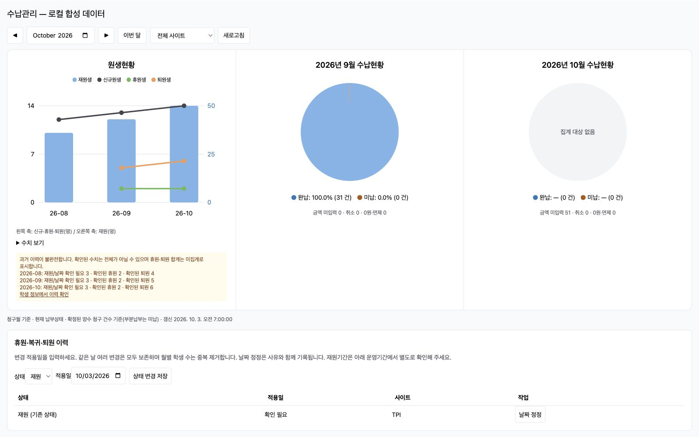
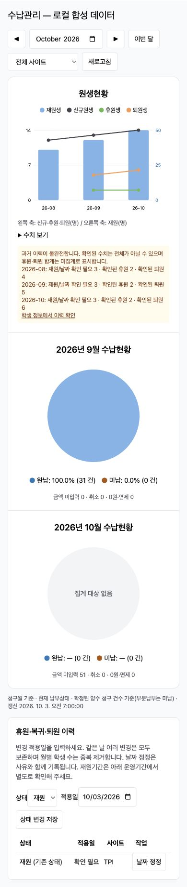
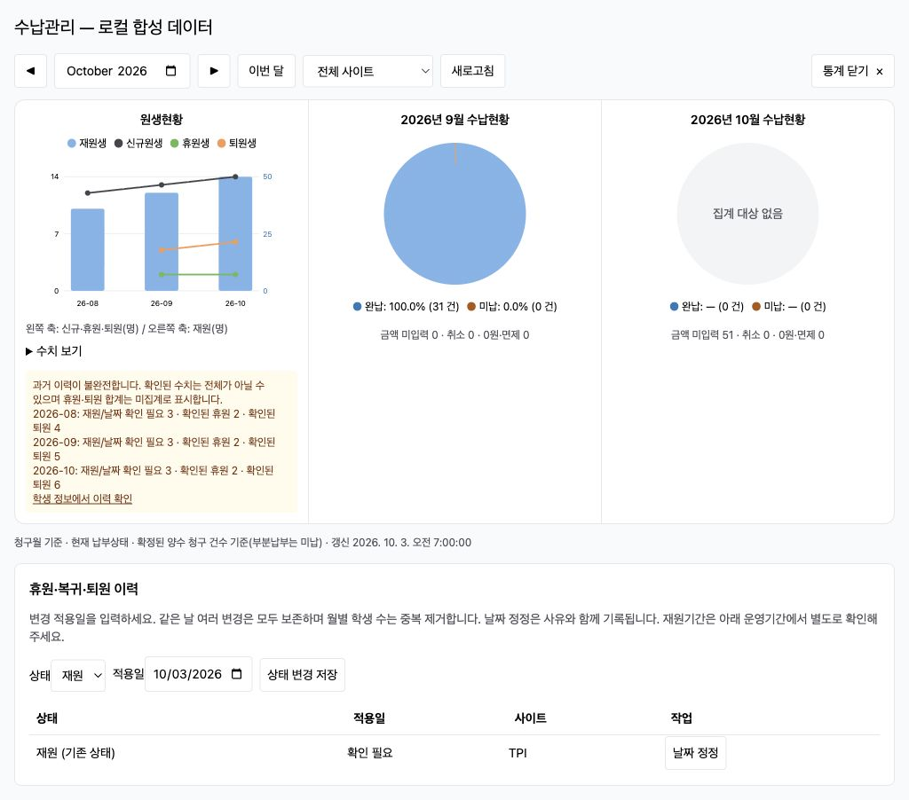
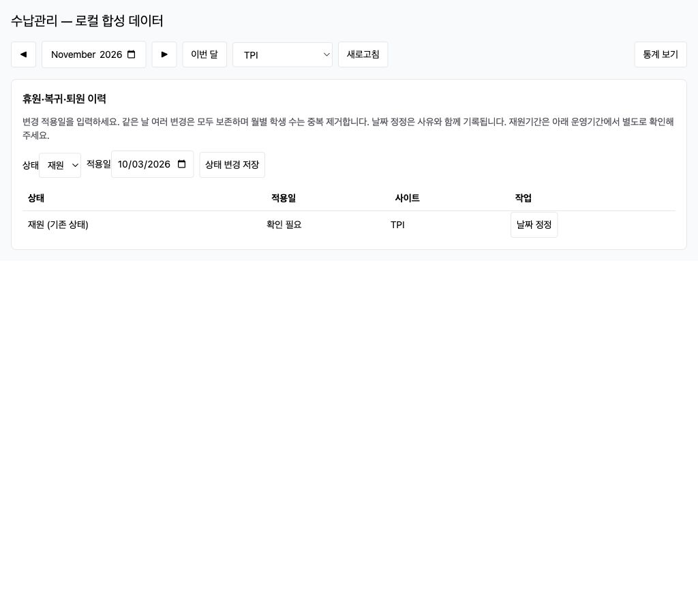
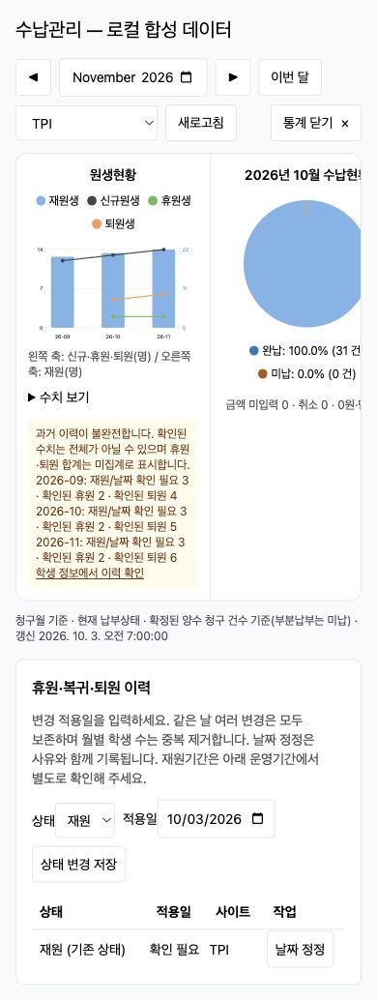

# Payment Header Statistics (수납 상단 통계 구현 보고서)

## 1. Result (구현 결과)

수납관리 모든 탭 상단에 최근 3개월 원생현황과 이전 월·선택 월 수납현황을 추가했다. 공통 월/사이트 선택을 월별 목록·기존 대시보드와 공유하며, 목록 검색·페이지·납부상태 필터와 독립적으로 집계한다. 기간 상세조회는 자체 기간 필터를 유지한다.

- 원생현황: 재원생 막대(오른쪽 축), 신규·휴원·퇴원 선(왼쪽 축), 수치표 제공.
- 수납현황: 완납/미납 **청구 건수**와 비율. 부분납부·환불 후 잔액은 미납. 금액 미입력·취소·0원/면제는 분모에서 제외.
- 데이터 없음: 회색 원형과 ‘집계 대상 없음’. 0건을 100% 완납으로 표시하지 않음.
- 월 경계/연도 변경, 사이트 선택, 로딩·오류·이력 부족, 모바일 세로 배치, 4개 언어 적용.

## 2. History and Definitions (상태 이력 및 집계 기준)

학생 상세에 휴원·복귀·퇴원 적용일 입력 및 날짜 정정 화면을 추가했다. 같은 날짜의 여러 전환은 이력으로 보존하고 월별 학생 수는 중복 제거한다. 미래 날짜와 이력 순서를 뒤집는 날짜는 거부한다. 정정에는 사유가 필요하며 이전/새 날짜·작성자·시각을 감사 기록으로 보존하고 revision 충돌을 검사한다.

`1029-std-status-history.sql`의 DB 트리거로 직접 수정·일반 학생 수정·가져오기·자동 생성에서도 상태 이력을 누락하지 않는다. 사용자 생성/수정/상태변경/가져오기에서는 가능한 작성자 컨텍스트를 저장한다. 자동 처리 및 기존 기준 자료는 작성자를 추측하지 않는다. 명시적인 입학일/퇴원일만 초기 날짜로 사용하며 나머지는 미확인으로 보존한다. 이전 퇴원일을 이후 재퇴원 날짜로 재사용하지 않는다.

이력의 상태 자체를 삭제/취소하는 API는 제공하지 않는다. 상태를 되돌리는 경우 새 적용일로 상태 변경을 기록하며, 잘못된 날짜는 정정 기능으로 수정한다. 재원기간 원장은 별도로 유지하므로 학생 상세의 기존 운영기간 편집 화면에서 함께 확인한다.

- 재원생: 기존 월별 재원기간 판정 함수를 재사용(해당 월에 하루 이상 재원, 전체는 학생 ID 중복 제거).
- 신규: 최초 입학일 기준이며 복귀는 신규에 포함하지 않는다.
- 휴원·퇴원: 날짜가 있는 상태 전환 기준. 단순한 운영기간 종료/사이트 이동을 퇴원으로 간주하지 않는다.
- 기존 baseline 이전의 휴원·재퇴원 전체 이력은 복원 불가. 해당 달은 합계를 `null`/‘확인 필요’로 표시하고 **확인된 건수**를 별도로 보여준다. 누락 이력을 0명으로 바꾸지 않는다.
- 수납: 청구월의 **현재 잔액** 기준이다. 과거 월말 시점의 잔액 스냅샷이 아니다.

## 3. Implementation (주요 구현)

- `GET /api/acm/pay/bills/statistics?month=YYYY-MM&site=...`: 테넌트 격리, repeatable-read 조회. 기간/학생 검색 등 목록 인자는 받지 않는다.
- `GET /api/acm/std/students/:id/status-history`: 학생 상태 이력.
- `PATCH /api/acm/std/students/:id/status`: 상태와 `effectiveDate` 필수.
- `PATCH /api/acm/std/students/:id/status-history/:historyId`: revision/사유 기반 날짜 정정.
- 프론트: `frontend-acm/src/modules/pay/top-statistics.tsx`, 학생 `status-history-panel.tsx`.
- DB: `sql/acm/1029-std-status-history.sql`. 운영 배포 시 백업 후 마이그레이션 필요.

기존 IDE 작업 폴더에 여러 미완료 변경과 구버전 소스가 있어 독립 체크아웃 `/private/tmp/acm-payment-261001`, 브랜치 `feat/pay-top-statistics-261003`에서 구현했다. 기준은 운영 main `b5003c1`이다. 기존 작업 파일을 덮어쓰지 않았다.

## 4. Validation (검증)

- PAY/STD 관련 Jest **51개 통과**: 청구 분모, 부분납부·환불, 빈 데이터, 연도 경계, 복귀/신규 구분, 상태 중복 제거, 날짜 누락, 사이트 구분, 정정 충돌·순서·미래일·테넌트 검사.
- 로컬 PostgreSQL 통합 테스트 통과: 실제 마이그레이션, baseline 재실행, 모든 SQL 상태 변경 기록, 작성자/적용일, 테넌트 분리, 롤백, 과거 퇴원일 재사용 방지. 격리 스키마에서 실행 후 전체 롤백.
- backend `npm run build`, frontend `npm run build` 통과. 기존 Vite 번들 크기 경고는 남아 있다.
- 로컬 Chrome: 월·사이트 변경, 숫자 표, 날짜 정정 입력 확인. 모바일 390px에서 document 너비와 content 너비 모두 390px, 가로 넘침 없음.
- 화면 캡처는 실제 컴포넌트에 **합성 데이터**를 사용했다. 운영 수치나 운영 화면 검증 결과가 아니다.

### Desktop (데스크톱)

### Mobile (모바일)

## 5. Deployment (운영 배포)

2026-10-03 **09:06:53 UTC / 18:06:53 KST** 운영 배포 완료.

- PR: [#298](https://github.com/amoeba-devops/appAcademy2/pull/298)
- 운영 커밋: `9851761973e34d26846b20fdf689399e1dbc4e33` (`9851761`)
- [PR CI](https://github.com/amoeba-devops/appAcademy2/actions/runs/37111537985): 모든 job/step 성공, PostgreSQL Testcontainers 포함.
- [Staging CD](https://github.com/amoeba-devops/appAcademy2/actions/runs/37111734265): 성공.
- [Production CD](https://github.com/amoeba-devops/appAcademy2/actions/runs/37111919122): 성공.
- 운영 backend/frontend 모두 `9851761`, 마이그레이션 1029 적용 확인.
- 공개 페이지 HTTP 200, frontend asset `/assets/index-rN6BjD63.js` 확인.

### Backup and Preservation (백업 및 보존 검증)

운영 호스트 `/home/appacademy/app-academy-backups/`:

- `db_acm-before-payment-20261003T090316Z.dump`: **7,631,179 bytes**, mode 0600, `pg_restore --list` 검증.
- `pay-stats-baseline-261003.json`: 배포 직전 학생/청구/납부 전체 행 건수·해시.
- 스테이징 백업: `db_acm-before-payment-20261003T085951Z.dump`, 558,382 bytes, 복원 목록 검증.

배포 후 전체 학생 **319건**, 청구 **51건**, 납부 **0건**의 전체 행 해시가 배포 전과 동일했다. 신규 상태 이력 baseline만 추가됐다. 대상 테넌트 baseline은 307건이며 날짜 미확인 183건은 추측하지 않고 보존했다.

### Deployed API Verification (배포된 API 검증)

스테이징 격리 합성 테넌트에서 실제 API로 완납/부분납부/미납/초안/취소/0원 분모, 사이트 필터, 빈 달, 월별 재원 명단 대사, 적용일 상태 전환, 중복 휴원 집계, 날짜 정정 감사 기록, revision 충돌, 순서 오류/미래일/적용일 누락 거부를 확인했다. 테스트 자료는 모두 정리했다.

운영은 읽기 전용으로 인증된 통계 API와 기존 월별 명단을 대사했다:

| Site | October enrolled | Amount-unset bills |
|---|---:|---:|
| ALL | 51 | 51 |
| TPI | 34 | 34 |
| TRINITY | 3 | 3 |
| SANTACROCE | 14 | 14 |
| UNASSIGNED | 0 | 0 |

10월 청구는 모두 금액 미입력 상태라 원형 그래프 집계 대상은 0건이다. 9월도 집계할 청구가 없다. 따라서 ‘집계 대상 없음’은 정상 결과다. 과거 상태 이력이 부족하여 휴원/퇴원은 확인된 수치와 이력 확인 안내로 표시한다. 초기 통계 API 응답은 14~46ms였다.

운영 브라우저는 로그인 화면으로 이동하여 로그인 후 화면 자체는 검증하지 못했다. 위 캡처는 계속 **로컬 합성 데이터**이며, 운영 확인은 인증된 API·공개 asset·실행 이미지·마이그레이션 기준이다.

앱 롤백 대상은 이전 `b5003c1`; 신규 상태 이력 테이블과 감사 기록은 보존한다.

### Initial Monitoring (초기 모니터링)

09:12:14 UTC 최종 확인(앱 시작 후 5분 28초): backend/frontend running, 재시작 0회, 배포 이후 백엔드 오류 로그 0건. 통계 API 재검증 10~30ms, 학생·청구·납부 원본 해시 및 사이트별 대사 재통과.

## 6. Compact Layout and Toggle (축소 배치·닫기/보기 추가 수정)

사용자의 추가 구성 승인 후 구현했다. **이 절의 변경사항도 운영 배포 완료**했으며, §7에 배포 검증 결과를 기록했다. §5는 이전 그래프 기능 배포 이력이다.

- 모든 화면 크기에서 3열 한 줄 유지. 원형 그래프 최대 160px, 혼합 그래프 최대 280px 및 카드 여백 축소.
- 600px 미만의 콘텐츠 영역에서는 그래프 행만 가로 스크롤. 페이지 전체 가로 넘침 없음.
- 우측 ‘통계 닫기 ×’/‘통계 보기’, `aria-expanded`/`aria-controls` 적용.
- 월·사이트 필터는 유지하며 닫힌 상태의 전용 통계 조회·새로고침을 비활성화. 다시 펼치면 현재 선택 기준으로 조회.
- 접힘 상태는 같은 페이지의 월/사이트/탭 변경 시 유지, 페이지 재진입 시 펼침. 4개 언어 반영.
- API·집계·DB 변경 없음.

검증: frontend production build 통과. 로컬 합성 데이터 화면에서 1024/1280px의 3열 배치와 닫기 → 월/사이트 변경 → 다시 펼치기 확인. 1280px 그래프 제목 3개의 top은 모두 125px. 모바일 390px에서 페이지 폭 390px, 그래프 스크롤 컨테이너 356px/콘텐츠 600px 확인.

## 7. Layout Release (배치·닫기 버튼 운영 배포)

2026-10-03 **10:03:18 UTC / 19:03:18 KST**, 운영 버전 `06e69228535c4d05ff1b6e71dbd47df8bb8332c4` (`06e6922`) 배포 완료.

- [PR #299](https://github.com/amoeba-devops/appAcademy2/pull/299)
- [CI](https://github.com/amoeba-devops/appAcademy2/actions/runs/37114644851): 전체 job/step 성공, 통합 테스트 포함.
- [Staging CD](https://github.com/amoeba-devops/appAcademy2/actions/runs/37114892815): 성공.
- [Production CD](https://github.com/amoeba-devops/appAcademy2/actions/runs/37115082289): 성공.
- 운영 backend/frontend 모두 `06e6922`, 재시작 0회, 초기 백엔드 오류 로그 0건.
- 스테이징·운영 공개 페이지와 `/assets/index-YxP5AfXc.js` 모두 HTTP 200. 제공되는 실제 JS의 3열 최소 폭 600px, 원형 최대 160px, hideCharts/showCharts 포함 확인.
- 운영 인증된 통계 API 45ms / 월별 명단 API 43ms, 모두 HTTP 200 및 재원생 집계 대사 통과.
- 이번 변경은 프론트엔드·번역·문서만 포함. API/집계/DB 변경 및 데이터 이관 없음. 롤백 기준은 이전 `9851761`.
- 1024/1280/390px 화면 및 닫기·필터 변경·다시 펼치기는 §6의 로컬 검증 결과이며, 운영 배포 확인은 실행 이미지·공개 파일·인증 API 기준이다.
