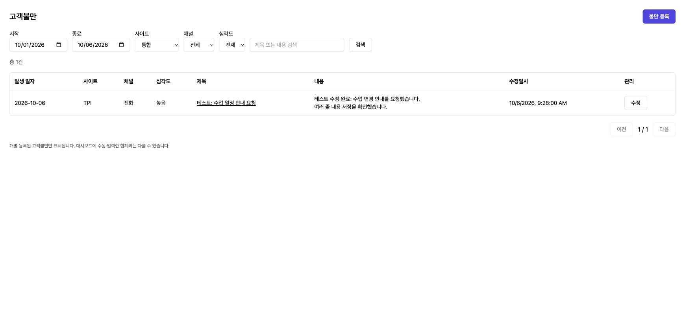
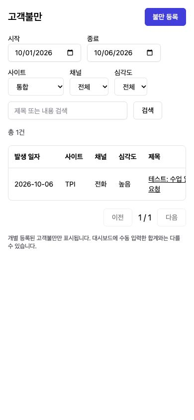

# Customer Complaint Management (고객불만 관리 구현 보고)

## 1. Result (구현 결과)

- `/admin/complaints` 고객불만 메뉴를 수업통계 바로 아래에 추가. 기존 테넌트의 사용자 지정 메뉴 순서가 있어도 새 메뉴 최초 삽입 위치를 보장하고, 이후 명시적 위치·표시 설정은 유지한다.
- 기간·사이트·채널·심각도 필터, 제목/내용 검색, 페이지당 20건, 상세 내용과 등록/수정 일시 제공.
- 대시보드에서 조회 중인 기간·사이트를 유지하는 고객불만 목록 바로가기 추가.
- 기존 등록 다이얼로그를 등록/수정에 공용 사용. 여러 줄 내용, 길이 제한, 빈 값 지우기, Q&A 검색/선택/해제, 저장 실패·충돌 안내 추가.
- 한국어/영어/베트남어/중국어 번역 및 모바일 필터 줄바꿈·목록 가로 스크롤 반영.

## 2. Data and API (데이터 및 API)

기존 `amb_acm_dsh_complaints`를 사용하며 스키마 이관은 없다. 기존 월별 배열 응답은 유지한다.

- `GET /api/acm/dsh/complaints/search`: 기간 최대 366일, 페이지 크기 최대 100, 필터/정렬/검색.
- `GET /api/acm/dsh/complaints/:id`: 같은 테넌트의 비삭제 불만 상세.
- `GET /api/acm/dsh/complaints/qna-options`: 같은 테넌트의 비삭제 Q&A 제목 검색, 최대 50건.
- `PUT /api/acm/dsh/complaints/:id`: 날짜 수정 및 nullable 필드 지우기. `expectedUpdatedAt` 필수. 수정 조건에 tenant/id/비삭제/수정시각을 포함하고 충돌 시 409.
- 연결 Q&A는 같은 테넌트의 유효한 항목인지 저장 전에 확인한다.
- 날짜 변경 시 이전/이후 날짜를 재집계한다. 기존 수동 통계 override 정책은 유지한다.
- 데이터 저장 후 KPI 재집계만 실패한 경우 저장 성공과 `statisticsPending`을 함께 반환하며 사용자에게 지연 안내를 표시한다. 기록 중복을 유발하는 저장 재시도를 방지한다. 실패 날짜는 서버 로그를 통해 기존 대시보드 재집계 절차로 복구해야 한다.

## 3. Validation (검증)

- Backend `npm run build`: PASS.
- Frontend `npm run build`: PASS. 기존 번들 크기 경고 유지.
- Jest: `complaint.service.spec.ts`, `tenant.service.spec.ts` — **15 tests passed**.
- 검증 항목: nullable 지우기, 전후 날짜 재집계 호출, 충돌 거부, 타 테넌트 접근/연결 차단, KPI 실패 후 저장 성공 구분, 검색 조건/페이징, 날짜/상한 검증, 기존 메뉴 순서와 표시 설정 보존.
- Chrome 로컬 테스트 데이터: 목록 → 상세 → 수정 → 여러 줄 내용 저장 → 갱신된 목록 확인.
- 모바일 390×844: 페이지 폭 390px, 문서 scrollWidth 390px. 표 내부만 가로 스크롤.
- 브라우저 검증은 메모리 응답 fixture를 이용했다. 실제 DB와 로그인 세션을 통한 통합 검증 및 운영 배포는 수행하지 않았다.

## 4. Screenshots (화면 확인)

아래는 테스트 데이터로 렌더링한 로컬 화면이다. 운영 고객 데이터가 아니다.

## 5. Source and Deployment (소스 및 배포)

- 기준: canonical main `06e69228535c4d05ff1b6e71dbd47df8bb8332c4`.
- 브랜치: `feat/customer-complaints-261006`.
- 독립 작업 경로: `/private/tmp/acm-complaints-261006`.
- 기존 IDE 작업 폴더에 다수 미커밋 변경이 있어 구현 소스는 독립 체크아웃에 보관하고, 분석/계획/보고서/캡처는 IDE 작업 폴더에도 동기화했다.
- 운영 배포 및 운영 데이터 변경 없음.
