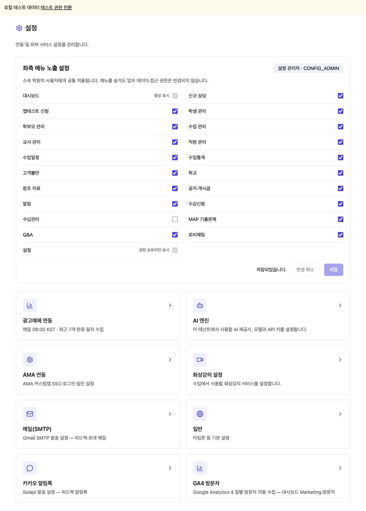
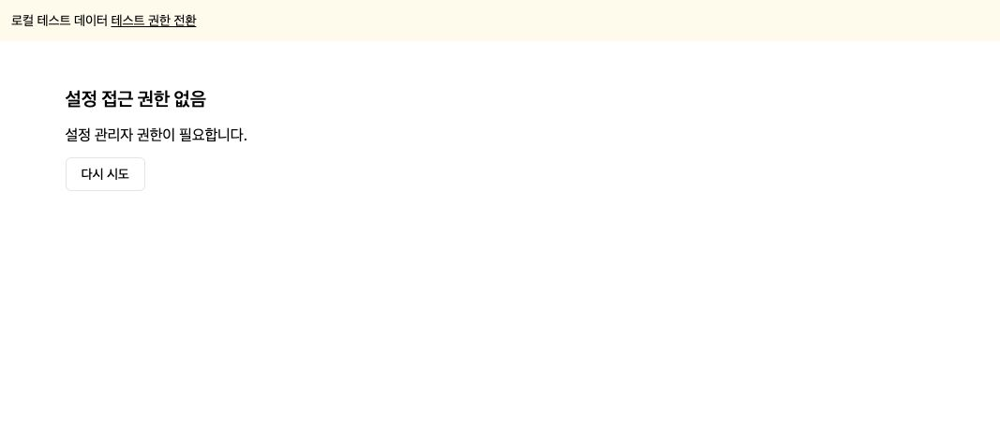

# Configuration Access Implementation (설정 권한 구현 보고)

## 1. Result (구현 결과)

- 기존 ADMIN/APP_ADMIN 등 기본 역할과 독립된 테넌트별 `CONFIG_ADMIN` 추가 권한 테이블 및 Guard 구현.
- `/admin/config`와 모든 하위 경로를 서버에서 조회한 최신 권한으로 보호. 미보유자는 메뉴 비노출 및 접근 거부 화면.
- AMA, 화상강의/BODA, 메일, 일반 설정 저장, 카카오, AI, GA4, 광고 연동 관리 API에 같은 Guard 적용. 기존 BODA demo-seed 우회 경로도 보호.
- 일반 업무에 필요한 시간대, 화상강의 capabilities, 광고비 조회·보정 경로는 기존 정책 유지.
- `/acm/me/config-access`에서 현재 계정의 권한 조회. 관리 API는 매 요청 실제 DB 권한/활성 사용자/테넌트를 확인한다. 기존 JWT 및 SSO 기본 role을 변경하지 않는다.
- 설정 페이지에 좌측 메뉴 표시·숨김 목록과 저장·취소·오류·미저장 안내 추가. 한국어/영어/베트남어/중국어 반영.
- 기존 테넌트 메뉴 저장소 재사용. 메뉴 순서를 변경하지 않고 변경된 노출값만 트랜잭션으로 저장한다.
- 대시보드 및 권한 보유자의 설정 메뉴는 항상 접근 가능. 설정 권한이 없는 사용자는 저장된 메뉴 플래그와 관계없이 설정 메뉴를 볼 수 없다.
- 설정·메뉴 조회 캐시를 사용자/테넌트별 분리. 메뉴 설정은 같은 학원의 사용자에게 공통 적용하며 업무 데이터 접근권한은 변경하지 않는다.

## 2. APIs and Data (API 및 데이터)

- `GET /api/acm/me/config-access`: 권한 여부. 설정 권한 조회 실패 시 화면 접근을 허용하지 않는다.
- `GET /api/acm/me/config-menus`: 권한 보유자의 자기 테넌트 메뉴 설정 조회.
- `PUT /api/acm/me/config-menus`: 권한 보유자의 메뉴 노출만 저장. 고정 메뉴 숨김/알 수 없는 키/중복 키/order·entId 주입 거부.
- 마이그레이션: `sql/acm/999x-config-admin-permission.sql`.
- 계정 부여: `scripts/operations/grant-config-admin-fremd.sql`. 확인된 UUID, 테넌트, 이메일, ACTIVE/ADMIN 상태가 모두 일치하는 단일 계정에만 멱등 부여한다.
- **운영 배포 및 fremd@naver.com의 CONFIG_ADMIN 권한 부여 완료. 기존 ADMIN / ACTIVE / AMA 계정 속성 유지.**

## 3. Validation (검증)

- FE production build, BE build 및 TypeScript noEmit 통과.
- 전체 백엔드 Jest 회귀: **98 suites / 762 tests 모두 통과**. 화상강의 설정의 이전 ADMIN 역할 테스트를 승인된 CONFIG_ADMIN 정책에 맞게 갱신했다.
- 권한·메뉴 관련 Jest 23건 통과: 미보유 ADMIN/APP_ADMIN 거부, 권한 철회 재검증, 테넌트 격리, 관리 API 보호 범위, 일반 조회 보존, DTO 검증, 기존 메뉴 순서 보존.
- `backend/test/config-access-pg-check.ts`: 임시 PostgreSQL 컨테이너 및 Nest HTTP로 스키마/권한부여 멱등성, 기존 ADMIN 유지, 403 차단·권한철회, 테넌트 위조, 메뉴 순서 보존을 검증. 통과 후 테스트 컨테이너 정리.
- Chrome 로컬 fixture: 메뉴 체크 해제 → 저장 완료, 권한 철회 → 접근 거부 화면 확인.
- 구현 검증 중 운영 고객 데이터 변경 없음. 운영 적용에서는 신규 권한 테이블과 요청된 추가 권한 1건만 반영했다. 실제 AMA 서버 재로그인은 별도로 수행하지 않았다. 추가 권한 테이블은 기존 SSO 사용자 갱신 경로와 분리돼 있다.
- 로컬 린트 신규 권한 코드 오류 0건. 기존 코드 스타일/테스트 mock 관련 경고 및 FE 번들 크기 경고 유지.

## 4. Screenshots (테스트 화면)

로컬 테스트 데이터이며 운영 계정 화면이 아니다.

## 5. Deployment Order (배포 순서)

1. 대상 계정·테넌트 재확인 및 현재 DB 백업. 다른 ADMIN에게 설정 권한을 자동 부여하지 않는다.
2. `999x-config-admin-permission.sql`을 적용한 뒤 운영 계정 부여 스크립트를 `ON_ERROR_STOP=1`로 실행한다. 대상 불일치 시 중단. 일반 역할은 변경하지 않는다.
3. 스테이징에서 전용 권한 보유/미보유 계정 검증 후 승인된 운영 배포를 진행한다. 신규 코드 가동 전에 대상 권한 부여를 마쳐 관리 진입점 공백을 방지한다.
4. 운영에서 fremd 계정 접근, 다른 일반 관리자 차단, 설정 카드 동작, 메뉴 표시/숨김 및 기존 업무 기능을 검증한다.
5. 이상 발생 시 직전 운영 이미지 `381097b`로 복구한다. 추가 테이블은 기존 버전에 영향을 주지 않으므로 고객 데이터나 테이블을 삭제하지 않는다. 개별 권한 철회는 정확한 ent_id/usr_id/CONFIG_ADMIN 조건으로만 수행한다.

## 6. Workspace (작업 위치)

- 독립 체크아웃: `/private/tmp/acm-complaints-261006`.
- 브랜치: `feat/config-permission-261006` (기준 main `381097b`).
- 기존 IDE 작업 변경은 보존하고 문서 및 캡처만 IDE 작업 폴더에 동기화했다.

## 7. Production Deployment (운영 배포 결과)

- 완료 시각: **2026-10-06 17:33:38 KST** / 15:33:38 ICT.
- 운영 SHA: `4696a58a376abc0116543b89d72a7c2fdf275991`.
- [PR #301](https://github.com/amoeba-devops/appAcademy2/pull/301) 병합 완료.
- [PR CI](https://github.com/amoeba-devops/appAcademy2/actions/runs/37435695093) / [main CI](https://github.com/amoeba-devops/appAcademy2/actions/runs/37436155373): 6개 항목 모두 성공.
- [스테이징 배포](https://github.com/amoeba-devops/appAcademy2/actions/runs/37436155281) / [운영 배포](https://github.com/amoeba-devops/appAcademy2/actions/runs/37436858457): 성공.
- 대상: `fremd@naver.com`, 일치 계정 1건 재확인. UUID·테넌트·활성 ADMIN 조건 검사 후 CONFIG_ADMIN 부여.
- 적용 후 DB 확인: `ADMIN | ACTIVE | CONFIG_ADMIN`. 기본 역할·AMA 속성 변경 없음.
- 백업: 운영 서버 `/home/appacademy/app-academy-backups/db_acm-before-config-20261006.dump`, 7,721,332 bytes, mode 600. `pg_restore -l` 성공.

배포 검증:

- 스테이징 임시 계정: 미부여 403 → 부여 후 접근 → 철회 후 같은 토큰 403. 검증 후 임시 계정 제거.
- 운영 대상 계정: 설정 API 8개 조회, 메뉴 고정 정책, 빈 변경 목록 저장, 타 테넌트 위조 요청 403 확인.
- 운영의 권한 미부여 관리자: 설정 메뉴 API 및 메일 설정 API 403 확인.
- 실제 운영 메뉴 표시/숨김 값 변경 0건. 요청된 권한 외 다른 사용자 권한 변경 없음.
- 컨테이너 모두 `4696a58`, running, restart count 0. 기동 후 확인 로그 ERROR/Exception 없음.
- `/admin/config` HTTP 200 및 API health 정상.
- 단기 인증 토큰은 서버 메모리에서만 사용했고 비밀값/설정 내용은 출력·보고하지 않았다.
- 실제 AMA 브라우저 재로그인과 장시간 관찰은 수행하지 않았다. 기존 계정 역할과 SSO 갱신 경로는 유지한다.

화면이 이전 상태로 보이면 새로고침 후 [설정](https://acm.amoeba.site/admin/config)에 접속한다. 이 권한은 기본 역할을 교체하지 않으며 서버의 최신 권한을 기준으로 검사한다.
