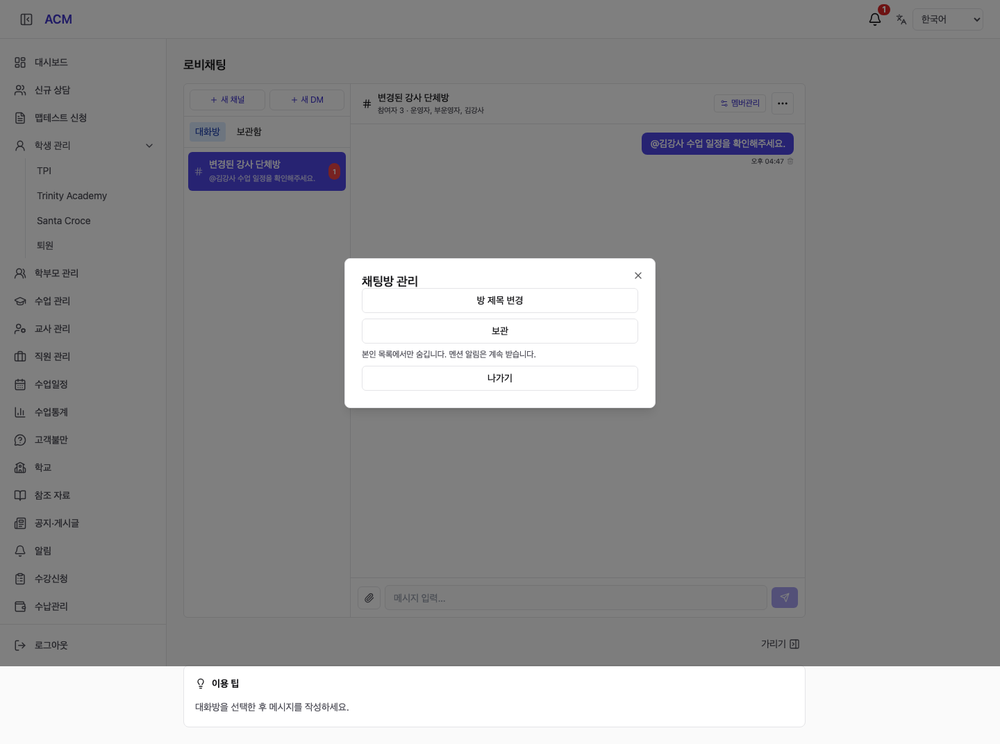
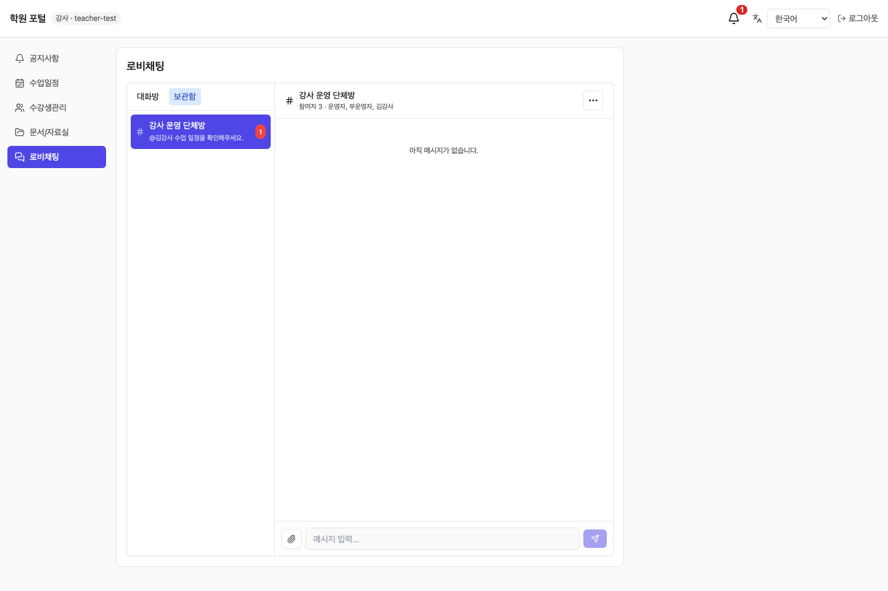
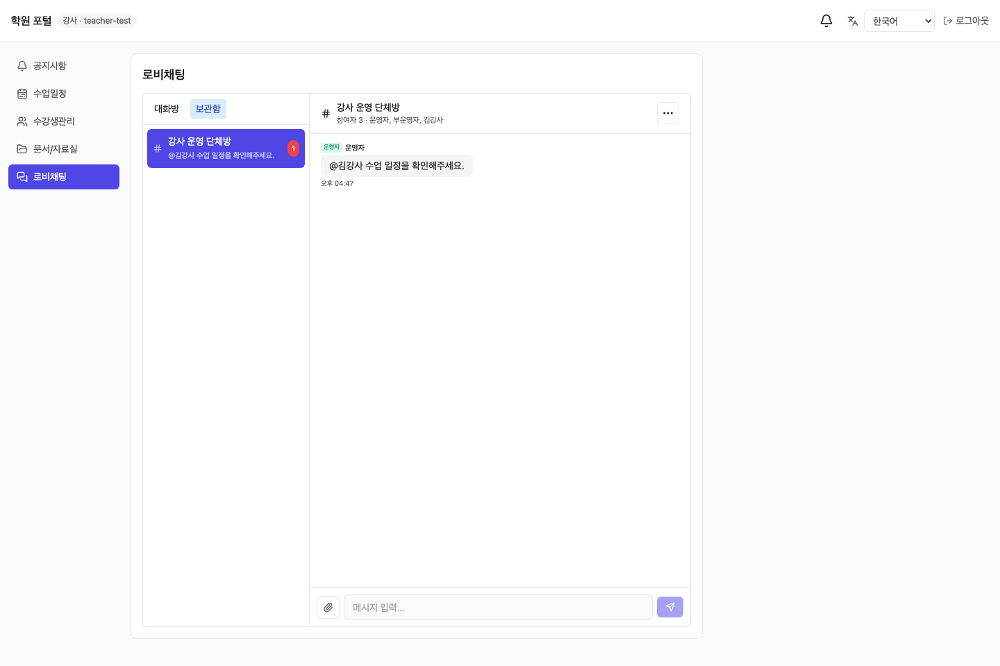
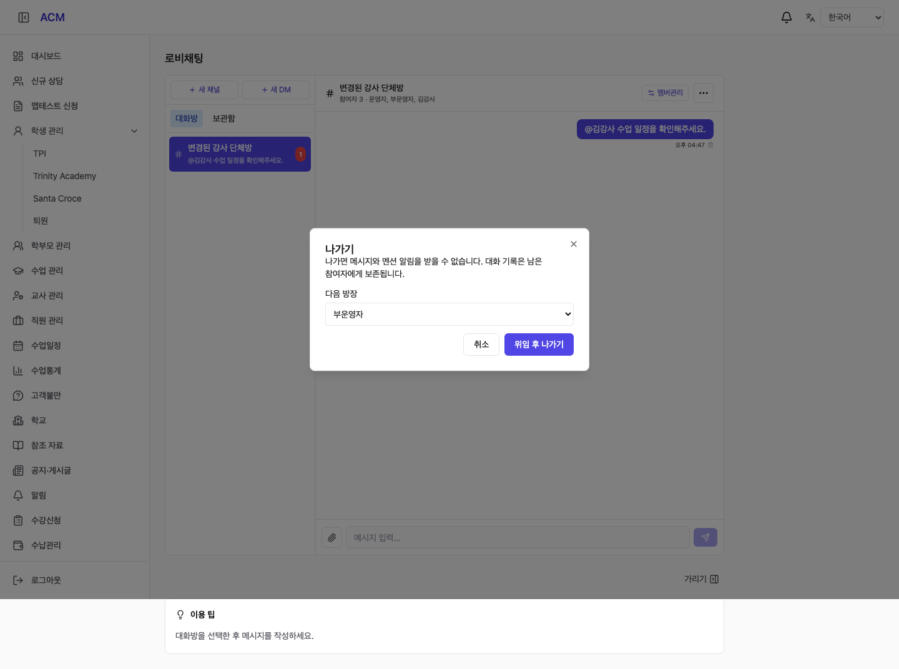
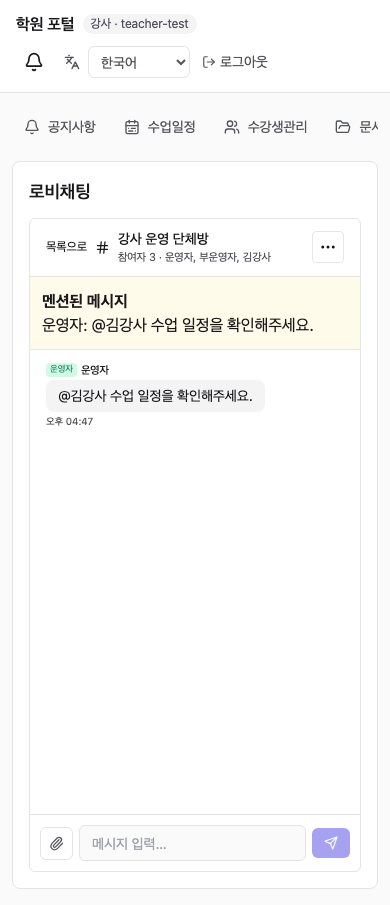

# Chat Management Implementation (채팅 관리 구현 보고서)

## 1. Result (결과)

운영자와 강사 채팅에 멘션 알림, 단체방 제목 변경, 나가기, 개인 보관/복원을 구현했다. 운영 데이터 변경이나 배포는 하지 않았다. 기존 IDE 작업 트리의 다른 변경을 보존하기 위해 `/private/tmp/acm-complaints-261006`의 `feat/chat-management-261006` 브랜치에서 작업했다.

- 운영자 멘션 알림을 유지하고 강사 TEACHER 수신자와 포털 알림 API를 추가했다. 강사 포털 상단 종 아이콘에서 미읽음 수, 목록, 읽음 처리, 해당 메시지 이동을 제공한다.
- 그룹 방장은 제목을 1~100자로 변경할 수 있다. DM 제목 변경은 차단한다.
- 보관은 본인 활성 목록에서만 숨기며 멘션 알림은 계속 받는다. 보관함에서 열기/복원할 수 있고 알림 링크로 열어도 보관을 해제하지 않는다.
- 나가기는 활성 참여를 종료한다. 메시지는 남은 참여자에게 보존된다. 방장은 활성 운영자에게 위임 후 나가고, 혼자 남은 경우 바로 나갈 수 있다.
- DM에서 상대가 나가면 이력만 볼 수 있고 전송은 차단한다. 새 DM 개설은 새 방을 만든다.
- 참여 변경·전송·방장 위임은 채널 잠금으로 직렬화했다. 나간 계정의 메시지/파일/알림 접근을 차단하고 진행 중 다운로드를 중단한다. 이미 내려받은 바이트는 회수할 수 없다.
- 운영자/포털 채팅 캐시를 계정·학원별로 분리했다. 한국어/영어/베트남어/중국어 문구를 추가하고 모바일 강사 포털 메뉴를 가로 배치했다.

## 2. Implementation (구현 구성)

| 영역 | 변경 |
|---|---|
| acm-talk | 채널 조회 범위, 제목 PATCH, archive PATCH, leave POST, 포털 단일 메시지 GET, 참여 권한·동시성 처리 |
| acm-notification | 기존 USER/usr_id 유지, TEACHER/tch_id 수신자 추가, outbox 전달 및 포털 inbox 인증·조회 |
| frontend-acm | 공용 채팅 방 관리 대화상자, 보관함, 메시지 바로가기, 강사 종 아이콘 |
| SQL | `sql/acm/999y-chat-room-management.sql` |
| 테스트 | `backend/test/integration/chat-management.int-spec.ts`, `frontend-acm/tests/chat-management.smoke.cjs` |

마이그레이션은 기존 알림 수신자를 USER로 보존하고 추가 recipient kind/id를 채운다. 기존 워커의 USER INSERT도 트리거로 호환 처리한다. 운영 반영 시 DB 백업 후 마이그레이션과 새 백엔드/프런트를 함께 적용해야 한다. TEACHER 수신자 형식은 새 워커가 처리하므로 구버전 워커로 단독 롤백하지 않는다. 수평 확장 시 실시간 이벤트 및 다운로드 중단 전파에는 공유 버스가 필요하며, 현재의 단일 인스턴스 SSE 구조를 유지했다.

## 3. Validation (검증)

| 검증 | 결과 |
|---|---|
| 백엔드 전체 단위 테스트 | 98 suites / 762 tests 통과 |
| 변경 후 채팅 단위 테스트 | 15 tests 통과 |
| 일회용 PostgreSQL 16 통합 테스트 | 11 tests 통과 |
| NestJS 빌드 | 통과 |
| 프런트 TypeScript + Vite 빌드 | 통과; 기존 큰 번들 경고 유지 |
| Playwright 운영자/강사 UI | 제목 변경 권한, 보관/복원, 보관방 멘션 이동, 방장 위임/나가기, 모바일 목록 전환 통과 |
| git diff --check | 통과 |

PG 테스트는 실제 서비스 및 HTTP 컨트롤러/DTO/역할 가드를 사용하고 로그인 가드만 테스트 주체로 대체했다. 기존 알림 행 보존, 마이그레이션 재실행, 상담/일정 알림 회귀, 멘션 3방향 전달, 본인/중복/타 학원 차단, 미읽음/읽음, 재전달 중복 방지, 보관 격리, 탈퇴 권한 종료, 진행 중 파일 중단, 방장 위임, DM 재개설, 동시 나가기/전송을 확인했다.

브라우저 검증은 로컬 Vite + 가상 API 응답으로 수행했다. 아래 캡처는 테스트 데이터 화면이며 운영 화면이나 실제 메시지 전송 결과가 아니다.

## 4. Screenshots (화면 캡처)

### Room Actions (채팅방 관리)


### Archive (보관함)


### Mention Navigation (강사 멘션 바로가기)


### Ownership Transfer (방장 위임 후 나가기)


### Mobile (모바일)


## 5. Reproduction (검증 명령)

```sh
cd backend
npm test -- --runInBand
npm run test:int -- --runTestsByPath test/integration/chat-management.int-spec.ts
npm run build
cd ../frontend-acm
npm run build
npm run dev -- --host 127.0.0.1 --port 5173 --strictPort
```

브라우저 검증은 별도 터미널에서 `node frontend-acm/tests/chat-management.smoke.cjs`를 실행한다. Playwright 설치 경로가 별도이면 `PLAYWRIGHT_MODULE`로 지정한다. 테스트는 운영 API를 호출하지 않는다.
