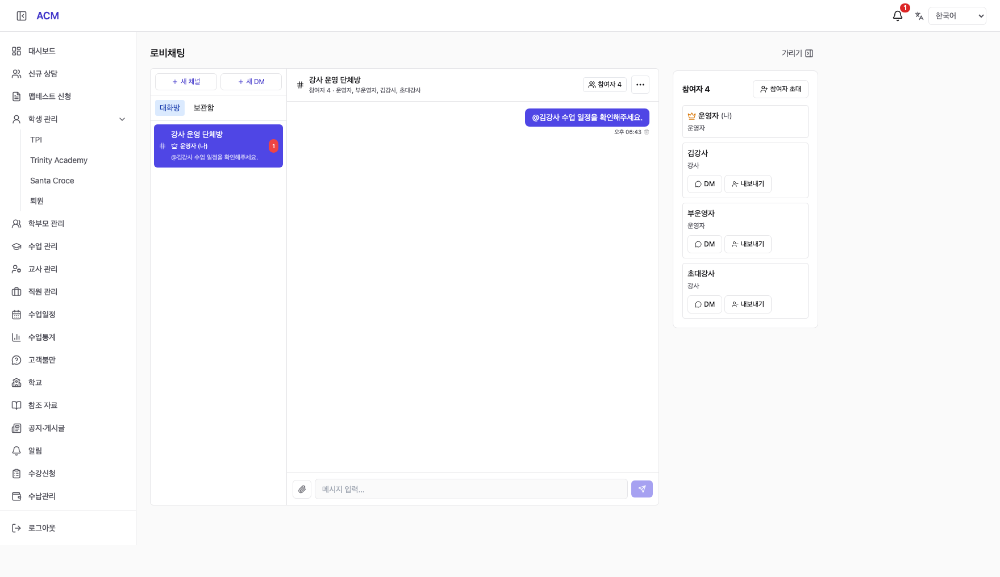
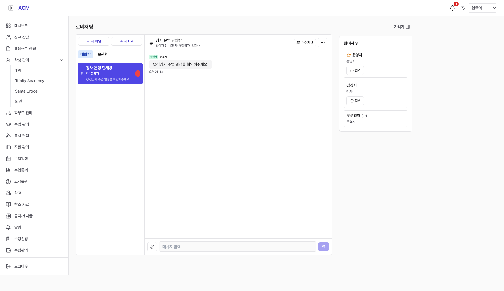
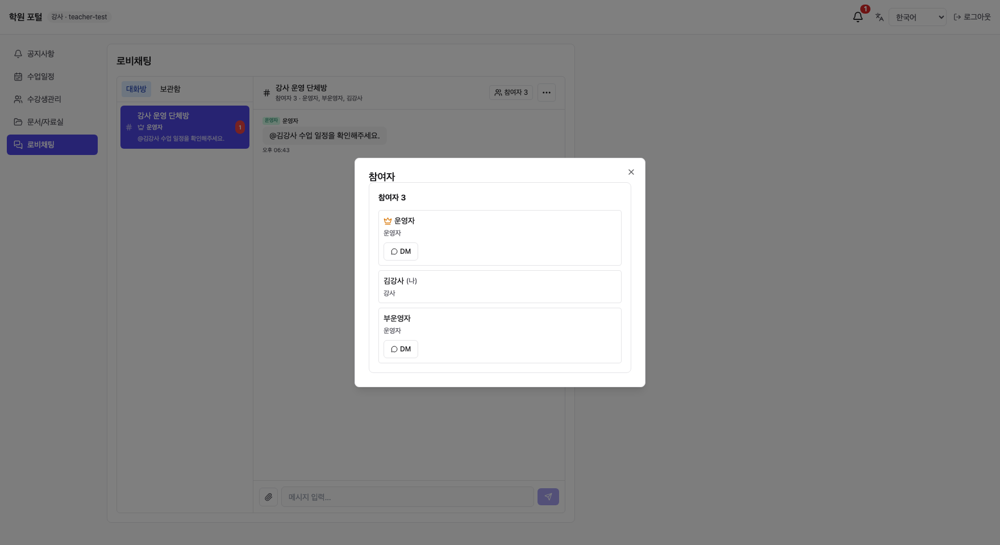

# Chat Participants Report (채팅 참여자 구현 보고)

## 1. Delivered Behavior (구현 결과)

- 관리자 채팅의 **기존 우측 이용 팁 자리**를 현재 방 참여자 목록으로 교체했다. 별도 우측 열을 추가하지 않았으며, 기존 가리기/다시 보기 및 계정별 표시 설정을 유지한다. 다른 페이지는 기존 이용 팁을 유지한다.
- 모든 단체방 목록에서 현재 OWNER를 왕관과 이름으로 표시한다. 본인이 방장이면 `(나)`를 표시하고, 방장 위임 시 현재 OWNER 기준으로 갱신한다.
- 방장은 참여자 검색/초대 및 개별 내보내기를 사용할 수 있다. 본인/방장 내보내기는 차단한다. 마지막 일반 참여자를 내보낸 뒤 방장만 남는 상태도 허용한다.
- 일반 운영자·강사는 참여자 목록과 본인 외 참여자에게 보내는 DM 버튼만 사용한다. 강사 포털에서는 같은 목록을 참여자 버튼의 대화상자로 제공한다.
- DM은 현재 같은 방의 활성 참여자에게만 시작할 수 있다. 기존 관리자 전체 디렉터리 DM은 유지한다. 동일한 두 사용자의 동시 DM 요청을 직렬화하고, 기존 DM을 열 때 요청자 본인의 보관 상태만 해제한다.
- 초대와 내보내기는 대상 멤버만 변경하므로 다른 참여자의 동시 변경을 전체 목록으로 덮어쓰지 않는다. 서버에서 테넌트·참여·OWNER 권한을 다시 검사한다.
- 한국어/영어/베트남어/중국어 문구를 추가했다.

## 2. Validation (검증 결과)

| Check (검증) | Result (결과) |
|---|---|
| Backend unit tests | 98 suites / 762 tests passed |
| PostgreSQL integration | 16 tests passed; isolated disposable PostgreSQL |
| Backend build | Passed |
| Frontend TypeScript + Vite build | Passed; existing bundle-size warning |
| New browser scenarios | Owner / ordinary operator / teacher passed |
| Existing browser regression | Rename, archive/restore, mention navigation, leave passed in admin and portal |
| Patch whitespace | git diff --check passed |

통합 테스트는 권한 및 DTO, 타 학원/비참여자 DM 차단, 동시 초대·DM, 퇴장 및 재초대, 보관 상태 보존, 기존 생성자 기록과 마이그레이션 재실행을 확인한다. 브라우저 검증은 로컬 Vite와 격리된 HTTP fixture를 사용했으며 **운영 데이터·실제 사용자 메시지를 사용하지 않았다**. 화면 캡처는 운영 반영 증거가 아니라 구현 화면 검증 자료다.

## 3. Screenshots (화면 캡처)

### Owner (방장)

### Ordinary Operator (일반 운영자)

### Teacher Portal (강사 포털)

## 4. Migration and Delivery (마이그레이션 및 적용)

`sql/acm/999z-chat-participants.sql`은 채널 생성자를 USER/TEACHER kind 및 ref로 보존한다. 기존 USER 생성자 UUID는 유지하고, 강사가 생성한 DM은 USER 전용 필드에 강사 UUID를 넣지 않는다. 기존 버전 USER 생성 쓰기도 트리거로 호환한다. 마이그레이션은 데이터 삭제를 포함하지 않으며 재실행을 검증했다. 배포할 때 백엔드보다 먼저 적용해야 한다.

사용자 승인 범위는 구현이다. 최초 구현 시 운영 변경을 하지 않았고, 이후 사용자 운영 배포 요청에 따라 아래와 같이 반영했다. 기존 IDE 작업 디렉터리의 변경을 보존하기 위해 `/private/tmp/acm-complaints-261006`의 `feat/chat-participants-261006` 브랜치에서 작업하고, 보고서·계획서·캡처는 IDE 작업 디렉터리에도 복사한다.

## 5. Production Deployment (운영 배포)

- 사용자 운영 배포 승인 후 PR #305 병합. 운영 커밋: `2f188cd5294ca9464582dec0071b4e25d086bba2`.
- 배포 시각: 2026-10-06 12:06:01 UTC / 21:06:01 KST / 19:06:01 ICT.
- [Main CI](https://github.com/amoeba-devops/appAcademy2/actions/runs/37460331103), [Staging CD](https://github.com/amoeba-devops/appAcademy2/actions/runs/37460331106), [Production CD](https://github.com/amoeba-devops/appAcademy2/actions/runs/37460794186): 모두 성공.
- 스테이징 임시 계정으로 방장 초대/내보내기, 퇴장 후 접근 차단, 재초대, 강사·운영자 동시 DM 단일 방 재사용, 멘션 알림, 보관/복원, 방장 위임/나가기를 확인했다. 임시 기록은 정리했다. 테스트 스크립트는 기존 비참여자 조회 정책(404)과 새 DM이 존재하는 상황에 맞춰 보정 후 통과했다.
- 운영 DB 백업: `/home/appacademy/app-academy-backups/db_acm-before-chat-participants-20261006T120203Z.dump` (7,731,126 bytes, mode 600). `pg_restore -l` 검증 완료.
- `999z-chat-participants.sql` 적용 파일과 마커 해시 일치. 생성자 정합성 오류 0, 활성 그룹 OWNER 오류 0, 생성자 트리거 활성 확인.
- 운영 전후 데이터: 대화방 9, 참여 기록 25, 메시지 11, 알림 1,156으로 동일.
- 운영 관리자/강사 채팅 페이지 HTTP 200, 비인증 채팅 API HTTP 401, backend health OK. 배포 후 초기 점검에서 backend 오류 로그 0건, 두 컨테이너 재시작 0회.
- 운영 확인은 읽기 전용 SQL·상태 확인·공개 HTTP 응답으로 수행했다. 실사용자 계정을 대신해 메시지 전송/초대/퇴장하지 않았다.
- 롤백 기준은 health 실패, 반복적인 서버 오류, 생성자/참여 권한 정합성 오류다. 이전 서비스 이미지 `7806e5a`로 복귀할 수 있으며, 기존 USER 쓰기와 호환되는 추가 컬럼/트리거는 유지한다. 사용자 활동 이후 전체 DB를 덮어써 복원하지 않는다.
- 배포 점검에 [engineering:deploy-checklist](</Users/gray/.codex/plugins/cache/claude-cowork/engineering/1.2.0/skills/deploy-checklist/SKILL.md>)를 사용했다.
