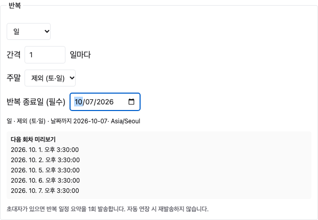

# Required Recurrence End Date (반복 종료일 필수)

## 1. Finding (확인 결과)

최신 main 소스에서 종료일 입력 기능이 존재하지만 기본값이 `NEVER`이고 종료 없음/횟수로 신규 반복을 생성할 수 있었다. 따라서 종료일 기능 추가보다 필수 입력 조건 보완이 필요했다.

## 2. Implementation (수정)

- 신규 일/주/월 반복: 빈 종료일 입력부터 시작하고, 날짜를 직접 선택해야 한다. 종료 없음/횟수 선택은 제거했다.
- 종료일 미입력 또는 시작일 이전이면 화면 저장 비활성. 서버 미리보기·생성도 누락, 잘못된 날짜, 학원 시간대 시작일 이전 날짜를 거부한다.
- 종료일 당일은 반복에 포함한다. 특정일자 방식은 선택한 마지막 날짜를 종료시점으로 표시한다.
- 기존 저장된 NEVER/COUNT 반복의 계산·자동 생성 및 ICS 처리에는 새 등록 검증을 적용하지 않는다. 기존 일정 수정/삭제·운영 데이터 변경 없음.

## 3. Validation (검증)

- 백엔드 전체: 101 suites / 778 tests 통과 (종료일 정책·반복 계산 18 tests 포함).
- 프런트·백엔드 빌드 통과. 프런트엔드 기존 번들 크기 경고 유지.
- 로컬 Vite + 격리 API fixture 브라우저: 종료일 없음/시작일 이전 저장 차단, 종료일까지 평일 반복 미리보기 및 등록 payload, 특정일자 미리보기, 기존 반복 편집, 모바일 확인.
- 서버 테스트는 실제 서비스의 preview/create 경로를 통해 DB 저장 전에 거부되는지 확인했다. 이번 변경에서 PostgreSQL 통합 스크립트는 새 날짜 조건에 맞춰 갱신했지만 별도 실행하지 않았다.

## 4. Delivery (적용)

`fix/cal-repeat-required-end-261008` 브랜치, 독립 작업 디렉터리 `/private/tmp/acm-complaints-261006`. 기존 IDE의 변경/스테이징 파일은 보존했다. 문서와 캡처만 IDE에 복사한다. DB 스키마 변경 없음. 운영 배포는 아직 수행하지 않았다.
