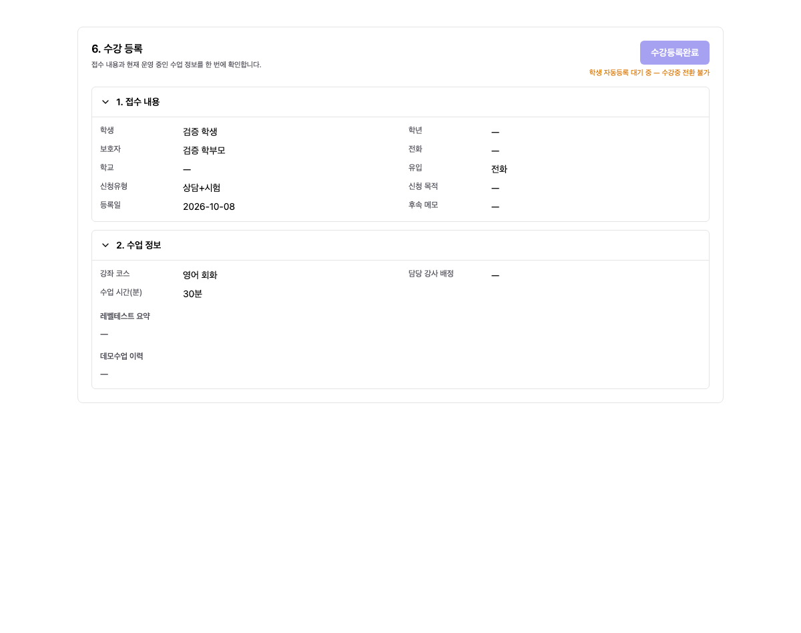
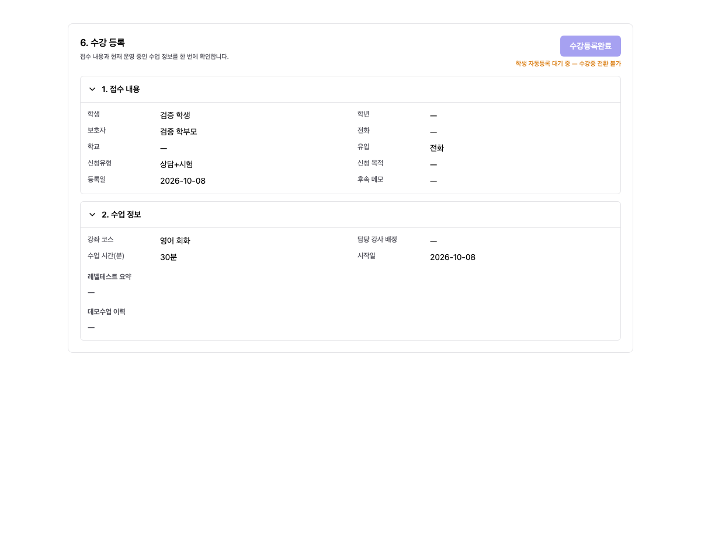

# Enrollment Summary Display (수강등록 요약 표시)

## 1. Changes (구현)

6단계 수강등록에서 수강횟수는 기존 값이 있어도 숨긴다. 시작일·종료일은 등록상담에 저장된 값이 있을 때만 각각 행을 표시한다. null/undefined/빈 문자열/공백은 미지정으로 처리한다. 7단계 수강중의 기존 표시, 4단계 입력, API 및 저장 데이터는 변경하지 않았다.

## 2. Validation (검증)

프런트 TypeScript/Vite 빌드 통과 (기존 번들 크기 경고 유지). 로컬 합성 API 응답으로 실제 공유 컴포넌트를 렌더링하여 다음 6가지 화면을 확인했다: 날짜 모두 없음, 시작일만 있음, 종료일만 있음, 두 날짜 있음, 빈 문자열/공백, 7단계. 수강횟수 12가 저장된 fixture에서도 6단계는 숨김, 7단계는 기존 표시를 유지했다. 브라우저 오류 없음. 임시 검증 페이지는 검사 후 제거했다.

## 3. Delivery (적용 상태)

`fix/csl-registration-summary-261008` 독립 브랜치에서 수정했다. 기존 IDE의 변경/스테이징은 보존하며 문서·캡처만 복사했다. 사용자의 운영 배포 요청에 따라 아래 버전으로 반영했다. 앞서 요청한 반복 종료일 수정 PR #310과 별도 변경이다.

## 4. Production Deployment (운영 배포)

- PR #311 병합, 운영 SHA `527ef4057ad6ad362658cad47e9ca74087016b4d`.
- 2026-10-08 21:29:43 KST / 19:29:43 ICT 반영.
- PR CI `37776157885`, main CI `37776702803`, staging CD `37776702740`, production CD `37777197635` 모두 성공.
- 스테이징 및 운영 `/admin/csl` HTTP 200. 운영 backend health OK, 초기 오류 로그 0건, 두 컨테이너 재시작 0회, 실행 이미지 SHA 일치.
- DB 변경/실제 상담 데이터 변경 없음. 운영 화면의 로그인 후 실사용자 데이터 확인은 수행하지 않았으며 표시 조건은 구현 단계 로컬 브라우저에서 검증했다.
- 반복 종료일 필수 수정 PR #310은 이번 배포에 포함하지 않았으며 미병합 상태다.
- 직전 운영 이미지 `7f87767`을 롤백 기준으로 보존한다.
