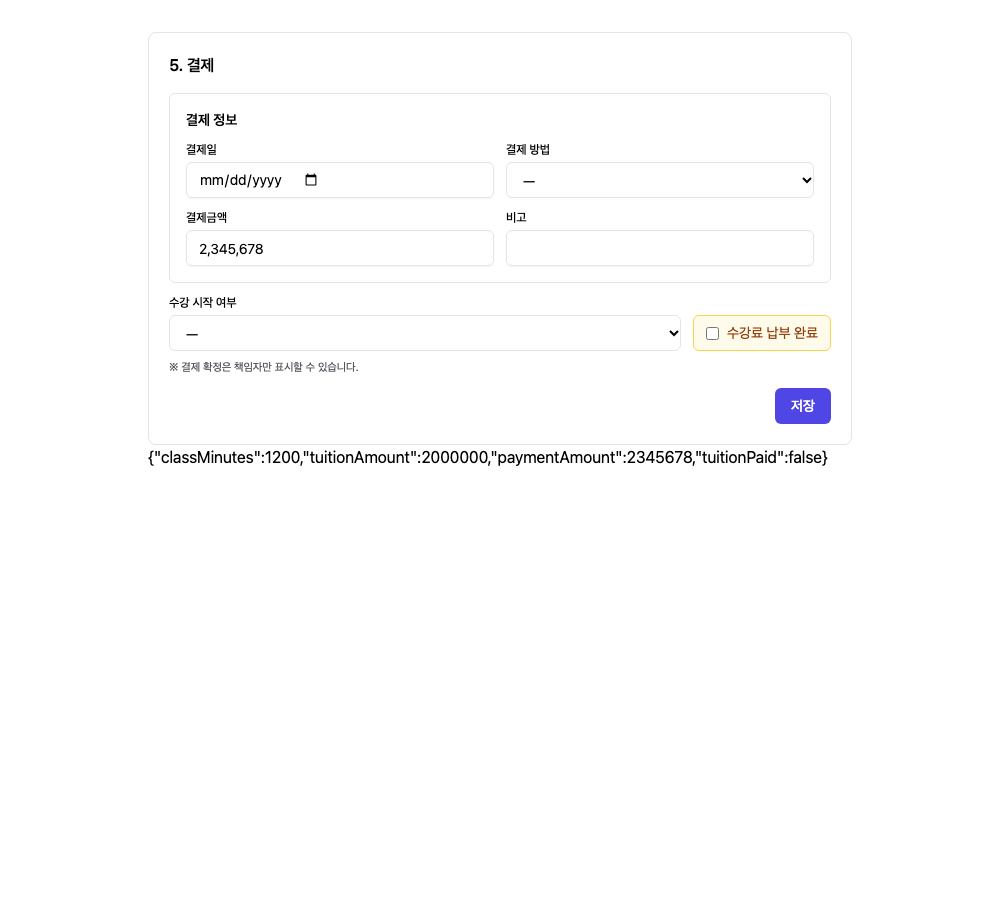

# Numeric Input Grouping (숫자 입력 콤마)

## 1. Result (구현 결과)

5단계 결제금액을 포함해 숫자형 입력 60곳 중 금액·수량 입력 58곳에 공통 천 단위 콤마 처리를 연결했다. 이미 포맷이 적용된 수납관리와 수강료는 유지했다. 연도·문항번호 2곳과 날짜·전화번호·인증번호·GA4 ID·포트 번호는 제외했다.

표시는 `2,345,678`, 폼 저장값은 기존 숫자 `2345678`이다. 수량, 소수, 음수, 빈 값, 최소/최대, step, required, reset 및 RHF 포커스를 확인했다. 폼 필드는 Controller로 연결한다. NumericInput의 표시 DOM 값을 직접 읽어 저장하는 register 방식은 사용하지 않는다.

## 2. Validation (검증)

- TypeScript/Vite 빌드 통과. 기존 번들 크기 경고 유지. 현재 저장소의 프런트 lint 스크립트는 안내문만 출력하므로 별도 린트 검증으로 간주하지 않는다.
- `numeric-input.smoke.cjs`: 표시 콤마/원본 저장/숫자 타입/소수·음수/최소·최대·step·required/reset/커서/붙여넣기/포커스 통과.
- `csl-payment-numeric.smoke.cjs`: 실제 5단계 결제 컴포넌트의 결제금액 `2345678` 저장, 4단계 시간 `1500` 저장 통과.
- 캘린더 반복 등록·편집·특정일자·모바일 회귀 통과. 테스트 시작·종료 시간을 고정해 실행 시각에 따라 자정을 넘는 fixture 문제를 제거했다.
- API는 합성 fixture로 처리했으며 실사용자 데이터 변경 없음. 전체 58개 입력의 개별 페이지를 모두 수동 조작한 것은 아니며 공통 컴포넌트 및 대표 폼 흐름을 검증했다.

## 3. Delivery (적용 상태)

반복 종료일 필수 PR #310은 운영 반영 완료 (`0be036d`, 2026-10-08 22:34:44 KST). 이 숫자 콤마 패치는 `feat/numeric-input-grouping-261008` 브랜치에서 구현했으며 아직 운영 배포하지 않았다. DB/서버 변경 없음. 기존 IDE 작업을 보존하기 위해 독립 디렉터리에서 구현하고 문서·캡처만 IDE에 복사했다.
